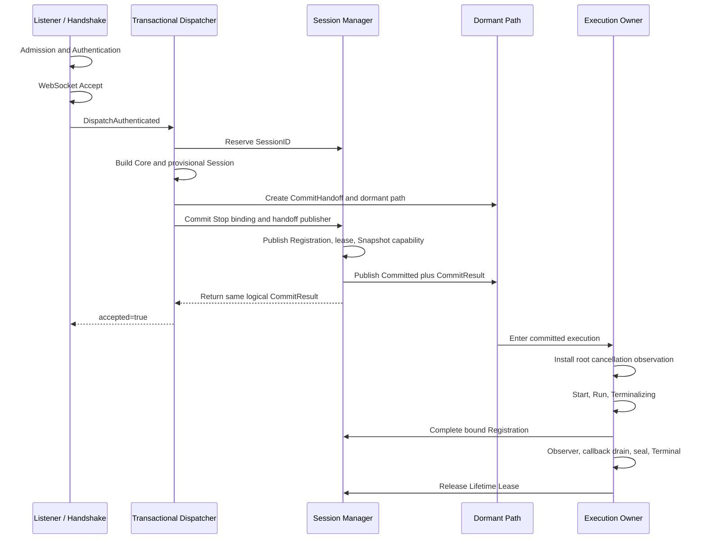
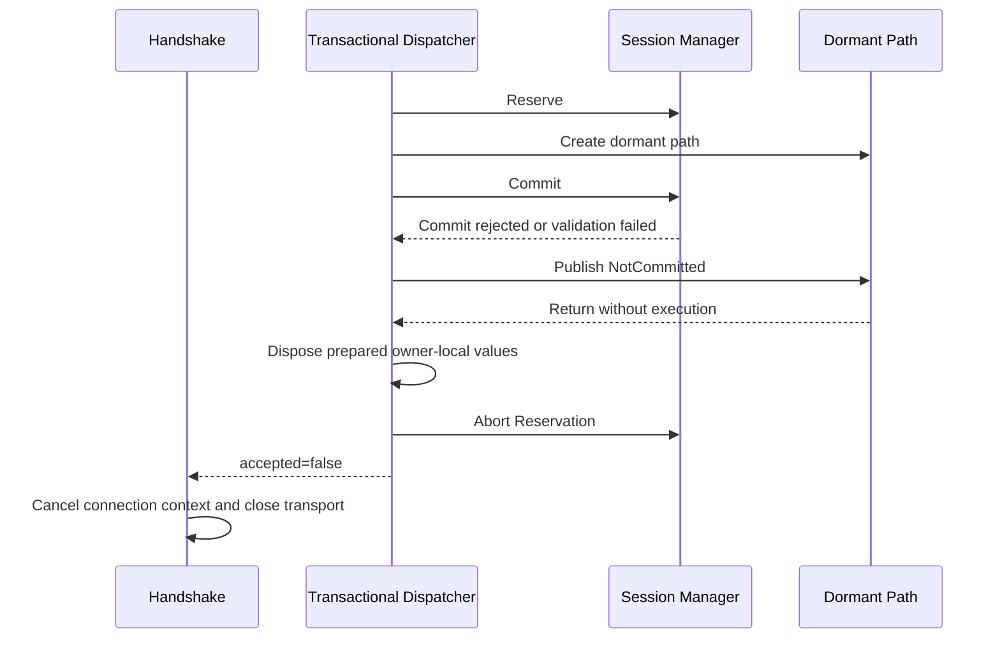
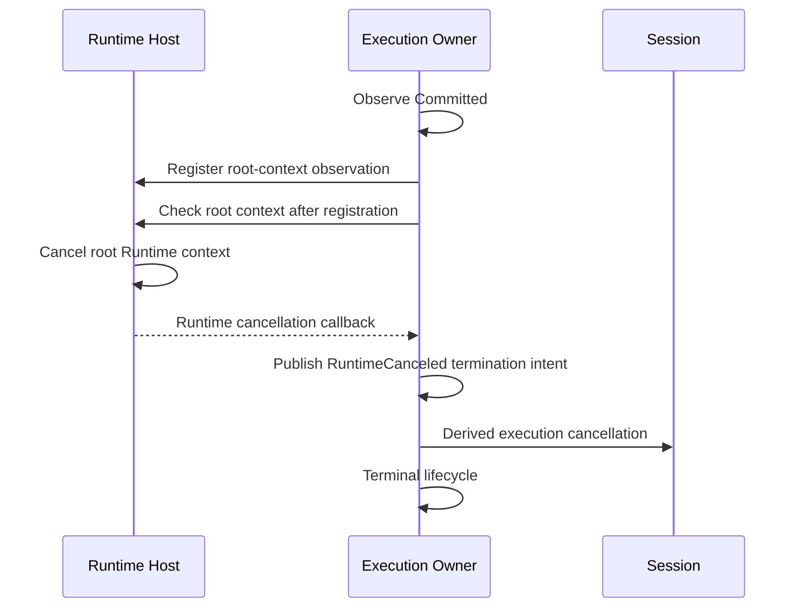

# DP-006: Runtime Production Integration

[Russian version](../../ru/design/DP-006-runtime-production-integration.md)

## 1. Status

**Status:** Draft

This proposal defines only the production integration of the already approved and implemented Runtime Foundation contracts. It does not revise [DP-003](DP-003-runtime-session-manager.md), [DP-004](DP-004-per-session-execution-boundary.md), or [ARCH-003](../architecture/ARCH-003-runtime-migration-revision.md).

## 2. Purpose

Runtime Foundation Migration Task 9 provides a complete transaction-capable Dispatcher, one `CommitHandoff`, one dormant execution path, complete Owner terminal processing, and truthful Manager accounting outside production Runtime composition. Production Runtime still selects the legacy synchronous Dispatcher and does not coordinate Session Manager shutdown.

This proposal defines Task 10: one atomic production cutover that selects the completed transactional path and activates its matching shutdown orchestration. It introduces no new component, ownership level, lifecycle, publication point, or recovery transaction.

## 3. Sources of Authority

The normative sources are:

- [DP-003: Runtime Session Manager](DP-003-runtime-session-manager.md);
- [DP-004: Per-Session Execution Boundary](DP-004-per-session-execution-boundary.md);
- [ARCH-002: Runtime Foundation Freeze](../architecture/ARCH-002-runtime-foundation-freeze.md);
- [ARCH-003: Runtime Foundation Migration Revision](../architecture/ARCH-003-runtime-migration-revision.md);
- the factual [current state](../../../spec/current-state.md).

If wording in this integration proposal can be read more broadly than those documents, the narrower approved contract prevails.

## 4. Scope

Task 10 includes only:

- constructing one Session Manager per Runtime instance in the Host composition root;
- supplying the DP-004 root Runtime-context observation input to prepared execution;
- supplying one synchronous Terminal Observer dependency without defining a diagnostics backend;
- selecting `TransactionalDispatcher` as the sole production Session handoff;
- storing the Manager as a stable member of the composed Runtime graph;
- extending Host shutdown with `BeginShutdown`, capability-bearing Snapshot Stop requests, root Runtime cancellation, Listener Stop, and Manager Wait in the approved order;
- removing the legacy synchronous Dispatcher from the production graph;
- preserving startup rollback, readiness, Admission Gate, Listener ownership, Router behavior, Authentication behavior, and the external Handshake handoff contract;
- adding production integration and shutdown proof tests.

Task 10 does not include:

- changes to Reserve, Commit, Abort, Complete, Lookup, Snapshot, Wait, `CommitHandoff`, or Owner Lifetime Lease semantics;
- changes to Execution Owner lifecycle, Terminal Result, Observer ordering, callback drain, Cleanup, or the causal cell;
- Router, Delivery, Presence, Groups, Topics, Broadcast, Persistence, Plugins, Metrics, diagnostics backends, limits, or rate limiting;
- new Runtime lifecycle states, restart, reload, supervision, or a global coordinator;
- new public Configuration or management APIs;
- changes to Handshake Authentication or WebSocket Upgrade ordering;
- a second execution path or compatibility fallback to the legacy Dispatcher.

After Task 10, future epics still own Delivery, Persistence, TLS capability execution not already present, Metrics, operational diagnostics, Plugin contracts, restart, reload, supervision, and every other item explicitly deferred by the approved roadmap. The accepted permanently blocked Cleanup, Observer, callback-entry, or accounting limitations remain unchanged.

## 5. Current Boundary and Cutover Rule

Before Task 10, Runtime composition builds Router, Authentication, the legacy synchronous Dispatcher, Handshake, and Listener. The complete TransactionalDispatcher exists but is not selected by Runtime.

Task 10 is one production cutover. Runtime must not select TransactionalDispatcher without also installing Manager-aware shutdown, and it must not install Manager shutdown around Sessions still owned by the legacy Dispatcher. After the cutover, exactly one production Session execution path exists.

## 6. Production Composition Root

Runtime Host remains the only production composition root and lifecycle coordinator. Container remains an immutable Snapshot holder rather than a service locator. Explicit construction produces this graph:

```text
Runtime Host
    -> immutable Runtime Snapshot / Container
    -> Host-owned Admission Gate
    -> Host-owned live Runtime-context access capability
    -> Message Router
    -> Authentication Service
    -> Session Manager
    -> synchronous Terminal Observer value
    -> Transactional Dispatcher
       -> Session Manager
       -> Message Router as Handler
       -> root Runtime-context observation input
       -> Terminal Observer
    -> Handshake Handler
       -> Admission capability
       -> Runtime-context capability
       -> Authentication Service
       -> Transactional Dispatcher
    -> Listener
```

The Host owns the identities of Listener, Manager, Runtime context, Runtime cancellation function, Admission Gate, and the immutable composed dependency graph. Manager owns only reservation, registration, Snapshot, completion, and lifetime-lease accounting. TransactionalDispatcher owns each pre-Commit transaction. Each committed Execution Owner owns its Session execution and terminal obligations.

The actual root Runtime context remains absent until Listener startup succeeds, exactly as frozen by ARCH-002. Composition passes the already approved live read-only Runtime-context observation input, not a prematurely created root context and never its cancellation function. Admission remains closed during startup, so no Dispatcher invocation can reach Commit before the Host activates the root context and enters Running.

The Terminal Observer dependency is a synchronous composition-local value required by DP-004. Task 10 defines no external diagnostics output. Until a diagnostics epic supplies a backend, the observer may consume the immutable Terminal Result and return without retaining ownership or producing another effect.

## 7. Startup Ordering

Startup preserves the ARCH-002 transaction:

1. Host enters `Starting`; readiness is false and Admission is closed.
2. Runtime Snapshot executability is validated.
3. Router and Authentication Service are constructed.
4. One empty Session Manager and one Terminal Observer value are constructed.
5. TransactionalDispatcher is constructed from Manager, Router, root observation input, and Observer.
6. Handshake is constructed with the TransactionalDispatcher.
7. Listener is constructed and started last.
8. On Listener success, Host creates and publishes the root Runtime context, stores Listener and Manager, enters `Running`, opens Admission, and becomes Ready in the existing startup commit.
9. On any earlier failure, Listener resources are rolled back, no admission opens, the unobserved empty Manager graph is discarded, and Host returns to the existing non-running state.

```mermaid
sequenceDiagram
    participant H as Runtime Host
    participant M as Session Manager
    participant D as Transactional Dispatcher
    participant L as Listener
    H->>H: Enter Starting; Admission closed
    H->>M: Construct empty Manager
    H->>D: Construct with Manager and observation input
    H->>L: Construct and Start
    alt Listener startup succeeds
        H->>H: Create root Runtime context
        H->>H: Publish graph; Running and Ready
        H->>H: Open Admission
    else Composition or startup fails
        H->>L: Roll back acquired Listener resource
        H->>H: Keep Admission closed and Ready false
    end
```

No Session, Reservation, Registration, callback, dormant path, or lease exists during startup.

## 8. Ownership Across Runtime Phases

| Phase | Transport and derived cancellation owner | Execution owner | Registration/accounting owner | Host responsibility |
| --- | --- | --- | --- | --- |
| Before Upgrade | Listener/Handshake boundary | None | None | Admission and root context |
| After Upgrade, before Commit | TransactionalDispatcher acting for Upgrade boundary | Dispatcher owns provisional path; Owner remains `PreCommit` and cannot execute | Dispatcher owns Reservation obligation; Manager accounts Reservation | No Session execution |
| Successful Commit | Ownership transfers atomically to Execution Owner | Exactly one committed path is eligible | Manager owns Registration and lease accounting | Coordinates only Runtime lifecycle |
| Running/Terminalizing | Execution Owner | Execution Owner is sole post-Commit lifecycle writer | Manager retains Registration until Complete and lease until Release | May publish Stop intent and root cancellation |
| After Complete, before lease release | Execution Owner until terminal obligations finish | Owner may still observe, drain, seal, and reach Terminal | Registration absent; lifetime lease remains active | Wait remains pending |
| After eligible lease release | No Runtime-owned transport or execution work remains | Owner performs no further Runtime-owned work | Registration and lease accounting are empty for that Session | Manager may converge |
| Shutdown | Existing owners retain their resources until terminal completion | Owners terminalize independently | Manager fixes Snapshot and waits truthfully | Host orders shutdown but never takes Session ownership |

There is no phase in which Host, Listener, Handshake, Manager, and Owner are concurrent owners of the same Session or WebSocket.

## 9. Successful Connection Lifecycle

The production connection flow follows DP-004. Reservation precedes provisional Session formation because it establishes the identity-owned transaction that must end in Commit or Abort.



Ownership by stage is:

1. Listener and Handshake own request processing before Upgrade.
2. After successful Accept, TransactionalDispatcher exclusively owns pre-Commit transport cleanup, derived cancellation, Reservation, prepared values, `CommitHandoff`, and dormant-path return obligation.
3. Manager owns only accounting and committed publication inside Commit.
4. Successful Commit transfers Session, WebSocket, derived cancellation, and execution ownership to the prepared Owner and makes exactly one dormant path eligible.
5. Dispatcher returns `accepted=true` immediately and performs no post-Commit cleanup.
6. Owner executes the complete terminal chain. Complete removes Registration; it does not release owner lifetime.
7. Eligible lease release is the final Runtime-owned operation.

## 10. Failed Commit and Pre-Commit Failure

Every recoverable failure before Commit, including a Commit lost to BeginShutdown, uses the existing Task 9 path:



No Registration, lease, Stop capability, Runtime callback, Complete, Observer, or Owner execution exists on this path. Runtime integration must not add a post-Commit `accepted=false` branch.

## 11. Runtime Cancellation

Host remains the sole owner of root Runtime cancellation. Handshake and TransactionalDispatcher receive observation only. Derived execution cancellation remains separate and owner-local after Commit.

Before Commit:

- no Runtime-cancellation callback is registered;
- Dispatcher checks current root and derived execution cancellation before Commit eligibility;
- cancellation or BeginShutdown loss produces NotCommitted, dormant-path return, Abort, and `accepted=false`.

After Commit:

- the committed Owner installs observation before Start linearization;
- registration uses the approved race-safe register-and-check contract;
- root cancellation before or during installation becomes `RuntimeCanceled` exactly once through the causal cell;
- explicit Stop and Runtime cancellation compete as termination intent and never become lifecycle writers;
- Session Cleanup cancels only the derived execution context and cannot generate root `RuntimeCanceled`.



Runtime integration creates no callback before Commit and does not allow Host, Dispatcher, or Manager to install one for Owner.

## 12. Runtime Shutdown

The first Host Stop owner executes the normative order:

```text
close Admission
    -> Manager.BeginShutdown
    -> capture immutable capability-bearing Snapshot
    -> invoke each Snapshot RequestStop capability
    -> cancel root Runtime context
    -> Listener Stop
       |-> HTTP handler drain -> Listener Stop returns
       |-> committed owners terminalize -> eligible leases release
    -> after Listener Stop returns, Manager Wait
    -> publish the one Host Stop result and exit
```

```mermaid
sequenceDiagram
    participant H as Runtime Host
    participant M as Session Manager
    participant O as Execution Owners
    participant L as Listener
    H->>H: Close Admission; enter Stopping
    H->>M: BeginShutdown
    M-->>H: Immutable Snapshot
    loop Every captured Registration
        H->>O: RequestStop
    end
    H->>H: Cancel root Runtime context
    par Handler drain
        H->>L: Stop
        L-->>H: Listener Stop returns
    and Owner drain
        O->>O: Terminal lifecycle
        O->>M: Complete and eligible lease release
    end
    H->>M: Wait after Listener Stop
    M-->>H: Accounting converged or caller context error
    H->>H: Store shared terminal Stop result
```

`BeginShutdown` is nonblocking and performs no Session I/O. Snapshot membership is fixed by its first call. RequestStop is nonblocking with respect to Session lifecycle. Root cancellation occurs before Listener Stop, preserving ARCH-002. Listener handler drain and Owner drain run concurrently; neither waits for the other. Manager Wait begins only after Listener Stop returns and performs no Stop request or Session I/O.

Listener Stop failure does not skip Manager Wait. Manager Wait failure or caller-context expiration does not erase accounting. Host combines the existing Listener terminal error and Wait error without replacing either cause. A nil Host Stop result proves both Listener completion and successful Manager convergence. A non-nil result makes no false convergence claim; Manager remains truthfully `Closing` if accounting is still active. Concurrent and repeated Host Stop callers observe the same stored terminal shutdown result, preserving the frozen Host lifecycle.

## 13. Commit and BeginShutdown Race

Commit and BeginShutdown retain the single Manager linearization boundary:

- Commit wins: the complete Registration, lease, Stop capability, and committed execution path are published before BeginShutdown captures them; the Snapshot includes the Registration and shutdown requests Stop normally.
- BeginShutdown wins: Commit is rejected, Dispatcher publishes NotCommitted, joins the dormant path, aborts Reservation, returns `accepted=false`, and Handshake cleans transport.

There is no late Registration discovery, mutable Snapshot membership, orphan execution, or rollback of a committed Registration.

## 14. Legacy Dispatcher Migration

The legacy synchronous Dispatcher currently performs `Start`, `Run`, and `Stop` in the HTTP handler call. Task 10 removes it from production composition.

| Element | Task 10 treatment |
| --- | --- |
| `session.NewDispatcher` production selection | Replaced atomically by `NewTransactionalDispatcher` |
| Legacy synchronous execution in `internal/session/dispatcher.go` | May be deleted immediately when its focused tests are migrated; it must not remain reachable from production composition |
| Legacy Dispatcher unit tests | Retained only while proving old compatibility during the change, then removed or rewritten against the sole production path |
| `connection.AuthenticatedDispatcher` interface | Retained unchanged; Handshake continues to depend on it |
| Handshake accepted/error behavior | Retained unchanged |
| Router as the injected `message.Handler` | Retained and passed to TransactionalDispatcher |
| Session Core, provisional Session, Cleanup, Owner, CommitHandoff, Manager | Retained unchanged in responsibility |

Temporary coexistence is permitted only inside the uncommitted implementation change or isolated tests. Task 10 acceptance requires no production reference, fallback, configuration switch, or runtime branch capable of selecting the legacy Dispatcher.

## 15. Expected Repository Impact

Production integration is expected to touch only focused seams:

- `internal/runtime/host.go`: store Manager identity and coordinate the approved shutdown order;
- `internal/runtime/composition.go`: construct Manager, Observer, and TransactionalDispatcher instead of the legacy Dispatcher and return/store the complete composed graph;
- `internal/runtime/startup_transaction.go` only if existing typed startup-resource plumbing must carry the complete graph without changing rollback semantics;
- `internal/session/transactional_dispatcher.go` and `internal/executionowner/environment.go`: adapt the construction seam to the DP-004-approved live root-context observation input while preserving Task 9 behavior and keeping root cancellation private to Host;
- `internal/session/dispatcher.go`: remove the obsolete production implementation when no test-only reference remains;
- focused Runtime, Handshake, Listener, Session, and Session Manager integration tests.

No production semantic change is expected in Router, Authentication, Listener, Handshake, Session Manager, Completion Adapter, Lifetime Lease, Execution Binding, or Execution Owner terminal logic. Changes in those packages are permitted only when compilation requires the already approved dependency seam; they must not alter their contracts.

## 16. Error and Result Semantics

- Composition failure prevents Listener construction or startup and preserves the existing startup error wrapping.
- Listener startup failure rolls back the acquired Listener resource and publishes neither Runtime context nor readiness.
- Pre-Commit Dispatcher failures preserve `(accepted=false, error)` semantics and Handshake cleanup ownership.
- Successful Commit preserves `(accepted=true, nil)` even when later execution fails.
- Post-Commit failures are represented only by Owner terminal processing and Terminal Observer, never by a second Handshake result.
- Listener Stop and Manager Wait are both attempted in their required order; their errors remain discoverable through normal cause-preserving combination.
- A caller deadline may end Manager Wait without modifying Manager state or claiming successful shutdown.

## 17. Concurrency and Deadlock Constraints

- Host holds no lifecycle mutex while Listener Stop or Manager Wait blocks.
- BeginShutdown holds no lock while invoking Snapshot RequestStop capabilities; Snapshot is detached and immutable.
- RequestStop and root cancellation wait for no Session terminal operation.
- Dispatcher waits for dormant-path return only on non-committed paths and never waits for Owner after successful Commit.
- Listener Stop may wait for HTTP handlers while committed owners terminalize independently.
- Owner never waits for Listener Stop or Manager Wait.
- Manager Wait holds no Manager lock while blocked and never calls Session or Owner.
- Completion and lease release mutate Manager accounting without waiting for Host.
- Permanently blocked Cleanup, Observer, callback entry, or unconfirmed callback cleanup may truthfully prevent successful Wait but creates no circular wait under the approved contracts.

## 18. Task 10 Architectural Invariants

- Host remains the sole production composition root and Runtime lifecycle coordinator.
- One Runtime instance owns exactly one Session Manager.
- Production uses exactly one TransactionalDispatcher and no legacy execution fallback.
- Runtime never starts Owner, Session Start, or Session Run before successful Commit.
- Dispatcher creates exactly one `CommitHandoff` and one dormant path per attempted handoff.
- Only Session Manager publishes Registration and committed Manager-bound capabilities.
- Commit remains the sole irreversible Registration, execution-eligibility, and ownership-transfer point.
- Every accepted production Session is Manager-tracked from Commit through Complete and Lifetime Lease release.
- No callback observing Runtime cancellation exists before Commit.
- Owner alone installs root Runtime-context observation after Commit and before Start.
- Root Runtime cancellation remains owned exclusively by Host.
- Derived execution context remains owned by Dispatcher before Commit and Owner after Commit.
- Session Cleanup cannot generate root `RuntimeCanceled`.
- Complete is the only Registration removal operation.
- Lease release remains the final Runtime-owned operation.
- First BeginShutdown fixes immutable Snapshot membership.
- Commit and BeginShutdown retain strict mutually exclusive race outcomes.
- Shutdown closes Admission before BeginShutdown and cancels root context before Listener Stop.
- Listener handler drain and Owner terminalization proceed concurrently.
- Manager Wait begins only after Listener Stop returns.
- Successful Manager Wait proves empty Reservation, Registration, and Lifetime Lease accounting and absence of tracked Runtime-owned work.
- Runtime never reports successful shutdown while Manager accounting remains active.
- Frozen Host lifecycle, startup rollback, readiness, Admission Gate, Runtime-context timing, and Listener ownership remain unchanged.

## 19. Acceptance Criteria

Implementation is accepted only when:

1. Runtime startup constructs one Manager and one TransactionalDispatcher and stores their identities for the Runtime lifetime.
2. Production composition contains no call or branch selecting the legacy Dispatcher.
3. Listener remains the last externally visible startup resource and readiness opens only after successful startup commit.
4. Every accepted WebSocket creates exactly one committed Registration, one eligible execution path, and one Lifetime Lease.
5. Failed Commit leaves no Registration or lease and returns transport cleanup to Handshake.
6. Normal disconnect performs Cleanup, Complete, Observer, callback drain, Terminal, and eligible lease release in the approved order.
7. Root Runtime cancellation is observed only after Commit and before Start/Run continuation.
8. Stop executes `Admission close -> BeginShutdown -> Snapshot RequestStop -> root cancellation -> Listener Stop -> Manager Wait`.
9. Commit/BeginShutdown races produce only the two approved outcomes.
10. Successful Host Stop implies successful Manager Wait and empty accounting.
11. Context-bounded shutdown failure preserves truthful Manager state and error causes.
12. Existing Authentication, Router, Echo/no-match, Handshake, Listener, startup rollback, readiness, and concurrent/repeated Host Stop behavior remains compatible.
13. No new lifecycle, coordinator, supervisor, global state, service locator, or post-Commit activation step is introduced.

## 20. Required Test Proofs

Tests must deterministically prove:

- startup success constructs Manager and selects TransactionalDispatcher exactly once;
- composition or Listener startup failure opens no admission and leaves no published Runtime Session state;
- normal authenticated connection reaches Commit, Start, Run, normal disconnect, Complete, Observer, Terminal, and lease release;
- failed Commit produces `accepted=false`, joins dormant execution, aborts Reservation, and lets Handshake close transport;
- Start failure, Run failure, Cleanup anomaly, Observer anomaly, and eligible lease release preserve truthful accounting;
- no matching Router route and Handler error retain their existing Session semantics through TransactionalDispatcher;
- multiple concurrent Sessions receive distinct Registration identities and one shared Manager;
- repeated dispatch never creates a second execution path for one connection;
- root cancellation before Commit produces no callback or Registration;
- root cancellation after Commit is observed by Owner and terminates through the normal path;
- explicit Snapshot Stop and root cancellation racing have one primary cause and no second lifecycle writer;
- Commit winning BeginShutdown appears in Snapshot; BeginShutdown winning Commit causes Abort and no Registration;
- Snapshot membership and Stop capabilities remain immutable and safe after Complete, Terminal, and lease release;
- Listener handler drain and Owner drain can overlap without deadlock;
- Manager Wait begins after Listener Stop returns and remains pending while Registration or lease accounting exists;
- successful graceful shutdown leaves Manager Closed and all tracked accounting empty;
- concurrent and repeated Runtime Stop calls observe one shutdown execution and one stored terminal result;
- legacy Dispatcher is unreachable from production composition;
- race-enabled tests cover dispatch, Commit/shutdown, Snapshot Stop, callback entry, Complete, lease release, Listener drain, and Wait without arbitrary sleeps.

## 21. Compatibility

The external Handshake dependency remains `connection.AuthenticatedDispatcher`; its `(accepted, error)` meaning does not change. WebSocket cleanup remains with Handshake only for `accepted=false`. Router remains the single Message Handler supplied to Session execution. Authentication remains before Upgrade. Listener remains the only network resource started by Host.

The production behavior change is intentionally limited to ownership and shutdown truthfulness: accepted Sessions no longer keep the HTTP handler as their synchronous execution owner and are now tracked by Manager until full owner-lifetime completion.

## 22. Consequences

Positive consequences:

- Runtime obtains one authoritative Session shutdown wait set;
- HTTP handlers return after successful Commit instead of owning Session lifetime;
- every accepted Session has exactly one execution owner and one Manager-tracked lifetime;
- Runtime cancellation and explicit Stop converge through the approved causal model;
- successful shutdown has a truthful accounting proof.

Costs and retained limitations:

- Host shutdown now waits for Listener drain and Manager accounting;
- permanently blocked mandatory terminal work may prevent successful shutdown;
- the Runtime graph includes mutable Manager accounting, while component identities remain fixed after startup;
- no diagnostics backend, retry, timeout policy beyond caller contexts, or operational remediation is introduced.

## 23. Independent Architecture Check

### DP-003 Compliance

Compliant. Manager remains limited to Reservation, Commit, Registration, Snapshot, Complete, lease accounting, BeginShutdown, and Wait. Commit and BeginShutdown linearization, Complete-only removal, immutable Snapshot, and truthful Wait are unchanged.

### DP-004 Compliance

Compliant. Production selects the already defined pre-Commit transaction, `CommitHandoff`, dormant execution, exclusive Owner lifecycle, root-only cancellation observation, terminal order, Snapshot Stop capability, and lease-release boundary without adding another owner or activation step.

### ARCH-003 Compliance

Compliant. The proposal implements only Task 10 atomic production composition and shutdown cutover after Task 9. Transactional activation and shutdown accounting are not separated.

### Scope Check

The proposal does not extend Task 10. It introduces no Router, Delivery, Persistence, Plugins, Metrics, diagnostics backend, restart, reload, supervisor, coordinator, lifecycle state, or ownership model.

### New-Decision Check

No new target-architecture decision is introduced. Every normative behavior is a production wiring or orchestration consequence already fixed by DP-003, DP-004, ARCH-002, and ARCH-003. Implementation-level names and private wiring shapes remain non-normative.

## 24. Open Questions

None. Independent approval review is required before implementation begins.
