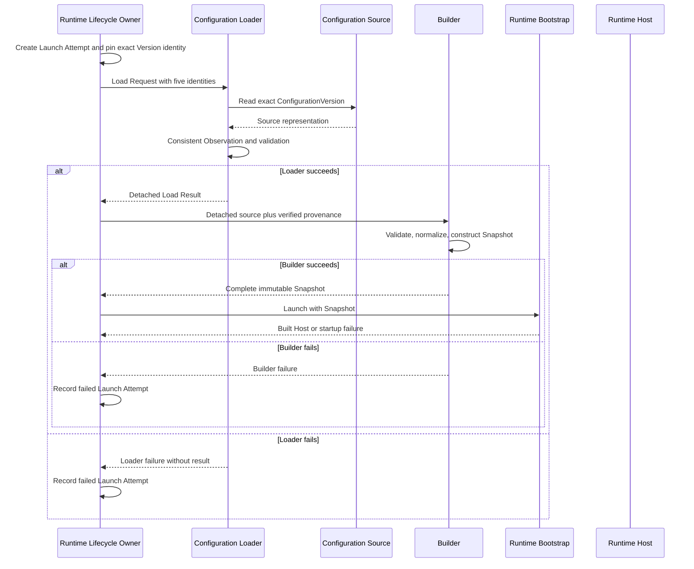

# DP-007: Configuration Loader Contract

[Russian version](../../ru/design/DP-007-configuration-loader-contract.md)

## 1. Status

**Status:** Draft

**Architecture status:** Implementation contract for the approved model in [ARCH-004](../architecture/ARCH-004-runtime-deployment-and-identity-model.md) and [ARCH-005](../architecture/ARCH-005-runtime-configuration-snapshot-and-loading-model.md)

This proposal does not introduce or revise architecture. It defines the engineering contract by which Runtime Lifecycle Owner obtains the exact Published ConfigurationVersion pinned by a Launch Attempt and hands detached source material to Builder.

## 2. Purpose

The repository has a ConfigurationVersion publication lifecycle, a Snapshot Builder, and Runtime Bootstrap, but no production boundary connecting them. Builder currently receives a prepared ConfigurationVersion, while Bootstrap receives a prepared Snapshot.

DP-007 defines that missing implementation contract:

```text
Runtime Lifecycle Owner
    -> Configuration Loader
    -> Builder
    -> Runtime Bootstrap
```

The proposal defines one Loader operation, its mandatory inputs, successful result, validation and failure boundaries, Builder handoff, dependency rules, and required acceptance proofs.

## 3. Sources of Authority

The normative architecture remains:

- [ADR-0002: Configuration DSL](../adr/0002-configuration-dsl.md);
- [ADR-0003: Runtime Architecture](../adr/0003-runtime-architecture.md);
- [ARCH-002: Runtime Foundation Freeze](../architecture/ARCH-002-runtime-foundation-freeze.md);
- [ARCH-004: Runtime Deployment and Identity Model](../architecture/ARCH-004-runtime-deployment-and-identity-model.md);
- [ARCH-005: Runtime Configuration Snapshot and Loading Model](../architecture/ARCH-005-runtime-configuration-snapshot-and-loading-model.md).

If this implementation proposal can be read more broadly than those documents, the narrower approved architectural contract prevails.

## 4. Scope

DP-007 defines:

- one Configuration Loader operation;
- the boundary between Runtime Lifecycle Owner, Loader, and Builder;
- the five mandatory existing identities carried by a load request;
- exact-version loading rather than current-version selection;
- consistent observation of source identity, lifecycle eligibility, schema identity, and payload;
- detached successful load result;
- Loader validation responsibilities;
- Loader failure categories and failure effects;
- guarantees and non-guarantees at the Builder handoff;
- ownership, immutability, concurrency, and dependency rules;
- acceptance proofs required before implementation approval.

DP-007 does not define:

- PostgreSQL schemas, queries, transactions, or drivers;
- HTTP resources or management API;
- YAML syntax or parsing rules;
- Runtime Instance or Launch Attempt persistence;
- Runtime Launcher implementation;
- management command or desired-state contracts;
- retry, fallback, replacement, rollback, or reconciliation policy;
- Configuration schema migration or version negotiation;
- Secret storage or changes to Secret resolution and Authentication semantics;
- Snapshot reload or in-place replacement;
- Runtime Bootstrap, Host lifecycle, readiness, rollback, or shutdown changes;
- Go interfaces, method signatures, concrete structs, packages, or exported APIs.

## 5. Contract Terms

### Pinned Version

Pinned Version is the exact ConfigurationVersion identity already associated with one Launch Attempt by Runtime Lifecycle Owner. It is not an instruction to load whichever version is currently Published.

### Load Request

Load Request is the immutable set of existing declarative and operational identities required to obtain and verify the Pinned Version.

### Detached Load Result

Detached Load Result is a complete, source-independent representation of the exact Published ConfigurationVersion plus the verified identity and schema facts required by Builder. It contains no source handle or mutable source-owned memory.

### Consistent Observation

Consistent Observation is one source observation in which exact identity, Configuration ownership, Published eligibility, Configuration schema identity, and the complete declarative payload belong to the same ConfigurationVersion state.

The Source Boundary must guarantee all of the following for one Consistent Observation:

- Workspace, Configuration, and exact ConfigurationVersion identities and their ownership relationships are observed as one logical source state;
- ConfigurationVersion lifecycle state, schema identity and version, and the complete declarative payload describe that same exact version in that same logical source state;
- no field or relationship is combined from another version or another source observation;
- the observation either succeeds completely or fails without exposing partial material;
- the returned source representation remains stable after the observation even if publication or archival changes the source later.

These are contractual atomicity properties. DP-007 does not prescribe whether a source satisfies them through a transaction, lock, storage snapshot, immutable record, or another mechanism.

### Semantic Equivalence

Two Detached Load Results are semantically equivalent when:

- all five identities, ConfigurationVersion number, Published fact, and schema identity and version are equal;
- their decoded declarative domain values are equal, including ordering and absent-versus-present distinctions;
- neither contains source-specific metadata that can distinguish the originating adapters; and
- the same conforming Builder produces structurally equal Snapshots from both results or rejects both with the same Builder failure category.

Pointer identity, allocation layout, serialization bytes, source type, retrieval path, and source-internal metadata do not affect Semantic Equivalence.

## 6. Contract Overview

The complete operation is:

```text
receive Load Request
    -> load exact Pinned Version
    -> validate identity and source consistency
    -> verify Published eligibility
    -> preserve schema identity
    -> detach complete source material
    -> return Detached Load Result

or

receive Load Request
    -> return one Loader failure
    -> publish no result
```

Loader never returns both a successful result and a failure. It never returns a partial result.

## 7. Loader Operation

The single architectural operation is **Load Exact Published Configuration**.

The operation performs the following ordered responsibilities:

1. Receive one immutable Load Request from Runtime Lifecycle Owner.
2. Validate that every mandatory identity is present.
3. Address the exact ConfigurationVersion identity from the request.
4. Obtain the Configuration and ConfigurationVersion relationship through the configured source boundary.
5. Establish one Consistent Observation of identity, Published eligibility, schema identity, and complete payload.
6. Reject any identity, lifecycle, consistency, or source-integrity violation.
7. Detach all returned declarative material from source-owned mutable memory.
8. Return one complete Detached Load Result or one failure.

The Consistent Observation is the source-selection linearization point. Before it, no source is accepted for Runtime construction. After it, the operation is bound to the observed exact ConfigurationVersion and cannot be redirected by a later publication.

The operation does not:

- choose a Configuration or ConfigurationVersion;
- search for a latest, newest, or replacement Published Version;
- create Runtime Instance or Launch Attempt identity;
- change ConfigurationVersion lifecycle state;
- normalize Runtime configuration;
- build Snapshot or Runtime components;
- resolve Secret values;
- acquire Runtime resources;
- retry or fall back to another source or version.

## 8. Loader Inputs

Load Request contains exactly the following mandatory identities already defined by ARCH-004 and ARCH-005:

1. Workspace identity.
2. Configuration identity.
3. Exact ConfigurationVersion identity.
4. Runtime Instance identity.
5. Launch Attempt identity.

No new domain identity is introduced.

The identities have distinct purposes:

| Identity | Loader use |
| --- | --- |
| Workspace | Verify the requested Configuration ownership boundary |
| Configuration | Address and verify the declarative parent |
| ConfigurationVersion | Load the exact Pinned Version and prohibit redirection |
| Runtime Instance | Preserve the operational provenance established by Lifecycle Owner |
| Launch Attempt | Bind the result to the one attempt for which it was loaded |

Runtime Instance and Launch Attempt identities are not source-selection criteria. Loader does not query Configuration by those identities and does not validate their persistence state. It preserves them unchanged for Builder handoff.

Source access is an explicitly supplied Loader dependency, not a sixth request identity and not data passed onward to Builder or Runtime. The Source Boundary must supply the schema identity and version together with the exact source representation; these are representation metadata, not new domain identities. A source that cannot supply them fails source-integrity validation. Concrete source adapter construction is outside this proposal.

## 9. Successful Loader Output

On success, Loader returns one Detached Load Result containing the architectural facts required by Builder:

- the complete declarative payload of the exact ConfigurationVersion;
- Workspace identity from the verified request boundary;
- Configuration identity verified against both Workspace and loaded version;
- exact ConfigurationVersion identity;
- ConfigurationVersion number;
- the fact that the version was Published at the Consistent Observation;
- Configuration schema identity and version preserved from the source representation;
- Runtime Instance identity preserved from the request;
- Launch Attempt identity preserved from the request.

The result must be:

- complete;
- immutable by ownership after publication to the caller;
- detached from repository, transport, parser, cache, or adapter-owned mutable memory;
- independent of source type;
- sufficient for Builder to perform its own validation, normalization, provenance construction, and Snapshot construction without another source read.

The result does not contain:

- Repository, transaction, cursor, HTTP client, parser, or source adapter;
- source type, retrieval path, cache metadata, or load timestamp;
- Secret values or Secret Resolver;
- Snapshot, Bootstrap, Host, or Runtime component;
- desired state, actual state, retry policy, or management authority.

## 10. Loader Validation

Loader validation is limited to the load boundary.

For Loader, **representation completeness** means that the Source Boundary supplied every identity, ownership relation, lifecycle fact, schema fact, configured section, field, ordering relation, and absent-versus-present distinction required to reconstruct the selected ConfigurationVersion without truncation or source mixing. It does not mean that the decoded configuration is semantically valid or executable.

Loader must validate:

- presence of all five mandatory identities;
- Workspace-to-Configuration relationship;
- Configuration-to-ConfigurationVersion relationship;
- equality between requested and loaded ConfigurationVersion identity;
- Published eligibility at the Consistent Observation;
- availability and preservation of Configuration schema identity;
- completeness and integrity of the source representation required to hand it to Builder;
- absence of source mixing across versions or lifecycle observations.

Loader must not validate:

- whether the Configuration schema is supported by the current Builder;
- behavior-specific Listener, Authentication, Routing, or future section semantics;
- cross-field Runtime Snapshot invariants;
- Runtime normalization;
- startup capability support;
- Handler references against Runtime composition;
- Secret existence or Secret values;
- whether Runtime can acquire Listener or other resources.

Those responsibilities remain with Builder, Runtime component construction, or Bootstrap as established by ARCH-005.

For Builder, **semantic completeness** means that the detached declarative values satisfy the supported schema, domain and cross-field invariants required to construct a canonical Snapshot. A representation may therefore be complete for Loader and still be rejected by Builder.

Validation at Control Plane publication does not remove Loader's defensive identity and lifecycle checks. Loader validation does not remove Builder or Bootstrap validation. Builder must repeat the Published-state check against the fact carried by Detached Load Result; it does not reread the source. A missing or non-Published fact is a Builder failure because the Loader-to-Builder contract has been violated.

## 11. Failure Contract

Loader exposes architectural failure categories rather than storage-specific failures.

### Invalid Load Request

One or more mandatory identities are absent, or the request cannot represent the required identity closure.

### Source Unavailable

The configured source cannot complete the required read before it can expose the requested entities and their logical state. This category covers source access failure and does not imply that any requested identity is absent or mismatched. It does not define transport, storage, or retry behavior.

### Source Not Found

At least one requested Workspace, Configuration, or exact ConfigurationVersion does not exist in the Source Boundary's logical state. This category applies only when absence, rather than a conflicting relationship, is established.

### Identity Mismatch

The requested entities exist, but the loaded Configuration does not belong to the requested Workspace, the loaded ConfigurationVersion does not belong to the requested Configuration, or the loaded version identity differs from the Pinned Version. Existence with a conflicting relationship is Identity Mismatch, not Source Not Found.

### Version Not Published

The exact Pinned Version is not Published at the Consistent Observation. Loader must not substitute another Published Version.

### Inconsistent Source Observation

The source is reachable and the requested material is available, but the Source Boundary cannot prove that identity relationships, lifecycle state, schema identity, and payload belong to one logical source state of the exact ConfigurationVersion. This category is distinct from Source Unavailable because source access succeeded, and from Source Integrity Failure because the problem is cross-observation consistency rather than malformed material.

### Source Integrity Failure

The Source Boundary produced material, but its representation is malformed, lacks representation-complete fields or schema facts, or cannot preserve the domain payload required for Builder handoff. Semantically invalid but representation-complete configuration belongs to Builder validation, not this category.

For every Loader failure:

- no Detached Load Result is returned;
- Builder is not invoked;
- Bootstrap and Host are not invoked;
- no Snapshot or Runtime resource exists;
- the source is not mutated;
- no alternative source or version is selected;
- Runtime Lifecycle Owner remains responsible for recording a truthful failed Launch Attempt.

DP-007 does not define Go error types, wrapping, logging, redaction format, retry, or caller-facing management errors.

Unsupported Configuration schema and invalid Runtime configuration are Builder failures, not Loader failures, when schema identity and source representation were preserved successfully.

## 12. Builder Handoff

Runtime Lifecycle Owner hands the complete Detached Load Result to Builder together with no additional declarative source access.

Loader guarantees to Builder:

- exact pinned identity;
- verified Workspace and Configuration relationship;
- Published eligibility at the source-selection linearization point;
- one complete and internally consistent declarative payload;
- preserved Configuration schema identity and version;
- preserved Runtime Instance and Launch Attempt identities;
- detached ownership with no source-owned mutable aliases;
- no Secret values.

Loader does not guarantee to Builder:

- that the schema is supported;
- that all behavior-specific or cross-field invariants are valid;
- that normalization has been performed;
- that startup-critical capabilities are executable;
- that Handler references can be resolved;
- that referenced Secrets exist;
- that the version remains the current Published Version after linearization;
- that Bootstrap or Host startup will succeed.

Builder remains the authoritative Runtime normalization boundary. It defensively validates schema support, completeness and cross-field Snapshot invariants, constructs mandatory provenance, detaches its own output, and either returns one complete Snapshot or a Builder failure.

Builder must repeat the Published-state check using the fact in Detached Load Result. Successful Loader return is not a reason to remove this defensive check, and Builder must not reread the source to perform it.

Builder must not call Loader, source adapter, Repository, or management API.

## 13. Ownership, Immutability, and Lifetime

Ownership proceeds in one direction:

| Stage | Ownership |
| --- | --- |
| Runtime Lifecycle Owner | Owns Load Request and launch decision |
| Loader | Temporarily owns the load operation and source material being detached |
| Runtime Lifecycle Owner after success | Owns Detached Load Result |
| Builder | Borrows the result for construction and retains no source reference |
| Launch preparation | Owns the complete Snapshot returned by Builder |
| Bootstrap and Host | Existing ARCH-002/005 ownership applies |

Loader must not retain the request, Detached Load Result, source transaction, or source-owned reference after the operation returns. Copying or repeated reading of the result must not permit mutation of source state or another result.

The Detached Load Result lifetime ends after Builder has completed and launch preparation no longer needs it. It owns no Runtime resource and requires no explicit cleanup protocol.

## 14. Publication and Concurrency Semantics

The exact ConfigurationVersion identity in Load Request is immutable for the operation.

Concurrency rules are:

- concurrent publication cannot redirect the operation to another version;
- publication or archival before the Consistent Observation is reflected in eligibility validation;
- publication or archival after a successful Consistent Observation does not alter or invalidate the detached result;
- the payload cannot combine fields from different versions or different observations of one version;
- concurrent loads of the same request must produce semantically equivalent detached results or the same architectural failure category for the same observed source state;
- Loader does not serialize Runtime Instance lifecycle and does not create a second launch claim;
- different Runtime Instances may independently load the same exact Published ConfigurationVersion;
- Loader creates no mutable global state visible to Runtime.

Idempotency of management commands and persistence transactions remains outside this proposal. The Loader operation itself is read-only with respect to Configuration and operational identity.

The Loader operation must be safe for concurrent invocation. This requirement does not prescribe internal synchronization or instance construction.

## 15. Package Dependency Rules

The implementation must preserve the following dependency direction:

```text
Runtime Lifecycle Owner
    -> Configuration Loader contract
        -> configured source adapter boundary

Runtime Lifecycle Owner
    -> Builder
        -> detached declarative input

Runtime Lifecycle Owner
    -> Runtime Launcher / Bootstrap
        -> Snapshot only
```

Required rules:

- Runtime Services do not know Loader, Repository, HTTP, YAML, or PostgreSQL.
- Runtime Bootstrap accepts Snapshot and does not know Repository or Loader.
- Runtime Host owns Snapshot and does not know Loader or ConfigurationVersion history.
- Builder does not know Loader implementation or source adapters.
- Loader does not know Builder implementation, Bootstrap, Host, Listener, Session Manager, Router, or Authentication services.
- Loader source adapters do not receive Bootstrap or Runtime ownership.
- Repository and transport-specific errors do not become dependencies of Runtime packages.
- Secret Resolver is not a Loader dependency.
- No dependency cycle may connect Runtime packages back to Control Plane repositories.

The contract representation shared at the Builder handoff must be placed so that Loader can produce it and Builder can consume it without Builder importing a concrete Loader implementation and without Loader importing Builder. The concrete package layout remains an implementation decision, but it must make these dependency rules statically reviewable.

## 16. Interaction Sequence



Runtime Launcher remains the approved stateless boundary between Lifecycle Owner and Bootstrap. Its concrete implementation is outside DP-007.

## 17. Acceptance Proofs

The following are mandatory implementation properties. They are not test names and do not prescribe one testing technique.

### AP-001: Pinned Version Stability

One Loader operation can observe only the exact ConfigurationVersion identity present in its Load Request.

### AP-002: Failure Stops the Pipeline

Builder, Bootstrap, and Host are never invoked after Loader failure.

### AP-003: Repository Isolation

No Repository, source adapter, transaction, cursor, or management service is reachable from Builder output, Snapshot, Bootstrap, Host, or Runtime Services.

### AP-004: Source Equivalence

For the same five identities, ConfigurationVersion number, Published fact, schema, and decoded declarative domain values, equivalent source representations satisfy every Semantic Equivalence criterion in Section 5. Source type, serialization, retrieval path, allocation, and source metadata cannot change the observed result or its Builder outcome.

### AP-005: Concurrent Publication Cannot Redirect

Publishing another ConfigurationVersion cannot cause an in-progress or completed load to return that other version.

### AP-006: Published-Only Eligibility

Draft, Validated, and Archived versions cannot produce a successful Detached Load Result for a new operation.

### AP-007: Identity Closure

A successful result proves the Workspace-to-Configuration-to-exact-ConfigurationVersion relationship. It preserves Runtime Instance and Launch Attempt identities byte-for-byte or value-for-value according to their representation, without claiming to validate their persistence state or lifecycle.

### AP-008: Consistent Observation

Identity, Published state, schema identity, and payload in one successful result originate from one source observation of one version.

### AP-009: Detached Ownership

Mutation or replacement of source-owned memory after return cannot change a successful result, and mutation of caller-owned result memory cannot change source state.

### AP-010: No Partial Success

Every operation returns either one complete Detached Load Result or one failure, never both and never a partial result.

### AP-011: Builder Responsibility Preserved

Loader performs no Runtime normalization or Snapshot construction, and Builder performs no source access or version selection.

### AP-012: Secret Boundary Preserved

Neither Load Request nor Detached Load Result contains Secret values or Secret Resolver authority.

### AP-013: No Runtime Resource Acquisition

Loader success alone creates no Host, Listener, Runtime context, Session Manager, socket, or readiness state.

### AP-014: Repeated-Load Equivalence

Repeated successful loads whose Consistent Observations contain the same five identities, ConfigurationVersion number, Published fact, schema, and decoded declarative domain values satisfy every Semantic Equivalence criterion in Section 5. Pointer identity and allocation may differ; source state must remain unchanged.

### AP-015: Failure Ownership

A Loader failure returns control to Runtime Lifecycle Owner, which remains the only authority permitted to record Launch Attempt failure or choose a later management action.

## 18. Architecture Compatibility

### ARCH-002

DP-007 ends before Runtime Bootstrap. It does not change Host construction, startup transaction, readiness, rollback, shutdown, or Snapshot ownership.

### ARCH-004

Runtime Lifecycle Owner remains the only launch authority. It creates Launch Attempt, pins the exact ConfigurationVersion, invokes Loader, owns the Host reference, and records failure. Loader creates no operational identity and makes no management decision.

### ARCH-005

Loader obtains one exact Published source and returns detached material. Builder remains the normalization and Snapshot-construction boundary. Bootstrap and Host receive only Snapshot.

### ADR-0002

Published ConfigurationVersion remains the only declarative source of Runtime behavior. No alternate defaults or second Configuration model are introduced.

### ADR-0003

Runtime core and Runtime Services receive neither Loader nor Repository access. Snapshot remains the only Configuration input to Runtime execution.

## 19. Intentionally Deferred Questions

The following matters remain outside DP-007 and require a focused proposal or implementation contract before they are implemented:

- concrete source adapter contracts;
- PostgreSQL and other persistent repository behavior;
- YAML representation and parsing;
- Runtime Instance and Launch Attempt persistence;
- management commands, authorization, and idempotency;
- Runtime Launcher implementation;
- Configuration schema compatibility ranges, negotiation, and migration;
- retry, replacement, rollback, and reconciliation;
- operational diagnostics, logging, and error redaction;
- Loader cancellation, deadline, and caller-wait semantics;
- Secret resolution timing and value lifetime for consuming capabilities;
- reload and process recovery.

None of these may be implemented as hidden Loader behavior.

## 20. Decision

UWP implements Configuration loading through one operation: Load Exact Published Configuration.

Runtime Lifecycle Owner supplies the five existing identities of Workspace, Configuration, exact ConfigurationVersion, Runtime Instance, and Launch Attempt. Loader performs one consistent read of the exact pinned source, verifies identity and Published eligibility, preserves schema identity, detaches the complete declarative material, and returns either one complete Detached Load Result or one Loader failure.

Builder receives that result without source access, performs Runtime validation and normalization, constructs mandatory provenance, and produces the immutable Snapshot consumed by Bootstrap. Loader never selects another version, builds Snapshot, resolves Secrets, acquires Runtime resources, or becomes a lifecycle owner.
