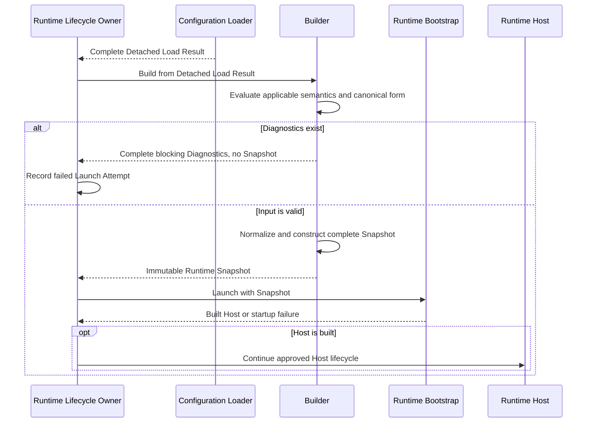

# DP-008: Snapshot Builder Contract

## 1. Status

**Status:** Draft

**Architecture status:** Implementation contract for the approved model in
[ARCH-004](../architecture/ARCH-004-runtime-deployment-and-identity-model.md)
and
[ARCH-005](../architecture/ARCH-005-runtime-configuration-snapshot-and-loading-model.md)

This proposal does not introduce or revise architecture. It defines the
engineering contract by which Builder transforms one complete
`DetachedLoadResult` into one complete immutable Runtime Snapshot or returns
blocking Diagnostics without a Snapshot.

## 2. Purpose

[DP-007](DP-007-configuration-loader-contract.md) defines how Runtime Lifecycle
Owner obtains the exact Published ConfigurationVersion pinned by one Launch
Attempt and receives a detached, source-independent result. ARCH-005 defines
Runtime Snapshot as the sole immutable configuration input to Runtime
Bootstrap and Runtime Host.

DP-008 defines the missing Builder contract between those boundaries:

```text
Configuration Loader
    -> Detached Load Result
    -> Builder
    -> immutable Runtime Snapshot
    -> Runtime Bootstrap
```

The proposal defines one Builder operation, its input and output boundaries,
semantic validation, normalization, Diagnostics, ownership, determinism,
dependency rules, Runtime Snapshot invariants, and required acceptance proofs.

## 3. Sources of Authority

The normative architecture remains:

- [ADR-0002: Configuration DSL](../adr/0002-configuration-dsl.md);
- [ADR-0003: Runtime Architecture](../adr/0003-runtime-architecture.md);
- [ARCH-002: Runtime Foundation Freeze](../architecture/ARCH-002-runtime-foundation-freeze.md);
- [ARCH-004: Runtime Deployment and Identity Model](../architecture/ARCH-004-runtime-deployment-and-identity-model.md);
- [ARCH-005: Runtime Configuration Snapshot and Loading Model](../architecture/ARCH-005-runtime-configuration-snapshot-and-loading-model.md);
- [DP-007: Configuration Loader Contract](DP-007-configuration-loader-contract.md).

If this implementation proposal can be read more broadly than those
documents, the narrower approved architectural contract prevails.

## 4. Scope

DP-008 defines:

- one Runtime Snapshot Builder operation;
- the handoff from `DetachedLoadResult` to Builder;
- the boundary between representation completeness and semantic completeness;
- complete semantic validation of Builder-owned rules;
- deterministic normalization into a canonical Runtime model;
- construction of one complete immutable Runtime Snapshot;
- preservation of declarative and operational provenance;
- generation of blocking Diagnostics;
- the exclusive success-or-failure result contract;
- ownership, detachment, immutability, atomicity, and determinism rules;
- dependency rules between Builder, Loader contract, Bootstrap, and Runtime;
- Runtime Snapshot invariants;
- acceptance proofs required before implementation approval.

DP-008 does not define:

- Configuration loading, source selection, or source adapters;
- Repository, PostgreSQL, HTTP, or YAML behavior;
- ConfigurationVersion publication or lifecycle mutation;
- Runtime Lifecycle Owner, Runtime Launcher, or management commands;
- Runtime Bootstrap implementation or Runtime startup;
- Runtime Host lifecycle, readiness, rollback, or shutdown changes;
- Runtime resource construction;
- Secret resolution or Secret value lifetime;
- Snapshot persistence, caching, serialization, or inspection API;
- hot reload, replacement, reconciliation, retry, or fallback;
- Go interfaces, method signatures, concrete structs, packages, or exported
  APIs.

## 5. Contract Terms

### Detached Load Result

Detached Load Result is the complete, immutable-by-ownership Loader output
defined by DP-007. It contains the exact declarative payload, verified
Published fact, schema identity, and the declarative and operational identities
required for Snapshot provenance.

Builder borrows this value for one Build operation. It does not acquire Loader,
Source, Repository, publication, or lifecycle authority.

### Runtime Snapshot

Runtime Snapshot is the complete, immutable, detached, execution-ready value
defined by ARCH-005 for one Runtime Host and one Launch Attempt.

Runtime Snapshot is a Runtime model. It is not ConfigurationVersion,
Configuration, Workspace, a Repository entity, a Control Plane DTO, or a
wrapper around any of those objects.

### Semantic Validation

Semantic Validation determines whether the detached declarative values and
provenance satisfy the supported schema, domain, cross-field, and complete
Runtime Snapshot invariants owned by Builder.

Semantic Validation does not repeat source access, publication selection,
representation decoding, or startup resource validation.

### Normalization

Normalization is the deterministic conversion of semantically valid
declarative values into one canonical Runtime representation. It may compute
pure derived values required by the Runtime model, but it does not create
Runtime resources or mutable operational state.

### Diagnostic

A Diagnostic is one blocking semantic violation discovered by Builder. It is
structured for downstream presentation by CLI, Web UI, or API without requiring
those consumers to reinterpret the Configuration domain.

### Semantic Equivalence

Two Detached Load Results are semantically equivalent for Builder when they
satisfy DP-007 Semantic Equivalence and carry equal declarative values, schema
facts, Published fact, and provenance identities relevant to Snapshot
construction. This definition applies whether those values are semantically
valid or invalid for Snapshot construction.

Two Runtime Snapshots are semantically equivalent when their effective Runtime
configuration, canonical ordering, absence-versus-presence semantics, Secret
References, pure derived structures, and complete provenance are equal.
Allocation layout and object address do not affect equivalence.

Two Diagnostics Sets are semantically equivalent when they contain the same
blocking semantic violations identified by the same rule identities and
logical locations. Presentation ordering, allocation layout, and object address
do not affect Diagnostics Set equivalence.

## 6. Contract Overview

The observable successful operation is:

```text
receive complete Detached Load Result
    -> evaluate handoff, schema, semantic, and normalization obligations
    -> construct complete Runtime model and provenance
    -> detach all Snapshot-owned values
    -> return immutable Runtime Snapshot
```

The observable failed operation is:

```text
receive Detached Load Result
    -> evaluate every applicable Builder-owned rule
    -> collect the deterministic blocking Diagnostics Set
    -> return Diagnostics
    -> publish no Runtime Snapshot
```

Builder has exactly two outcomes:

1. one complete Runtime Snapshot and no Diagnostics; or
2. one non-empty Diagnostics collection and no Runtime Snapshot.

Runtime Snapshot plus Diagnostics, partial Snapshot, recoverable Snapshot, and
Snapshot with deferred semantic validation are forbidden outcomes.

These flows define observable obligations and outcomes, not an internal
algorithm. Builder may interleave, repeat, or share any pure intermediate
calculation needed for semantic validation, normalization, Diagnostics, or
Snapshot construction. No intermediate calculation becomes an observable
Snapshot, Diagnostic, or Runtime resource.

## 7. Builder Operation

The single architectural operation is **Build Runtime Snapshot**.

The operation has the following observable responsibilities:

- receive one complete `DetachedLoadResult`;
- defensively verify the handoff facts required by DP-007 and ARCH-005;
- verify that the Configuration schema is supported by this Builder;
- evaluate every applicable semantic, cross-field, and normalization rule;
- collect all applicable blocking Diagnostics instead of stopping after the
  first independent violation;
- return the complete Diagnostics Set and no Snapshot when any Diagnostic
  exists;
- otherwise produce one canonical Runtime model, including permitted pure
  derived structures and complete provenance;
- detach all Snapshot-owned logical content from input-owned mutable memory;
- publish one complete immutable Runtime Snapshot.

This list does not prescribe phase order or internal control flow. Builder may
compute provisional canonical values or pure derived structures whenever they
are needed to determine semantic validity. Such computations are
operation-local and do not constitute a partial Snapshot.

The successful return is the Snapshot construction linearization point. Before
that return, no Snapshot is architecturally visible. After it, the complete
Snapshot is immutable and Builder retains neither input nor output.

The operation does not:

- load or select Configuration;
- call Loader, Source, Repository, or management API;
- mutate ConfigurationVersion or `DetachedLoadResult`;
- make launch, retry, replacement, or lifecycle decisions;
- invoke Bootstrap or construct Runtime components;
- resolve Secret values;
- acquire sockets or other Runtime resources;
- start goroutines, callbacks, or background work.

## 8. Builder Input

Builder receives exactly one complete `DetachedLoadResult` through the neutral
handoff contract defined after DP-007.

The input supplies:

- the complete declarative payload of the exact ConfigurationVersion;
- Workspace identity;
- Configuration identity;
- exact ConfigurationVersion identity and version number;
- the Published fact observed by Loader;
- Configuration schema identity and version;
- Runtime Instance identity;
- Launch Attempt identity.

Builder must defensively verify the input facts it requires for successful
construction, including:

- presence and internal consistency of required provenance;
- the Published fact carried by the handoff;
- supported Configuration schema;
- completeness needed for semantic validation and Snapshot construction.

Builder does not reread or re-establish:

- source existence;
- Workspace-to-Configuration repository ownership;
- the Loader Consistent Observation;
- whether this version remains the current Published version;
- Runtime Instance or Launch Attempt persistence state.

A Loader guarantee is not permission to omit defensive handoff validation.
Defensive validation must not turn Builder into a second Loader.

## 9. Runtime Snapshot Output

On success, Builder returns one Runtime Snapshot containing exactly the
architectural categories approved by ARCH-005:

1. complete effective behavior-affecting Runtime configuration for the
   supported component graph; and
2. complete stable declarative and operational provenance.

Runtime Snapshot must be:

- complete;
- immutable after successful construction;
- structurally independent of the Configuration domain model;
- detached from all input-owned mutable memory;
- canonical for semantically equivalent input;
- sufficient for Bootstrap and Runtime Services without source access;
- free of independently owned Runtime resources.

Runtime Snapshot must not contain:

- ConfigurationVersion, Configuration, or Workspace objects;
- Repository entities, Source adapters, Loader, or management services;
- HTTP, YAML, or persistence DTOs;
- ConfigurationVersion history or publication authority;
- Secret values or Secret Resolver;
- Runtime components, callbacks, contexts, goroutines, channels, locks,
  sockets, timers, or mutable operational state;
- desired or actual lifecycle state;
- Snapshot identity, Build identity, source metadata, or telemetry.

Concrete Runtime Snapshot field layout remains an implementation design matter.
It must not weaken the invariants in this proposal.

## 10. Provenance Contract

Runtime Snapshot has no independent business identity. Builder must not create
a Snapshot ID, Build ID, or another identity.

Snapshot preserves the identity closure already established for the selected
launch:

- Workspace identity;
- Configuration identity;
- exact ConfigurationVersion identity and version number;
- Configuration schema identity and version;
- Runtime Instance identity;
- Launch Attempt identity.

Provenance contains values, not Control Plane entities. It does not contain
source adapter type, load time, build time, duration, PID, Host pointer, socket
address, process identity, or other telemetry.

Builder may validate and copy provenance. It does not allocate, replace, or
reinterpret the identities supplied through the handoff.

## 11. Semantic Validation Boundary

Builder is the authoritative semantic validation boundary for Runtime Snapshot
construction.

Builder must validate:

- supported Configuration schema identity and version;
- completeness required by the supported Runtime model;
- domain semantics of supported behavior-affecting sections;
- cross-field and cross-section Runtime Snapshot invariants;
- uniqueness, ordering, reference, and absence-versus-presence rules owned by
  the supported Configuration semantics;
- the ability to construct every required canonical Runtime value and pure
  derived structure;
- preservation and internal consistency of mandatory provenance;
- the Published handoff fact required by DP-007.

Builder must evaluate every applicable semantic rule and collect all discovered
blocking violations. It must not stop at the first independent violation.

Semantic validation may use any operation-local pure normalization or derived
calculation required to evaluate a rule. The distinction between validation and
normalization defines responsibility and observable outcomes; it does not
require separate internal phases.

Builder must not validate:

- source availability or storage representation;
- repository ownership through another source read;
- publication history or current-version selection;
- persistence state of Runtime Instance or Launch Attempt;
- management authorization, desired state, or launch eligibility;
- Secret existence or Secret values;
- whether Listener, TLS, Authentication, or another Runtime resource can be
  constructed in the current environment;
- Runtime lifecycle, readiness, rollback, or shutdown.

Control Plane validation and Loader validation do not remove Builder's
defensive semantic responsibility. Builder acceptance semantics must not
contradict the approved Configuration domain.

Runtime Bootstrap retains startup-critical capability validation required by
ARCH-002 and ARCH-005. That validation concerns executable resource
construction, not Configuration semantic validity.

## 12. Normalization and Pure Derived Structures

Builder is the sole Runtime-boundary normalization authority.

Normalization must:

- be a pure function of the complete `DetachedLoadResult`;
- preserve approved Configuration semantics;
- produce canonical Runtime values;
- preserve significant ordering and absence-versus-presence distinctions;
- establish deterministic ordering where Configuration semantics define order
  independently from source representation;
- resolve declarative references only when resolution is a pure operation over
  the detached input;
- compute lookup tables, indices, inheritance results, and other derived
  structures only when they are immutable values fully determined by input;
- leave the input unchanged.

Builder must not create as part of normalization:

- goroutines;
- channels;
- mutexes or other synchronization primitives;
- sockets or network clients;
- timers;
- TLS configuration objects;
- compiled regular expressions;
- JWT validators;
- Authentication Providers;
- Router instances;
- Listener, Session Manager, or other Runtime objects.

Those objects belong to Runtime Bootstrap or the focused Runtime component
that owns their construction.

Bootstrap and Runtime Services must not repeat semantic normalization, create
source-specific defaults, or reinterpret a valid Snapshot. Bootstrap may only
perform the startup-critical checks and Runtime resource construction already
assigned to it.

## 13. Diagnostics Contract

Builder Diagnostics contain only blocking semantic violations. Warning and
informational diagnostics are outside this proposal.

Every Diagnostic must:

- identify one violated semantic rule in a machine-readable manner;
- identify the affected logical configuration location when the violation is
  location-specific;
- provide presentation text suitable for a human operator;
- contain no Secret value, source-owned object, Runtime resource, or mutable
  authority;
- remain meaningful without Repository, Loader, Bootstrap, or Runtime access.

The Diagnostics collection must:

- contain every blocking violation discoverable by evaluating all applicable
  semantic rules against the supplied detached input;
- not contain a Snapshot or partial Runtime model;
- be independent from traversal timing, source adapter, and allocation layout;
- be suitable for deterministic rendering by CLI, Web UI, and API layers;
- remain detached from input-owned mutable memory.

### Diagnostics Applicability

A semantic rule is **applicable** when:

- the rule belongs to the supported schema and configured section being
  evaluated;
- every prerequisite fact required to evaluate the rule is present and
  semantically usable; and
- evaluating the rule requires no assumption about a fact already rejected by
  another applicable prerequisite rule.

A **prerequisite rule** establishes a fact required by one or more dependent
rules. Failure of a prerequisite rule:

- produces its own blocking Diagnostic;
- makes only the rules that require the rejected fact inapplicable;
- does not suppress independent rules whose prerequisites remain satisfied.

Builder must suppress a cascading Diagnostic when that Diagnostic would report
only a consequence of an already reported failed prerequisite and cannot
identify an additional independently evaluable violation. Builder must not use
cascade suppression to omit an independent violation.

For one input and one approved semantic rule set, Builder must return one
deterministic Diagnostics Set:

- each applicable violated rule contributes one Diagnostic for each distinct
  logical location at which that violation exists;
- the same rule identity and logical location occur at most once;
- semantically equivalent invalid inputs produce semantically equivalent
  Diagnostics Sets;
- traversal order, allocation, and presentation ordering do not change Set
  membership;
- rules made inapplicable by failed prerequisites contribute no Diagnostic.

Builder must not log Diagnostics, publish them to an external system, record
Launch Attempt failure, or choose a management response. Runtime Lifecycle
Owner remains responsible for the failed launch outcome after Builder returns.

Exact Diagnostic code namespace, logical-location grammar, canonical ordering,
localization policy, and redaction presentation require an implementation
contract before coding.

**TODO:** Define those Diagnostics representation details without changing the
blocking-only semantic contract established here.

## 14. Result Atomicity and Failure Semantics

Builder publishes exactly one of:

- one complete immutable Runtime Snapshot; or
- one non-empty complete Diagnostics collection.

The following states are forbidden:

- Snapshot and Diagnostics returned together;
- partial Snapshot;
- recoverable or degraded Snapshot;
- Snapshot containing invalid sections to be checked by Bootstrap;
- Snapshot completed asynchronously after return;
- success followed by later Builder-owned failure.

On Builder failure:

- no Snapshot is returned or published;
- Bootstrap and Runtime Host are not invoked by Builder;
- no Runtime resource exists because of the Build operation;
- `DetachedLoadResult` remains unchanged;
- no fallback, retry, replacement, or schema downgrade occurs;
- Builder retains no input or Diagnostics-owned mutable reference;
- Runtime Lifecycle Owner remains responsible for recording the truthful failed
  Launch Attempt.

Diagnostics publication to the caller is the failure linearization point. No
observer may obtain a partially validated or partially normalized Snapshot.

## 15. Snapshot Invariants

### Identity Invariants

- Runtime Snapshot has no independent identity.
- Snapshot preserves Workspace, Configuration, exact ConfigurationVersion,
  Runtime Instance, and Launch Attempt identities.
- Snapshot preserves ConfigurationVersion number and Configuration schema
  identity and version.
- Builder creates, replaces, or rebinds none of those identities.

### Structural Invariants

- Snapshot contains a Runtime model, not Configuration domain objects.
- Snapshot contains effective Runtime configuration and provenance only.
- Every supported Runtime section required for execution is structurally
  complete.
- No Repository, Source, Loader, DTO, history, or mutable authority is
  reachable from Snapshot.

### Semantic Invariants

- Every Snapshot value satisfies the supported Configuration and cross-field
  rules owned by Builder.
- Unsupported schema and semantically invalid input cannot produce Snapshot.
- Secret References may be preserved; Secret values cannot enter Snapshot.
- Bootstrap does not receive unresolved semantic violations.

### Normalization Invariants

- Snapshot uses one canonical representation for semantically equivalent
  input.
- Significant ordering and absence-versus-presence distinctions are preserved.
- Derived structures are immutable and determined solely by input.
- No source-specific or hidden Runtime defaults alter Configuration semantics.

### Ownership Invariants

- Builder borrows the input and retains no reference after return.
- Successful Snapshot has no mutable alias to input-owned logical content.
- Builder retains no Snapshot ownership after return.
- Snapshot readers cannot mutate another reader's logical view.

### Runtime Independence

- Snapshot construction acquires no Runtime resource.
- Snapshot contains no Runtime object or mutable operational state.
- Runtime Services never need Loader, Source, Repository, or Configuration
  history to interpret Snapshot.

### Determinism

- Semantically equivalent valid inputs produce semantically equivalent
  Snapshots.
- Repeated Build operations do not depend on traversal timing, allocation,
  process state, source type, or external mutable state.

### Completeness

- Every supported behavior-affecting input value is either represented in the
  Snapshot according to approved semantics or causes blocking Diagnostics.
- Snapshot is sufficient for Bootstrap without another declarative source
  read.
- No supported semantic obligation is deferred to Runtime Services.

### Atomicity

- Snapshot becomes visible only after complete successful construction.
- Failure publishes Diagnostics and no Snapshot.
- No observer can access intermediate validation, normalization, or
  construction state.

## 16. Ownership, Immutability, and Lifetime

Ownership proceeds in one direction:

| Stage | Ownership |
| --- | --- |
| Runtime Lifecycle Owner | Owns launch preparation and Detached Load Result |
| Builder | Borrows input and owns only the synchronous Build operation |
| Runtime Lifecycle Owner after success | Owns the complete Runtime Snapshot |
| Runtime Launcher / Bootstrap | Borrows or accepts Snapshot under ARCH-005 ownership transfer |
| Runtime Host | Owns its independent immutable Snapshot for Host lifetime |
| Runtime Services | Read only |

Builder must not retain:

- `DetachedLoadResult`;
- any input-owned mutable reference;
- Diagnostics after failure return;
- Runtime Snapshot after success return;
- a cache or registry of earlier Build operations.

Snapshot becomes immutable at successful construction. Its value lifetime
continues according to ARCH-005 through launch preparation, Bootstrap, Host,
and permitted Runtime readers. It has no cleanup protocol because it contains
no Secret values or independently owned Runtime resources.

## 17. Determinism and Concurrency

Builder output must depend only on the complete input and approved semantic
rules.

The determinism rules are:

- semantically equivalent valid inputs produce semantically equivalent
  Snapshots;
- repeated builds from equivalent inputs do not accumulate state;
- publication or source changes after Loader success cannot affect Build;
- Builder reads no clock, random source, environment, global registry,
  Repository, network service, or Runtime state;
- pure derived structures are computed identically for equivalent input;
- input ordering is preserved or canonicalized only as required by approved
  Configuration semantics.

Builder contains no mutable operation state that survives a Build. Independent
Build operations share no partially constructed Snapshot or Diagnostics state.
The contract introduces no synchronization object or background execution.

The exact concurrency API and caller-wait semantics are outside this proposal.
Nothing in an implementation may weaken deterministic isolation between
independent Build operations.

## 18. Dependency Rules

The required dependency direction is:

```text
Runtime Lifecycle Owner
    -> neutral Loader handoff contract
        -> Builder
            -> immutable Runtime Snapshot

Runtime Lifecycle Owner
    -> Runtime Launcher / Bootstrap
        -> immutable Runtime Snapshot
```

Builder consumes only the neutral Loader handoff contract. It does not import
or depend on concrete Configuration Loader implementation. The current
repository realizes that neutral contract in `internal/runtimeconfigload`;
this path is an implementation fact, not a normative package-layout
requirement of DP-008.

Required rules:

- Builder does not know Loader implementation or Source adapters.
- Builder does not know Repository, PostgreSQL, HTTP, YAML, or Configuration
  services.
- Builder does not know Runtime Bootstrap, Runtime Host, Listener, Session
  Manager, Router implementation, or Runtime Services.
- Builder does not know Secret Resolver.
- Loader does not import or invoke Builder.
- Runtime Bootstrap accepts Runtime Snapshot and does not receive
  `DetachedLoadResult`.
- Runtime Host and Runtime Services receive neither Builder nor Loader
  authority.
- No dependency cycle may connect Runtime Snapshot construction back to
  Control Plane repositories.

This proposal defines dependency responsibilities, not package layout.

## 19. Interaction Sequence



Builder invokes neither Loader nor Bootstrap. Runtime Lifecycle Owner preserves
the approved pipeline and owns all management outcomes.

## 20. Acceptance Proofs

The following are mandatory implementation properties. They are not test names
and do not prescribe one testing technique.

### AP-001: Builder Determinism

Semantically equivalent valid `DetachedLoadResult` values produce semantically
equivalent Runtime Snapshots independently of allocation, invocation order,
source adapter, and process-local incidental state.

### AP-002: Runtime Model Independence

No ConfigurationVersion, Configuration, Workspace, Repository entity, Control
Plane DTO, or source-specific representation is reachable from Runtime
Snapshot.

### AP-003: Semantic Validation Boundary

Every supported semantic and cross-field rule owned by Builder is evaluated
before success, while source access, Secret resolution, resource construction,
and lifecycle decisions remain outside Builder.

### AP-004: Snapshot Completeness

Every successful Runtime Snapshot contains all supported effective Runtime
configuration and mandatory provenance required by Bootstrap without another
declarative source read.

### AP-005: No Partial Snapshot

Any blocking semantic violation produces no Runtime Snapshot, and no observer
can obtain intermediate or recoverable Snapshot state.

### AP-006: Diagnostics Completeness

For invalid input, the returned Diagnostics identify every blocking violation
from every applicable Builder-owned semantic rule, suppress only cascading
consequences of failed prerequisite rules, and contain every independent
violation exactly once per distinct logical location.

### AP-007: Snapshot Immutability

No mutation of caller-owned input after Build can alter a successful Snapshot,
and no Snapshot reader can mutate another reader's logical view.

### AP-008: Ownership Isolation

Builder retains neither input, Diagnostics, nor Snapshot after return, and no
mutable logical content is shared between independent Build results.

### AP-009: Normalization Completeness

Every successful Snapshot represents all supported input through one canonical
Runtime form, preserving significant order and absence semantics and applying
no source-specific or hidden defaults.

### AP-010: Runtime Independence

Build success alone creates no Runtime component, goroutine, channel, lock,
socket, timer, TLS configuration, validator, context, readiness state, or other
Runtime resource.

### AP-011: Bootstrap Responsibility

Builder returns only semantically complete Snapshot values; Bootstrap performs
startup-critical capability validation and resource construction without
repeating Configuration semantic validation or normalization.

### AP-012: Identity Preservation

Every successful Snapshot preserves the complete declarative and operational
provenance from `DetachedLoadResult` without creating Snapshot or Build
identity.

### AP-013: Semantic Equivalence

Equivalent source representations satisfying DP-007 Semantic Equivalence
produce semantically equivalent Snapshot values or semantically equivalent
deterministic Diagnostics Sets for the same invalid semantics.

### AP-014: Repeated Build Equivalence

Repeated successful Builds from semantically equivalent input produce
semantically equivalent, independently owned Snapshots and do not mutate input
or retain operation state.

### AP-015: Snapshot Authority

Builder is the sole construction authority for Runtime Snapshot; Loader,
Bootstrap, Runtime Host, and Runtime Services neither complete, normalize,
repair, nor mutate Snapshot.

## 21. Architecture Compatibility

### ADR-0002

ConfigurationVersion remains the only declarative source of Runtime behavior.
Builder creates a detached Runtime representation rather than a second
Configuration language, and it introduces no hidden behavior-affecting input.

### ADR-0003

Runtime continues to consume one immutable Configuration Snapshot through
explicit composition. Builder receives no HTTP or Repository dependency and
constructs no Runtime service.

### ARCH-002

DP-008 ends before Runtime Bootstrap. It does not change Host composition,
startup transaction, readiness, Admission Gate, rollback, shutdown, or
lifecycle.

### ARCH-004

Builder creates no Runtime Instance, Launch Attempt, desired state, actual
state, or management decision. It preserves the identities already owned by
Runtime Lifecycle Owner.

### ARCH-005

Builder remains the unique semantic validation, normalization, detachment, and
Snapshot-construction boundary. Snapshot remains the immutable Runtime input
owned according to the approved one-way lifetime.

### DP-007

Builder consumes the complete neutral `DetachedLoadResult`, repeats only the
defensive handoff checks assigned to it, performs no source access, and returns
either complete Snapshot or Builder-owned Diagnostics.

## 22. Intentionally Deferred Questions

The following matters remain outside DP-008:

- Configuration schema compatibility ranges, negotiation, and migration;
- Runtime Bootstrap and Runtime Launcher implementation;
- Runtime startup and startup error contract;
- Secret resolution timing and Secret value lifetime;
- Snapshot persistence, cache, serialization, inspection, and transport;
- hot reload, replacement, reconciliation, retry, fallback, and recovery;
- Warning and informational Diagnostics;
- operational logging, metrics, and diagnostics storage;
- management API representation of Build outcomes.

None of these may be implemented as hidden Builder behavior.

## 23. Implementation Prerequisites

The approved architecture does not yet specify:

1. the exact supported Configuration schema identity and compatibility rule;
2. the complete Runtime Snapshot field layout and section-specific
   normalization rules;
3. the exact structured Diagnostics representation and canonical ordering.

**TODO:** Resolve these three implementation contracts through focused review
before coding Builder. Their resolution must refine this proposal without
changing the ownership, validation, atomicity, or Runtime-independence model.

## 24. Decision

UWP constructs Runtime Snapshot through one Builder operation over the neutral
`DetachedLoadResult`.

Builder is the sole semantic validation, normalization, and Runtime Snapshot
construction authority. It evaluates all applicable semantic violations,
returns either one complete immutable Runtime Snapshot or complete blocking
Diagnostics, preserves mandatory provenance without creating new identity,
and constructs no Runtime resource.

Runtime Snapshot is a detached Runtime model, not ConfigurationVersion or a
Control Plane entity. It contains only complete effective Runtime configuration
and provenance, remains immutable after successful construction, and is
deterministic for semantically equivalent input. Bootstrap receives only a
semantically complete Snapshot and remains responsible for startup-critical
capability validation and Runtime resource construction.
