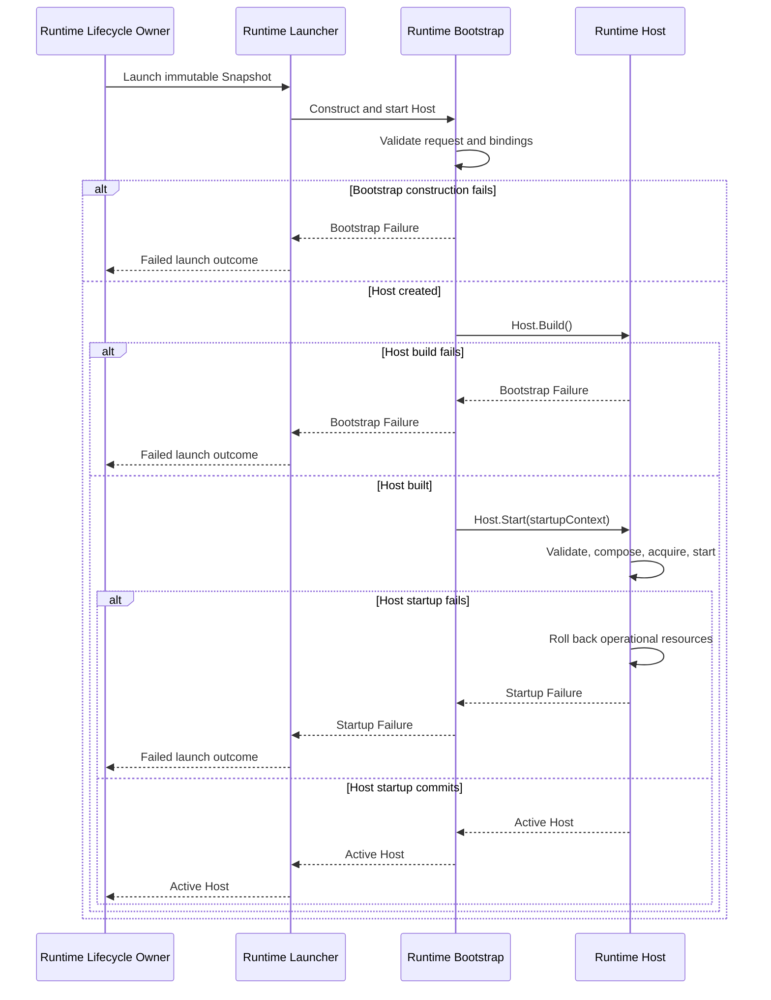

# DP-009: Runtime Bootstrap Contract

## 1. Status

**Design Status:** Draft

**Implementation Status:** Planned

This proposal describes a future implementation contract. It does not claim
that the Loader-to-Builder-to-Launcher pipeline is implemented.

The focused implementation-prerequisites refinement is complete. The Runtime
Bootstrap implementation and its production integration remain planned.

## 2. Purpose

Define the engineering boundary by which the stateless Runtime Launcher invokes
Runtime Bootstrap with one concrete request, and Bootstrap creates at most one
Host and synchronously invokes `Host.Start()` at most once.

Host remains the sole production composition root and sole owner of the
operational startup transaction.

## 3. Sources of Authority

The normative architecture remains:

- [ADR-0002: Configuration DSL](../adr/0002-configuration-dsl.md);
- [ADR-0003: Runtime Architecture](../adr/0003-runtime-architecture.md);
- [ARCH-002: Runtime Foundation Freeze](../architecture/ARCH-002-runtime-foundation-freeze.md);
- [ARCH-004: Runtime Deployment and Identity Model](../architecture/ARCH-004-runtime-deployment-and-identity-model.md);
- [ARCH-005: Runtime Configuration Snapshot and Loading Model](../architecture/ARCH-005-runtime-configuration-snapshot-and-loading-model.md);
- [DP-007: Configuration Loader Contract](DP-007-configuration-loader-contract.md);
- [DP-008: Snapshot Builder Contract](DP-008-snapshot-builder-contract.md).

If this Draft can be read more broadly than an Approved, Active, or Frozen
source, the narrower higher-authority contract prevails.

## 4. Scope

DP-009 defines:

- one synchronous Bootstrap operation;
- Bootstrap input and output;
- the Launcher-to-Bootstrap boundary;
- static construction-input validation;
- explicit dependency binding;
- Host creation;
- synchronous delegation to `Host.Start()`;
- separation of Bootstrap failure from Host startup failure;
- ownership, cleanup, dependency, and acceptance-proof rules.

DP-009 does not define:

- Configuration loading or Snapshot construction;
- Runtime Instance or Launch Attempt persistence;
- Runtime Launcher implementation;
- Host internals or public API changes;
- operational composition, startup validation, resource acquisition, startup
  rollback, readiness, Admission Gate, shutdown, retry, or replacement policy;
- Repository, PostgreSQL, HTTP, YAML, or management API behavior.

## 5. Contract Terms

### Runtime Bootstrap

Runtime Bootstrap is a construction boundary. It receives one concrete request,
checks only its static representation, binds fixed dependencies, creates and
builds one Host, and invokes `Host.Start()` at most once.

Bootstrap is not a production composition root, resource owner, lifecycle
owner, registry, or management authority.

### Runtime Launcher

Runtime Launcher is the stateless boundary defined by ARCH-004. Runtime
Lifecycle Owner asks Launcher to perform one launch attempt. Launcher invokes
Bootstrap and returns its outcome without retaining Snapshot, Host, or
lifecycle state.

### Runtime Host

Runtime Host is the sole production composition root and lifecycle coordinator.
Only `Host.Start()` owns startup-critical validation, operational graph
composition, resource acquisition, component startup, rollback, readiness, and
the final startup result.

### Bootstrap Failure

Bootstrap Failure is a failure before `Host.Start()` begins: invalid static
construction input, missing required dependency binding, or inability to create
or build the unstarted Host value. It creates no operational Runtime resource.

### Startup Failure

Startup Failure is the final failed outcome returned by `Host.Start()` after
Host-owned rollback. Bootstrap relays it without reclassification as a
Bootstrap Failure.

## 6. Required Execution Flow

```text
Runtime Lifecycle Owner
    -> Runtime Launcher
        -> Runtime Bootstrap
            -> validate request
            -> validate dependency bindings
            -> create Host
            -> Host.Build()
            -> Host.Start()
                -> validate fully assembled Runtime configuration
                -> compose operational Runtime graph
                -> acquire and start operational resources
                -> commit or rollback
            -> return active Host or failure
        -> return launch outcome
    -> record Launch Attempt outcome
```

Runtime Lifecycle Owner does not call Bootstrap or `Host.Start()` directly.
Launcher does not create Host or compose the Runtime graph. Bootstrap does not
bypass Launcher and does not absorb Host startup ownership.

## 7. Bootstrap Operation

The single architectural operation is **Construct and Start Runtime Host**:

1. validate the concrete Bootstrap Request;
2. validate its concrete Dependency Bindings;
3. invoke the fixed production Host constructor at most once;
4. invoke `Host.Build()` at most once;
5. invoke `Host.Start(startupContext)` at most once;
6. return exactly one Success, Bootstrap Failure, or Startup Failure.

The order is fixed and fail-fast. A failed step prevents all later steps. The
operation is synchronous, contains no retry, and retains no request,
dependency, Host, or launch state after return.

`Host.Build()` performs only the existing non-operational transition from
Created to Built. A Build failure is a Bootstrap Failure. Operational resource
acquisition remains impossible before `Host.Start()` and belongs exclusively
to Host after Start begins.

## 8. Concrete Bootstrap Request

The request is one structurally complete value containing exactly:

| Field | Contract |
| --- | --- |
| Snapshot | One complete immutable architectural Runtime Snapshot, passed by value |
| Startup Context | One required non-nil startup context, borrowed only for the synchronous `Host.Start()` call and passed unchanged |
| Dependency Bindings | One fixed typed Dependency Bindings value defined by Section 11 |

Snapshot provenance is the only launch identity carried by the request. The
request must not duplicate Workspace, Configuration, ConfigurationVersion,
schema, Runtime Instance, or Launch Attempt identity outside Snapshot.

The startup context is not the Runtime lifetime context. Bootstrap borrows it,
passes the same context value to `Host.Start()`, and does not retain it. An
already-cancelled context is a valid static input. If Host refuses startup
because that context is cancelled, the result is Startup Failure rather than
Bootstrap Failure.

The request carries no Repository, Configuration Source, Loader, Builder,
publication, management, Runtime Lifecycle Owner, preconstructed Listener, or
operational Runtime graph authority. Dependency Bindings cannot override
Snapshot or act as a second declarative Configuration source.

## 9. Exclusive Bootstrap Outcome

The closed tagged outcome has exactly one of these forms:

| Outcome | Payload | Meaning |
| --- | --- | --- |
| Success | `ActiveHost` | `Host.Start()` succeeded and Host is Running |
| Bootstrap Failure | `Stage`, `Code`, optional `Cause` | Failure before `Host.Start()` was invoked |
| Startup Failure | required `Cause` | `Host.Start()` was invoked and returned failure after Host-owned rollback |

The outcome cannot contain both Host and failure. Success cannot contain a nil,
Built, unstarted, failed, or partially constructed Host. Bootstrap Failure and
Startup Failure publish no Host. No `PreparedRuntime`, partial-success, or
intermediate Host outcome exists.

## 10. Validation Boundary

Bootstrap performs exactly three static validation checks, in this order:

1. the request envelope and startup context are structurally present;
2. Snapshot is non-zero and contains all eight provenance facts:
   Workspace ID, Configuration ID, ConfigurationVersion ID and number, schema
   identity and version, Runtime Instance ID, and Launch Attempt ID;
3. the Dependency Bindings envelope is structurally present and its required
   Secret Resolver is present under Section 11.

After those validations succeed, Bootstrap executes the fixed production Host
constructor and then executes the created Host's non-operational `Build()`.
These are real execution steps, not static checks or dry runs. Constructor
failure and Build failure are the fourth and fifth failure points in the
global fail-fast precedence defined by Section 14. Bootstrap does not invoke
the constructor after an earlier validation failure, does not invoke Build
unless construction succeeded, and does not invoke Start unless Build
succeeded.

A nil or typed-nil startup context fails static input validation. An
already-cancelled but non-nil context passes static validation and reaches
`Host.Start()`.

Bootstrap does not validate:

- Configuration domain semantics owned by Builder;
- schema, Listener, TLS, Timeout, Authentication, or Routing semantics already
  owned by Builder and Snapshot;
- whether startup capabilities are executable;
- whether Listener, TLS, Authentication, or other operational resources can be
  acquired;
- whether the Runtime graph can start;
- readiness or lifecycle transitions.

Components may own focused startup validators. `Host.Start()` is the only
caller and coordinator of those validators for the fully assembled Runtime
configuration.

## 11. Concrete Dependency Bindings

Dependency Bindings is one fixed typed value, not a map, service locator, or
registry:

| Binding | Presence | Bootstrap contract |
| --- | --- | --- |
| Secret Resolver | Required, including when Authentication is disabled | Stable borrowed capability; Bootstrap never calls `Resolve` |
| Legacy Message Handler | Optional | Absence is explicit; Host composition alone decides whether it is needed |
| Terminal Error Reporter | Optional | Synchronous callback capability; Bootstrap never invokes it |

For the required Secret Resolver, nil and typed-nil both mean missing. For each
optional binding, nil and typed-nil both mean absent. Absence never selects a
fallback implementation.

Bindings carry no Runtime or Launch Attempt identity and no Loader, Builder,
Repository, publication, management, or lifecycle authority. Bootstrap passes
the selected stable capability references to Host without closing them.
External owners retain ownership; Host may retain only the references required
by its existing composition contract.

The production Host constructor is fixed and owned by Bootstrap rather than
supplied as a caller binding. An implementation may use a private immutable
factory seam only for tests. Binding must not introduce reflection-based
dependency injection, a global registry, hidden fallback, mutable shared
launch state, or operational graph construction.

## 12. Host Startup Boundary

`Host.Start()` exclusively:

- validates startup-critical capabilities;
- constructs the supported operational component graph;
- constructs and acquires Listener and other operational resources;
- starts Runtime components;
- owns the startup transaction;
- performs rollback after any startup failure;
- preserves startup and rollback error information;
- publishes Runtime context, readiness, admission, and Running only at commit.

Bootstrap may invoke this operation and relay its outcome. Invocation does not
transfer any of these responsibilities to Bootstrap or Launcher.

## 13. Cleanup and Rollback

Before `Host.Start()`, a failed Bootstrap invocation discards only its local
construction values. Those values are non-operational and require no cleanup
contract.

After `Host.Start()` begins, Host owns every operational resource acquired for
startup and all rollback. Bootstrap never calls `Host.Stop()`, performs
cleanup, retries, creates a second Host, or invokes Start again.

After successful startup, Runtime Lifecycle Owner owns the active Host
reference under ARCH-004. Bootstrap retains no ownership.

## 14. Structured Failure Contract

Bootstrap Failure and Startup Failure are mutually exclusive stages:

- Bootstrap Failure means Host startup was never invoked;
- Startup Failure means Host startup was invoked and returned only after its
  rollback contract completed.

Bootstrap uses this complete, ordered Bootstrap Failure registry:

| Precedence | Stage | Code | Fixed description |
| --- | --- | --- | --- |
| 1 | Input Validation | `invalid-startup-context` | Bootstrap startup context is missing |
| 2 | Input Validation | `invalid-snapshot` | Bootstrap Snapshot is invalid |
| 3 | Dependency Binding | `missing-secret-resolver` | Bootstrap Secret Resolver binding is missing |
| 4 | Host Construction | `host-construction-failed` | Runtime Host construction failed |
| 5 | Host Preparation | `host-build-failed` | Runtime Host build failed |

Validation is fail-fast and returns at most one Bootstrap Failure using the
first applicable pair. Missing optional bindings are not failures.

`Stage` and `Code` are the stable machine-readable Bootstrap failure identity.
Bootstrap Failure may have a cause; Startup Failure always has the cause
returned by `Host.Start()`. A failure directly unwraps its cause so
`errors.Is`, `errors.As`, and an existing `errors.Join` chain remain observable.
Bootstrap does not replace, flatten, stringify, or reclassify a Host startup
cause.

Every error after the actual call to `Host.Start()` begins is exclusively a
Startup Failure. Bootstrap performs no cleanup, Stop, retry, second Start, or
fallback after it.

Failure identity does not duplicate Runtime Instance or Launch Attempt
identity, which remains solely in Snapshot provenance. Bootstrap failure
descriptions are constant and contain no Snapshot values, Secret values,
dependency values, or cause text. This contract does not claim that a cause is
safe to log and does not define logging, serialization, operational
presentation, storage, or redaction.

Neither outcome selects another ConfigurationVersion, rebuilds Snapshot,
retries launch, or changes Launch Attempt identity. Runtime Lifecycle Owner
records the truthful Launch Attempt outcome.

## 15. Ownership

| Object | Before Bootstrap | During Bootstrap | After success |
| --- | --- | --- | --- |
| Bootstrap Request | Launcher boundary | Borrowed by synchronous invocation | Not retained |
| Runtime Snapshot | Lifecycle Owner | Passed by value for Host creation | Host owns its immutable value |
| Startup context | Caller | Borrowed and passed unchanged to `Host.Start()` | Not retained by Bootstrap |
| Stable dependency capabilities | External owners | Borrowed for binding; never closed by Bootstrap | Host retains required references; external ownership is unchanged |
| Host | Does not exist | Constructed and built by Bootstrap; startup owned by Host | Lifecycle Owner owns the sole active reference |
| Operational Runtime graph | Does not exist | Created and owned inside `Host.Start()` | Host |
| Listener | Does not exist | Created and owned inside `Host.Start()` | Host |
| Runtime context | Does not exist | Created at Host startup commit | Host |

Bootstrap retains none of these objects after return.

## 16. Lifecycle and Activation Boundary

Host startup commit is the only activation linearization point.

Before it:

- no active Host is published;
- Runtime context does not exist;
- readiness is false;
- admission is closed;
- operational failure is still subject to Host rollback.

After it:

- Host is Running;
- Runtime context exists;
- readiness and admission reflect the existing Host lifecycle;
- Runtime Lifecycle Owner may publish the active Host reference.

Bootstrap return does not create a second activation point.

## 17. Determinism and Concurrency

Before Start, Bootstrap follows the same fixed validation precedence and
binding order for the same request. It does not iterate a dependency map or
consult a global, registry, cache, environment fallback, or mutable shared
state.

One Bootstrap invocation constructs at most one Host, calls Build at most once,
and calls Start at most once. Bootstrap creates no goroutine or background
lifecycle. Concurrent invocations are independent. The result of
`Host.Start()` may depend on operational external conditions; this does not
weaken deterministic pre-Start behavior.

## 18. Dependency Rules

```text
Runtime Lifecycle Owner
    -> Runtime Launcher
        -> Runtime Bootstrap
            -> Runtime Host
```

- Launcher depends on the Bootstrap contract, not Host internals.
- Bootstrap depends on the fixed Host construction contract and fixed typed
  Dependency Bindings.
- Host does not depend on Launcher or Bootstrap.
- Bootstrap does not depend on Loader implementation, Builder implementation,
  Repository, HTTP, or Control Plane services.
- Bootstrap receives Snapshot rather than ConfigurationVersion or
  `DetachedLoadResult`.
- No dependency cycle may connect Host or Bootstrap back to Control Plane
  repositories.

## 19. Interaction Sequence



## 20. Acceptance Proofs

### AP-001: Single Composition Root

Only `Host.Start()` composes the production Runtime graph.

### AP-002: Single Startup Owner

Startup validation, operational acquisition, commit, and rollback are all
coordinated by Host.

### AP-003: Launcher Presence

Every production launch request passes through the stateless Runtime Launcher.
An isolated Bootstrap implementation cannot prove this integration property;
proof is required when Launcher, Lifecycle Owner, and production launch wiring
are implemented.

### AP-004: Bootstrap Boundary

Bootstrap validates static construction input, binds dependencies, creates at
most one Host, and performs no operational startup work itself.

### AP-005: At-Most-Once Build and Start

One Bootstrap operation constructs at most one Host, invokes `Host.Build()` at
most once, and invokes `Host.Start()` at most once.

### AP-006: No Partial Host Publication

Only an active Host whose startup committed can be returned successfully.

### AP-007: Failure Separation

Bootstrap Failure proves Start was not invoked; Startup Failure proves
Host-owned rollback completed before return. The structured outcome is
exclusive and preserves the original cause chain.

### AP-008: Snapshot Authority

Bootstrap and Host receive Snapshot without Loader, Builder, Repository, or
publication authority.

### AP-009: No Declarative Reinterpretation

Bootstrap neither normalizes Snapshot nor introduces a second declarative
configuration source.

### AP-010: Resource Ownership

Every operational resource created during startup is owned by Host and covered
by Host rollback.

### AP-011: Stateless Launcher

Launcher retains no Snapshot, Host, registry, or lifecycle state after the
launch call. An isolated Bootstrap implementation cannot prove this Launcher
property; proof is required by production integration.

### AP-012: Bootstrap Detachment

Bootstrap retains no Snapshot, Host, dependency, or launch state after return.

### AP-013: Activation Atomicity

No observer sees Running, readiness, admission, or Runtime context before Host
startup commit.

### AP-014: Dependency Direction

Neither Host nor Bootstrap gains Repository or Control Plane authority, and no
dependency cycle is introduced.

### AP-015: Planned-State Honesty

Until implementation is verified, project-state documentation identifies this
pipeline as planned rather than implemented.

### AP-016: Concrete Request

Bootstrap accepts exactly one Snapshot by value, one required non-nil startup
context, and one fixed typed Dependency Bindings value. No launch identity is
duplicated outside Snapshot provenance.

### AP-017: Fixed Binding Semantics

Secret Resolver is always required. Nil and typed-nil are treated identically
for required and optional bindings, optional absence selects no fallback, and
Bootstrap invokes neither Secret Resolver nor Terminal Error Reporter.

### AP-018: Validation Precedence

Every pre-Start failure selects at most one of the five ordered Stage/Code
pairs, and no optional-binding absence produces a failure.

### AP-019: Cause Preservation

Startup Failure directly unwraps the unchanged `Host.Start()` cause, including
`errors.Join` chains, and Bootstrap performs no post-Start cleanup, Stop, retry,
or reclassification.

### AP-020: Ownership and Independence

Bootstrap retains no request, context, dependency, Host, or launch state;
concurrent invocations share no Bootstrap-owned mutable state.

## 21. Architecture Compatibility

### ARCH-002

Host remains the sole production composition root and owner of startup
transaction, operational resources, rollback, readiness, and lifecycle.

### ARCH-004

Runtime Launcher remains mandatory and stateless. Runtime Lifecycle Owner uses
Launcher rather than invoking Bootstrap or Host directly.

### ARCH-005

Snapshot remains the sole immutable declarative Runtime input. Bootstrap
transfers an independent value to Host without source or publication authority.

### DP-007 and DP-008

Bootstrap receives neither Loader result nor Builder authority and performs no
source validation, semantic normalization, or Snapshot repair.

## 22. Intentionally Deferred Questions

The following remain outside DP-009:

- concrete Go types, signatures, and package layout;
- the private test-factory seam and production wiring details;
- Runtime Launcher implementation;
- Runtime Lifecycle Owner and Control Service integration;
- operational diagnostics, logging, serialization, storage, and redaction;
- retry, replacement, reconciliation, and persistence;
- Secret resolution timing where not already fixed by higher authority;
- process topology and remote launch transport.

None may be implemented as hidden Bootstrap behavior.

## 23. Implementation Prerequisites

The focused prerequisite refinement defines the concrete request semantics,
fixed binding set and nil behavior, ordered failure identity, exclusive outcome,
and cause preservation required before implementation.

This completes the design refinement prerequisite, not implementation or
production integration. Concrete Go types, signatures, package placement, the
private test seam, and production wiring remain for a separate implementation
task within Sections 7–18. AP-003 and AP-011 remain integration-gated.

## 24. Decision

UWP uses Runtime Launcher as the mandatory stateless launch boundary. Launcher
will invoke one synchronous Runtime Bootstrap operation with one concrete
request: Snapshot by value, required startup context, and fixed typed
Dependency Bindings. Bootstrap validates only static representation in a fixed
order, constructs at most one Host, calls Build at most once, and calls Start at
most once.

Host alone validates the fully assembled Runtime configuration, composes and
starts the operational graph, acquires resources, owns rollback, and publishes
startup success. Bootstrap returns exactly one Success, structured Bootstrap
Failure, or cause-preserving Startup Failure, publishes no partial Host,
performs no cleanup or retry, and retains no lifecycle state.
