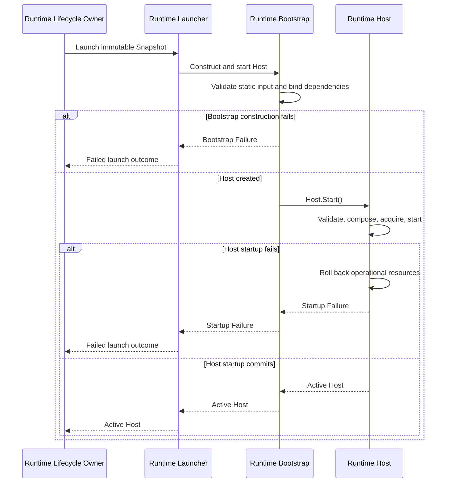

# DP-009: Runtime Bootstrap Contract

## 1. Status

**Design Status:** Draft

**Implementation Status:** Planned

This proposal describes a future implementation contract. It does not claim
that the Loader-to-Builder-to-Launcher pipeline is implemented.

## 2. Purpose

Define the engineering boundary by which the stateless Runtime Launcher invokes
Runtime Bootstrap with one immutable Runtime Snapshot, and Bootstrap creates
one Host and synchronously invokes `Host.Start()`.

Host remains the sole production composition root and sole owner of the
operational startup transaction.

## 3. Sources of Authority

The normative architecture remains:

- [ADR-0002: Configuration DSL](../adr/0002-configuration-dsl.md);
- [ADR-0003: Runtime Architecture](../adr/0003-runtime-architecture.md);
- [ARCH-002: Runtime Foundation Freeze](../architecture/ARCH-002-runtime-foundation-freeze.md);
- [ARCH-004: Runtime Deployment and Identity Model](../architecture/ARCH-004-runtime-deployment-and-identity-model.md);
- [ARCH-005: Runtime Configuration Snapshot and Loading Model](../architecture/ARCH-005-runtime-configuration-snapshot-and-loading-model.md);
- [DP-007: Configuration Loader Contract](DP-007-configuration-loader-contract.md);
- [DP-008: Snapshot Builder Contract](DP-008-snapshot-builder-contract.md).

If this Draft can be read more broadly than an Approved, Active, or Frozen
source, the narrower higher-authority contract prevails.

## 4. Scope

DP-009 defines:

- one synchronous Bootstrap operation;
- Bootstrap input and output;
- the Launcher-to-Bootstrap boundary;
- static construction-input validation;
- explicit dependency binding;
- Host creation;
- synchronous delegation to `Host.Start()`;
- separation of Bootstrap failure from Host startup failure;
- ownership, cleanup, dependency, and acceptance-proof rules.

DP-009 does not define:

- Configuration loading or Snapshot construction;
- Runtime Instance or Launch Attempt persistence;
- Runtime Launcher implementation;
- Host internals or public API changes;
- operational composition, startup validation, resource acquisition, startup
  rollback, readiness, Admission Gate, shutdown, retry, or replacement policy;
- Repository, PostgreSQL, HTTP, YAML, or management API behavior.

## 5. Contract Terms

### Runtime Bootstrap

Runtime Bootstrap is a construction boundary. It receives launch input, checks
its static representation, binds concrete dependencies, creates one Host, and
invokes `Host.Start()` exactly once.

Bootstrap is not a production composition root, resource owner, lifecycle
owner, registry, or management authority.

### Runtime Launcher

Runtime Launcher is the stateless boundary defined by ARCH-004. Runtime
Lifecycle Owner asks Launcher to perform one launch attempt. Launcher invokes
Bootstrap and returns its outcome without retaining Snapshot, Host, or
lifecycle state.

### Runtime Host

Runtime Host is the sole production composition root and lifecycle coordinator.
Only `Host.Start()` owns startup-critical validation, operational graph
composition, resource acquisition, component startup, rollback, readiness, and
the final startup result.

### Bootstrap Failure

Bootstrap Failure is a failure before `Host.Start()` begins: invalid static
construction input, missing required dependency binding, or inability to create
the unstarted Host value. It creates no operational Runtime resource.

### Startup Failure

Startup Failure is the final failed outcome returned by `Host.Start()` after
Host-owned rollback. Bootstrap relays it without reclassification as a
Bootstrap Failure.

## 6. Required Execution Flow

```text
Runtime Lifecycle Owner
    -> Runtime Launcher
        -> Runtime Bootstrap
            -> validate static construction input
            -> bind dependencies
            -> create Host
            -> Host.Start()
                -> validate fully assembled Runtime configuration
                -> compose operational Runtime graph
                -> acquire and start operational resources
                -> commit or rollback
            -> return active Host or failure
        -> return launch outcome
    -> record Launch Attempt outcome
```

Runtime Lifecycle Owner does not call Bootstrap or `Host.Start()` directly.
Launcher does not create Host or compose the Runtime graph. Bootstrap does not
bypass Launcher and does not absorb Host startup ownership.

## 7. Bootstrap Operation

The single architectural operation is **Construct and Start Runtime Host**:

1. receive one immutable Runtime Snapshot and required construction
   dependencies from Launcher;
2. validate static presence, identity, and representation of those inputs;
3. bind the selected implementations without creating operational resources;
4. create exactly one unstarted Host;
5. invoke `Host.Start()` exactly once;
6. return either the active Host, one Bootstrap Failure, or the Host Startup
   Failure.

The operation is synchronous. Bootstrap retains no launch state after return.

## 8. Inputs

Bootstrap receives:

- one complete immutable Runtime Snapshot;
- the fixed construction dependencies required to create Host;
- the startup context and launch-scoped inputs required by the existing Host
  contract.

Bootstrap does not receive:

- Repository or Configuration Source;
- Loader or Builder authority;
- publication history;
- Control Plane management authority;
- a preconstructed Listener or operational Runtime graph.

Any external construction configuration read by Bootstrap is limited to static
dependency wiring. It is not a second declarative Configuration source and
cannot override Runtime Snapshot.

## 9. Output

The operation returns exactly one outcome:

- the active Host whose startup commit completed;
- one Bootstrap Failure produced before `Host.Start()`; or
- one Startup Failure returned after Host-owned rollback.

No partially constructed, unstarted, or failed Host is published to Runtime
Lifecycle Owner. No separate `PreparedRuntime` handoff exists in this contract.

## 10. Validation Boundary

Bootstrap validates only:

- required construction inputs are present;
- their static identities and types are internally consistent;
- required dependency bindings can be selected without operational work;
- one Host can be created from those values.

Bootstrap does not validate:

- Configuration domain semantics owned by Builder;
- whether startup capabilities are executable;
- whether Listener, TLS, Authentication, or other operational resources can be
  acquired;
- whether the Runtime graph can start;
- readiness or lifecycle transitions.

Components may own focused startup validators. `Host.Start()` is the only
caller and coordinator of those validators for the fully assembled Runtime
configuration.

## 11. Dependency Binding

Bootstrap selects and binds the concrete implementations required by the Host
constructor. Binding is explicit and deterministic. It does not instantiate
the operational graph that Host composes during Start.

Binding must not introduce a service locator, reflection-based dependency
injection, global registry, hidden fallback, or mutable shared launch state.

## 12. Host Startup Boundary

`Host.Start()` exclusively:

- validates startup-critical capabilities;
- constructs the supported operational component graph;
- constructs and acquires Listener and other operational resources;
- starts Runtime components;
- owns the startup transaction;
- performs rollback after any startup failure;
- preserves startup and rollback error information;
- publishes Runtime context, readiness, admission, and Running only at commit.

Bootstrap may invoke this operation and relay its outcome. Invocation does not
transfer any of these responsibilities to Bootstrap or Launcher.

## 13. Cleanup and Rollback

Before `Host.Start()`, Bootstrap cleans up only Bootstrap-local construction
values that it created and did not transfer to Host. Such cleanup is not
operational startup rollback.

After `Host.Start()` begins, Host owns every operational resource acquired for
startup and all rollback. Bootstrap performs no duplicate cleanup or retry.

After successful startup, Runtime Lifecycle Owner owns the active Host
reference under ARCH-004. Bootstrap retains no ownership.

## 14. Failure Contract

Bootstrap Failure and Startup Failure are mutually exclusive stages:

- Bootstrap Failure means Host startup was never invoked;
- Startup Failure means Host startup was invoked and returned only after its
  rollback contract completed.

Neither outcome selects another ConfigurationVersion, rebuilds Snapshot,
retries launch, or changes Launch Attempt identity. Runtime Lifecycle Owner
records the truthful Launch Attempt outcome.

Concrete Go errors, wrapping, diagnostics presentation, retry, and persistence
remain outside this proposal.

## 15. Ownership

| Object | Before Bootstrap | During Bootstrap | After success |
| --- | --- | --- | --- |
| Runtime Snapshot | Lifecycle Owner | Borrowed for Host creation | Host owns its immutable copy |
| Construction dependencies | Launcher boundary | Borrowed for binding | Host owns required bindings |
| Host | Does not exist | Created by Bootstrap; startup owned by Host | Lifecycle Owner owns active reference |
| Operational Runtime graph | Does not exist | Created and owned inside `Host.Start()` | Host |
| Listener | Does not exist | Created and owned inside `Host.Start()` | Host |
| Runtime context | Does not exist | Created at Host startup commit | Host |

Bootstrap retains none of these objects after return.

## 16. Lifecycle and Activation Boundary

Host startup commit is the only activation linearization point.

Before it:

- no active Host is published;
- Runtime context does not exist;
- readiness is false;
- admission is closed;
- operational failure is still subject to Host rollback.

After it:

- Host is Running;
- Runtime context exists;
- readiness and admission reflect the existing Host lifecycle;
- Runtime Lifecycle Owner may publish the active Host reference.

Bootstrap return does not create a second activation point.

## 17. Determinism and Concurrency

For the same Snapshot, construction dependencies, and equivalent external
conditions, Bootstrap selects the same bindings and delegates the same startup
operation.

One Bootstrap invocation creates at most one Host and invokes its Start at most
once. Bootstrap contains no mutable global state, registry, cache, goroutine,
or background lifecycle. Concurrent invocations are independent.

## 18. Dependency Rules

```text
Runtime Lifecycle Owner
    -> Runtime Launcher
        -> Runtime Bootstrap
            -> Runtime Host
```

- Launcher depends on the Bootstrap contract, not Host internals.
- Bootstrap may depend on Host construction contracts and focused dependency
  factories.
- Host does not depend on Launcher or Bootstrap.
- Bootstrap does not depend on Loader implementation, Builder implementation,
  Repository, HTTP, or Control Plane services.
- Bootstrap receives Snapshot rather than ConfigurationVersion or
  `DetachedLoadResult`.
- No dependency cycle may connect Host or Bootstrap back to Control Plane
  repositories.

## 19. Interaction Sequence



## 20. Acceptance Proofs

### AP-001: Single Composition Root

Only `Host.Start()` composes the production Runtime graph.

### AP-002: Single Startup Owner

Startup validation, operational acquisition, commit, and rollback are all
coordinated by Host.

### AP-003: Launcher Presence

Every production launch request passes through the stateless Runtime Launcher.

### AP-004: Bootstrap Boundary

Bootstrap validates static construction input, binds dependencies, creates one
Host, and performs no operational startup work itself.

### AP-005: Start Exactly Once

One Bootstrap operation invokes `Host.Start()` at most once.

### AP-006: No Partial Host Publication

Only an active Host whose startup committed can be returned successfully.

### AP-007: Failure Separation

Bootstrap Failure proves Start was not invoked; Startup Failure proves
Host-owned rollback completed before return.

### AP-008: Snapshot Authority

Bootstrap and Host receive Snapshot without Loader, Builder, Repository, or
publication authority.

### AP-009: No Declarative Reinterpretation

Bootstrap neither normalizes Snapshot nor introduces a second declarative
configuration source.

### AP-010: Resource Ownership

Every operational resource created during startup is owned by Host and covered
by Host rollback.

### AP-011: Stateless Launcher

Launcher retains no Snapshot, Host, registry, or lifecycle state after the
launch call.

### AP-012: Bootstrap Detachment

Bootstrap retains no Snapshot, Host, dependency, or launch state after return.

### AP-013: Activation Atomicity

No observer sees Running, readiness, admission, or Runtime context before Host
startup commit.

### AP-014: Dependency Direction

Neither Host nor Bootstrap gains Repository or Control Plane authority, and no
dependency cycle is introduced.

### AP-015: Planned-State Honesty

Until implementation is verified, project-state documentation identifies this
pipeline as planned rather than implemented.

## 21. Architecture Compatibility

### ARCH-002

Host remains the sole production composition root and owner of startup
transaction, operational resources, rollback, readiness, and lifecycle.

### ARCH-004

Runtime Launcher remains mandatory and stateless. Runtime Lifecycle Owner uses
Launcher rather than invoking Bootstrap or Host directly.

### ARCH-005

Snapshot remains the sole immutable declarative Runtime input. Bootstrap
transfers an independent value to Host without source or publication authority.

### DP-007 and DP-008

Bootstrap receives neither Loader result nor Builder authority and performs no
source validation, semantic normalization, or Snapshot repair.

## 22. Intentionally Deferred Questions

The following remain outside DP-009:

- concrete Go interfaces and package layout;
- external construction-input representation;
- concrete dependency factories;
- Runtime Launcher implementation;
- operational diagnostics and redaction;
- retry, replacement, reconciliation, and persistence;
- Secret resolution timing where not already fixed by higher authority;
- process topology and remote launch transport.

None may be implemented as hidden Bootstrap behavior.

## 23. Implementation Prerequisites

Before implementation, focused work must define the concrete Bootstrap input,
dependency bindings, and failure representation without moving operational
startup responsibility out of Host.

## 24. Decision

UWP uses Runtime Launcher as the mandatory stateless launch boundary. Launcher
invokes one synchronous Runtime Bootstrap operation. Bootstrap validates static
construction input, binds dependencies, creates one Host, and invokes
`Host.Start()` exactly once.

Host alone validates the fully assembled Runtime configuration, composes and
starts the operational graph, acquires resources, owns rollback, and publishes
startup success. Bootstrap returns only the resulting active Host or failure
and retains no lifecycle state.
