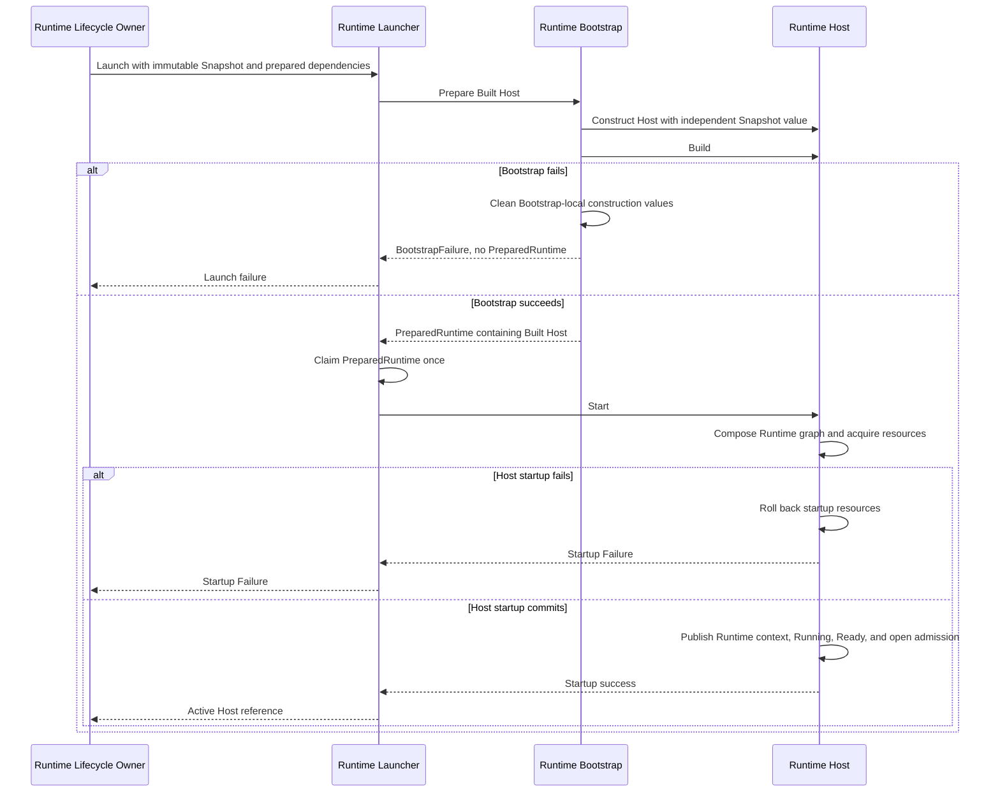

# DP-009: Runtime Bootstrap Contract

## 1. Status

**Status:** Draft

**Architecture status:** Implementation contract for the approved model in
[ARCH-002](../architecture/ARCH-002-runtime-foundation-freeze.md),
[ARCH-004](../architecture/ARCH-004-runtime-deployment-and-identity-model.md),
and
[ARCH-005](../architecture/ARCH-005-runtime-configuration-snapshot-and-loading-model.md)

This proposal does not introduce or revise architecture. It defines the
engineering contract by which Runtime Bootstrap prepares one Built Host from
one immutable Runtime Snapshot, publishes it as one one-shot
`PreparedRuntime`, and returns that package to the mandatory Runtime Launcher
boundary.

Runtime Host remains the only production composition root. Runtime Launcher,
not Bootstrap or Runtime Lifecycle Owner directly, consumes
`PreparedRuntime`, invokes `Host.Start()`, waits for the Host-owned startup
transaction, and returns either an active Host reference or startup failure to
Runtime Lifecycle Owner.

## 2. Purpose

[DP-007](DP-007-configuration-loader-contract.md) defines how Runtime
Lifecycle Owner obtains the exact Published ConfigurationVersion pinned by one
Launch Attempt. [DP-008](DP-008-snapshot-builder-contract.md) defines how
Builder transforms the detached source into one complete immutable Runtime
Snapshot.

DP-009 defines the next construction and launch handoff:

```text
Runtime Lifecycle Owner
    -> Configuration Loader
    -> Detached Load Result
    -> Snapshot Builder
    -> immutable Runtime Snapshot
    -> Runtime Launcher
    -> Runtime Bootstrap
    -> PreparedRuntime containing one Built Host
    -> Runtime Launcher
    -> Host.Start()
    -> Running Host
    -> Runtime Lifecycle Owner
```

Bootstrap completes only the transition from immutable Runtime Snapshot to
Built Host. It does not compose or activate the production Runtime graph.

Runtime Launcher is the stateless launch boundary that orchestrates Bootstrap
and the single Host startup attempt. Runtime Host performs dependency
composition, Runtime resource acquisition, Listener construction and startup,
startup rollback, and lifecycle publication inside `Host.Start()`.

## 3. Sources of Authority

The normative architecture remains:

- [ADR-0002: Configuration DSL](../adr/0002-configuration-dsl.md);
- [ADR-0003: Runtime Architecture](../adr/0003-runtime-architecture.md);
- [ARCH-002: Runtime Foundation Freeze](../architecture/ARCH-002-runtime-foundation-freeze.md);
- [ARCH-004: Runtime Deployment and Identity Model](../architecture/ARCH-004-runtime-deployment-and-identity-model.md);
- [ARCH-005: Runtime Configuration Snapshot and Loading Model](../architecture/ARCH-005-runtime-configuration-snapshot-and-loading-model.md);
- [DP-007: Configuration Loader Contract](DP-007-configuration-loader-contract.md);
- [DP-008: Snapshot Builder Contract](DP-008-snapshot-builder-contract.md).

If this implementation proposal can be read more broadly than those
documents, the narrower approved architectural contract prevails.

## 4. Scope

DP-009 defines:

- one Runtime Bootstrap operation that prepares one Built Host;
- the immutable Runtime Snapshot handoff to one Host;
- required Host construction dependencies;
- Host construction and the single `Host.Build()` transition;
- one complete `PreparedRuntime` around the Built Host;
- one-shot `PreparedRuntime` consumption;
- the mandatory Runtime Launcher boundary;
- separation between Bootstrap construction and Host startup;
- Bootstrap construction validation;
- Bootstrap-local cleanup and Bootstrap failure categories;
- Host-owned production composition, startup transaction, and rollback;
- ownership, atomicity, determinism, isolation, and dependency rules;
- acceptance proofs required before implementation approval.

DP-009 does not define:

- Configuration loading, source selection, or source adapters;
- Configuration semantic validation or normalization;
- Runtime Snapshot construction or mutation;
- ConfigurationVersion, Repository, HTTP, or Control Plane behavior;
- Runtime Instance or Launch Attempt creation, persistence, or management;
- desired state, actual state, or launch decisions;
- Runtime component graph design;
- Host lifecycle, startup transaction, rollback, readiness, or shutdown
  changes;
- Runtime execution, scheduling, supervision, or terminal observation;
- hot reload, replacement, reconciliation, retry, fallback, or degradation;
- concrete Secret Resolver behavior or Secret value lifetime;
- concrete Listener, Metrics, or other Runtime resource implementations;
- Go interfaces, method signatures, concrete structs, package layout, or
  exported APIs.

## 5. Contract Terms

### Runtime Snapshot

Runtime Snapshot is the complete immutable, detached Runtime model defined by
ARCH-005 and constructed under DP-008.

Runtime Lifecycle Owner owns the Snapshot during launch preparation. Bootstrap
accepts it for construction of exactly one Host and transfers an independent
immutable Snapshot value to that Host. Bootstrap retains no Snapshot after
return.

### Construction Dependency

A Construction Dependency is an explicitly supplied operational capability
required to create one Host and preserve the approved dependency injection
boundary.

Construction Dependencies are not Configuration and do not determine
behavior that belongs in Runtime Snapshot. They include no Repository,
Loader, Builder, HTTP, or Control Plane authority.

Construction Dependencies may be retained by the Built Host for later use
inside `Host.Start()`. Possession by the Host before Start does not mean that
the production Runtime graph has been composed or that a Runtime resource has
been acquired.

### Built Host

Built Host is one Runtime Host that:

- was constructed from one independent immutable Snapshot value;
- received all mandatory Host construction dependencies;
- completed `Host.Build()` successfully;
- is in the `Built` lifecycle state;
- has not entered `Starting`;
- owns no composed production Runtime graph;
- owns no acquired production Runtime resource;
- has no Listener, Runtime context, readiness, or open admission.

### PreparedRuntime

`PreparedRuntime` is one one-shot launch package around one Built Host for one
Launch Attempt.

It is a transfer capability between Bootstrap and Runtime Launcher. It is not
a Runtime graph, Runtime resource collection, Running Runtime, lifecycle
owner, composition root, or reusable template.

### Runtime Launcher

Runtime Launcher is the stateless launch boundary defined by ARCH-004.
Runtime Lifecycle Owner invokes it with prepared launch input. Launcher
orchestrates Bootstrap and exactly one `Host.Start()` attempt without acquiring
composition, management, or Runtime-resource ownership.

### BootstrapFailure

`BootstrapFailure` is the architectural failed outcome of preparing one Built
Host. It applies only before `PreparedRuntime` publication and does not
represent a `Host.Start()` failure.

### Startup Failure

Startup Failure is the failed result of `Host.Start()` after the Host-owned
startup transaction and rollback. Runtime Launcher returns it to Runtime
Lifecycle Owner. It is not a `BootstrapFailure`.

## 6. Authoritative Pipeline

The complete pipeline is:

```text
Runtime Lifecycle Owner
    -> pins one Launch Attempt and exact Published ConfigurationVersion
    -> invokes Configuration Loader
    -> receives Detached Load Result
    -> invokes Snapshot Builder
    -> receives immutable Runtime Snapshot
    -> invokes Runtime Launcher

Runtime Launcher
    -> invokes Runtime Bootstrap with Snapshot and Construction Dependencies

Runtime Bootstrap
    -> transfers an independent immutable Snapshot value to one new Host
    -> attaches required Construction Dependencies
    -> invokes Host.Build()
    -> returns PreparedRuntime containing the Built Host

Runtime Launcher
    -> consumes PreparedRuntime once
    -> invokes Host.Start()
    -> waits for Host startup transaction
    -> returns active Host reference or Startup Failure

Runtime Lifecycle Owner
    -> owns the active Host reference or records truthful launch failure
```

No stage may be bypassed:

- Lifecycle Owner does not call Bootstrap as a substitute for Launcher;
- Lifecycle Owner does not consume `PreparedRuntime` or call `Host.Start()`
  directly;
- Bootstrap does not call `Host.Start()`;
- Launcher does not compose the Runtime graph;
- Host does not load or build Snapshot.

## 7. Bootstrap Operation

The single architectural Bootstrap operation is **Prepare Built Host**.

The operation has the following observable responsibilities:

1. Receive one immutable Runtime Snapshot and the required Construction
   Dependencies from Runtime Launcher.
2. Validate the Snapshot handoff and presence of mandatory Construction
   Dependencies.
3. Create exactly one Runtime Host.
4. Transfer an independent immutable Snapshot value to that Host.
5. Attach the mandatory Construction Dependencies required by Host startup.
6. Invoke `Host.Build()` exactly once.
7. Verify that the Host reached `Built`.
8. Construct one `PreparedRuntime` around that Built Host.
9. Publish either the complete `PreparedRuntime` or one `BootstrapFailure`.
10. Retain no Snapshot, Host, dependency, package, or cleanup ownership after
    return.

The successful return is the Bootstrap publication linearization point.
Before it, no `PreparedRuntime` is visible outside Bootstrap. After it,
Runtime Launcher exclusively owns the one-shot package.

Bootstrap does not:

- construct the production Runtime component graph;
- perform production dependency composition;
- create or open Listener;
- acquire production Runtime resources;
- start goroutines or background workers;
- create Runtime context;
- open Admission Gate;
- publish Ready or Running;
- execute the Host startup transaction;
- roll back Host startup resources;
- call `Host.Start()`;
- make a launch or management decision;
- replace Runtime Launcher.

## 8. Bootstrap Input and Snapshot Handoff

Bootstrap receives:

1. one complete immutable Runtime Snapshot for one Launch Attempt; and
2. the mandatory Construction Dependencies required to create the Host.

Runtime Snapshot carries:

- effective Runtime configuration;
- Workspace identity;
- Configuration identity;
- exact ConfigurationVersion identity and version number;
- Configuration schema identity and version;
- Runtime Instance identity;
- Launch Attempt identity.

The ownership transfer is unambiguous:

1. Runtime Lifecycle Owner owns the complete Snapshot before launch.
2. Runtime Launcher carries the Snapshot through the stateless launch
   operation without becoming its long-lived owner.
3. Bootstrap accepts the Snapshot for exactly one Host construction.
4. Host receives an independent immutable Snapshot value.
5. Host owns that value throughout its lifecycle.
6. Bootstrap retains no Snapshot reference after return.
7. `PreparedRuntime` represents the Built Host with the Snapshot transfer
   already completed.

The Host-owned value must have no caller-owned mutable alias capable of
changing its logical content. Pointer identity, allocation identity, and
storage layout are not part of Snapshot identity.

Bootstrap does not receive:

- Loader, Source, Repository, or ConfigurationVersion;
- `DetachedLoadResult`;
- publication authority or Configuration history;
- HTTP or management service;
- desired state, actual state, or management authority.

## 9. PreparedRuntime Contract

On success, Bootstrap returns exactly one `PreparedRuntime`.

`PreparedRuntime` guarantees:

- exactly one Host exists;
- the Host owns an independent immutable Snapshot value;
- every mandatory Construction Dependency is attached;
- `Host.Build()` completed successfully exactly once;
- the Host lifecycle state is `Built`;
- the production Runtime graph has not been composed;
- production Runtime resources have not been acquired;
- Listener has not been created or opened;
- no background worker has been started;
- Runtime context does not exist;
- Admission Gate is closed;
- readiness is false;
- Runtime execution has not begun;
- the package belongs to exactly one Launch Attempt;
- Runtime Launcher can attempt to consume the package exactly once.

`PreparedRuntime` is not:

- a fully initialized Runtime graph;
- a collection of active Runtime resources;
- a Running Runtime;
- a second lifecycle owner;
- a production composition root;
- a reusable template;
- a cacheable package for another Launch Attempt.

The package contains no authority to alter Snapshot provenance, replace Host,
or rebind the package to another Runtime Instance or Launch Attempt.

## 10. PreparedRuntime One-Shot Consumption

Runtime Launcher is the only permitted `PreparedRuntime` consumer.

The first valid consumption:

- atomically claims the package;
- preserves its Runtime Instance and Launch Attempt binding;
- obtains the only Host reference authorized for the startup attempt;
- permits exactly one invocation of `Host.Start()`.

Any repeated, concurrent, or foreign consumption attempt must produce an
explicit rejection outcome.

That rejection:

- occurs without invoking `Host.Start()` again;
- creates no second Runtime execution;
- creates no second Host;
- changes no Snapshot or Launch Attempt identity;
- transfers no Host ownership;
- does not change the result of the valid consumption;
- is distinguishable from Bootstrap failure and Host Startup Failure.

Concurrent consumers may race to claim the package, but at most one succeeds.
All losing attempts complete with the same rejection category:
`PreparedRuntime Consumption Rejected`.

The concrete enforcement mechanism and concrete representation of the
rejection are implementation decisions. The one effective claim and its
observable rejection semantics are normative.

## 11. Runtime Launcher Contract

Runtime Launcher performs one stateless launch operation:

1. Receive prepared launch input from Runtime Lifecycle Owner.
2. Invoke Runtime Bootstrap.
3. Receive one `PreparedRuntime` or `BootstrapFailure`.
4. Return Bootstrap failure without invoking `Host.Start()` when preparation
   failed.
5. Consume successful `PreparedRuntime` exactly once.
6. Invoke `Host.Start()` exactly once.
7. Wait for the Host-owned startup transaction to return.
8. On success, return the active Host reference to Runtime Lifecycle Owner.
9. On failure, return Startup Failure after Host-owned rollback has returned.
10. Retain no Host, `PreparedRuntime`, Snapshot, or lifecycle state after
    return.

Runtime Launcher:

- is stateless between operations;
- owns no Runtime Instance or Launch Attempt identity;
- owns no desired or actual state;
- does not select Configuration or Snapshot;
- does not construct Runtime component graph;
- does not acquire or release production Runtime resources;
- does not execute startup rollback;
- does not decide retry, fallback, replacement, or launch policy;
- does not become a second Runtime Lifecycle Owner.

Launcher owns orchestration of the synchronous launch operation. Host owns
composition, startup transaction, Runtime resources, and lifecycle.

## 12. Bootstrap Construction Validation

Bootstrap validation is limited to preparation of one Built Host.

Bootstrap must validate:

- the Snapshot can be transferred as an independent immutable Host value;
- required Snapshot provenance is preserved during handoff;
- every mandatory Host Construction Dependency is present;
- Host construction accepts the Snapshot and Construction Dependencies;
- `Host.Build()` can complete;
- the resulting Host is in `Built`;
- no production Runtime resource or lifecycle publication occurred.

Bootstrap must not validate:

- Configuration source representation or publication state;
- Configuration schema semantics;
- behavior-specific or cross-field Snapshot invariants;
- Runtime normalization;
- whether the production Runtime graph can be composed;
- whether a startup capability can acquire its production resource;
- whether Listener can be opened;
- whether `Host.Start()` will succeed;
- management authorization or launch eligibility;
- desired or actual lifecycle state.

Loader owns source and publication validation. Builder owns semantic validation
and normalization. Host startup owns composition and startup capability
validation. Bootstrap repeats none of those responsibilities.

## 13. Host Composition and Startup Boundary

Runtime Host is the only production composition root.

Inside `Host.Start()` the Host:

- enters `Starting`;
- keeps Admission Gate closed and readiness false;
- constructs the production Runtime component graph;
- performs explicit dependency composition;
- creates Runtime objects;
- creates Listener;
- starts Listener;
- acquires required production Runtime resources;
- owns the startup transaction;
- rolls back acquired startup resources after failure;
- creates Runtime context after successful Listener startup;
- publishes the composed Runtime state only at startup commit;
- enters `Running`, opens Admission Gate, and becomes Ready at commit.

Bootstrap and Launcher do not duplicate any of these actions.

Host startup success is the Runtime activation linearization point. Before
commit, no Runtime component graph, Listener, Runtime context, open admission,
or readiness is published as Running. After commit, Host owns the active
Runtime graph and all Runtime resources.

## 14. BootstrapFailure Contract

`BootstrapFailure` is one immutable architectural result with:

- one bounded primary failure category;
- one bounded architectural failure location;
- a reason that identifies the failed Bootstrap obligation without Secret
  values or source-specific authority;
- one Bootstrap-local cleanup outcome;
- an optional bounded cleanup-anomaly fact when cleanup was not confirmed.

Primary failure categories are exactly:

1. `Snapshot Handoff Failure`;
2. `Missing Construction Dependency`;
3. `Host Construction Failure`;
4. `Host Build Failure`;
5. `Bootstrap Cleanup Anomaly`.

Architectural failure locations are exactly:

1. `Snapshot Handoff`;
2. `Construction Dependencies`;
3. `Host Construction`;
4. `Host Build`;
5. `Bootstrap Cleanup`.

The category and location must correspond:

| Category | Location |
| --- | --- |
| Snapshot Handoff Failure | Snapshot Handoff |
| Missing Construction Dependency | Construction Dependencies |
| Host Construction Failure | Host Construction |
| Host Build Failure | Host Build |
| Bootstrap Cleanup Anomaly | Bootstrap Cleanup |

Cleanup outcome is exactly one of:

- `Complete`: every Bootstrap-local value requiring cleanup reached its
  required unpublished state;
- `Anomalous`: at least one Bootstrap-local cleanup result could not be
  confirmed.

If cleanup anomaly follows another primary failure, the original primary
category, location, and reason are preserved and the cleanup-anomaly fact is
reported separately. `Bootstrap Cleanup Anomaly` is the primary category only
when cleanup is the first failed Bootstrap obligation.

Every `BootstrapFailure` guarantees:

- no `PreparedRuntime` was published;
- `Host.Start()` was not invoked;
- no production Runtime graph was composed;
- no Listener or production Runtime resource was created;
- no Runtime context, readiness, Running state, or open admission was
  published;
- Bootstrap retained no caller-visible mutable authority;
- control returned to Runtime Launcher.

`BootstrapFailure` does not define Go error types, stack traces, logging,
transport serialization, retry, or management response.

Host Startup Failure is outside this taxonomy.

## 15. Bootstrap Construction Cleanup

Bootstrap construction cleanup and Host startup rollback are different
responsibilities.

Bootstrap construction cleanup applies only before `PreparedRuntime`
publication. It covers:

- Bootstrap-local construction values;
- an unpublished Host that did not reach a publishable Built state;
- Construction Dependencies temporarily owned during Host construction;
- internal ownership records required to prevent partial publication.

Bootstrap construction cleanup:

- creates no production Runtime resource;
- never stops Listener because Listener does not yet exist;
- never cancels Runtime context because it does not yet exist;
- never performs Host startup rollback;
- completes before `BootstrapFailure` publication;
- reports `Complete` or `Anomalous` truthfully.

After successful `PreparedRuntime` publication, Bootstrap cleanup is no longer
permitted. The package and Built Host are owned by Runtime Launcher until
one-shot consumption.

Inside `Host.Start()`, the Host startup transaction owns:

- composed Runtime components;
- Listener;
- opened or partially opened production resources;
- reverse-order startup rollback;
- preservation of startup and rollback errors;
- prevention of Runtime publication before commit.

After startup commit, resource release is Host shutdown, not Bootstrap cleanup
or startup rollback.

## 16. Required Invariants

### Bootstrap Responsibility

- Bootstrap prepares one Built Host and nothing beyond Built.
- Bootstrap invokes `Host.Build()` exactly once and never invokes
  `Host.Start()`.
- Bootstrap does not compose the production Runtime graph.
- Bootstrap creates no Listener, Runtime context, worker, readiness, or open
  admission.

### PreparedRuntime

- Success publishes exactly one complete `PreparedRuntime`.
- The package contains exactly one Built Host for one Launch Attempt.
- The package exposes one effective consumption claim.
- The package is neither Runtime graph nor Runtime execution.

### Snapshot Ownership

- Lifecycle Owner owns Snapshot before launch.
- Bootstrap transfers an independent immutable Snapshot value to one Host.
- Host owns that value for its lifecycle.
- Bootstrap retains no Snapshot after return.
- No Snapshot handoff is reused across Launch Attempts or Hosts.

### Launcher Authority

- Runtime Launcher is mandatory between Lifecycle Owner and Bootstrap/Host.
- Launcher alone consumes `PreparedRuntime` and invokes `Host.Start()`.
- Lifecycle Owner does not call `Host.Start()` directly.
- Launcher retains no Host or lifecycle state after return.

### Host Authority

- Host is the only production composition root.
- Host owns startup transaction and startup rollback.
- Host publishes Running, Ready, Runtime context, Listener, and open Admission
  Gate only at successful startup commit.

### Failure and Cleanup

- Bootstrap failure publishes no `PreparedRuntime`.
- Host Startup Failure is not `BootstrapFailure`.
- Bootstrap cleanup covers no production Runtime resource.
- Bootstrap and Host rollback outcomes remain distinct.

### Atomicity

- No observer can obtain partially prepared `PreparedRuntime`.
- At most one consumer claims the package.
- No observer can obtain a partially published Running Host.

### Runtime Independence

- Bootstrap receives neither Loader nor Builder authority.
- Runtime graph receives no Repository, HTTP, or Control Plane authority.
- Snapshot remains the sole behavior-affecting Runtime input.

## 17. Ownership, Immutability, and Lifetime

Ownership proceeds as follows:

| Stage | Owner and responsibility |
| --- | --- |
| Launch preparation | Runtime Lifecycle Owner owns Snapshot and launch decision |
| Launcher before Bootstrap | Runtime Launcher owns only the synchronous launch operation |
| Bootstrap operation | Bootstrap owns Host construction and unpublished local values |
| PreparedRuntime publication | Runtime Launcher owns the one-shot package |
| Host.Start() before commit | Host owns composition, acquired resources, startup transaction, and rollback |
| Successful startup return | Runtime Lifecycle Owner owns the active Host reference; Host owns Snapshot and Runtime resources |
| Bootstrap failure | Runtime Launcher receives failure; no package or active Host exists |
| Startup failure | Runtime Launcher receives Host failure after Host-owned rollback |

Runtime Launcher never becomes the long-lived Host owner. Runtime Lifecycle
Owner never acquires Runtime-internal resource ownership. Host never acquires
Runtime Instance, Launch Attempt, desired-state, actual-state, or management
authority.

`PreparedRuntime` lifetime begins at successful Bootstrap publication and ends
when Runtime Launcher consumes or rejects the package. It cannot survive as a
reusable post-launch object.

## 18. Determinism, Equivalence, and Concurrency

Two Bootstrap inputs are observably equivalent when:

- their Runtime Snapshots are semantically equivalent under DP-008;
- their Snapshot provenance is equal;
- they supply the same mandatory Construction Dependency set;
- each corresponding dependency presents the same construction acceptance or
  rejection outcome.

Two successful Bootstrap outcomes are observably equivalent when:

- both Hosts are in `Built`;
- both preserve equal Snapshot provenance;
- both retain the same required Construction Dependency set;
- neither has composed Runtime graph or acquired production Runtime resource;
- neither has Listener, Runtime context, readiness, or open admission;
- the packages share no mutable cross-attempt state.

Two Bootstrap failures are observably equivalent when:

- their primary failure category is equal;
- their architectural failure location is equal;
- their cleanup outcome is equal;
- their cleanup-anomaly fact is equal;
- neither publishes `PreparedRuntime` or Runtime side effects.

Allocation identity, pointer identity, internal object address, and ordering of
independent internal calculations do not affect equivalence.

Bootstrap determinism requires equivalent inputs to produce observably
equivalent successful outcomes or equivalent failures. It does not require
equal process-local identities.

Concurrency rules are:

- independent Launch Attempts share no mutable Bootstrap operation state;
- one package cannot authorize two startup attempts;
- concurrent consumption produces one winner and explicit rejection for every
  loser;
- one Launch Attempt cannot consume another attempt's package;
- Bootstrap does not serialize Runtime Instance management operations;
- Launcher remains stateless between invocations.

## 19. Dependency Rules

The required dependency direction is:

```text
Runtime Lifecycle Owner
    -> Configuration Loader contract
    -> Snapshot Builder
    -> immutable Runtime Snapshot
    -> Runtime Launcher
        -> Runtime Bootstrap
            -> Built Host / PreparedRuntime
        -> Host.Start()
    -> active Host reference or launch failure
```

Required rules:

- Loader and Builder remain before Runtime Launcher and Bootstrap.
- Runtime Launcher receives prepared launch input and no Repository authority.
- Bootstrap receives Runtime Snapshot and explicit Construction Dependencies.
- Bootstrap does not know Loader implementation, Builder implementation,
  Repository, PostgreSQL, HTTP, YAML, or Control Plane services.
- Bootstrap does not receive `DetachedLoadResult` or ConfigurationVersion.
- Host and Runtime components receive neither Loader nor Builder authority.
- Runtime Host remains the production composition root.
- Runtime Launcher performs orchestration and no dependency composition.
- Runtime Lifecycle Owner performs management orchestration and no Runtime
  composition.
- No dependency cycle connects Runtime packages back to Control Plane
  repositories.

Operational Construction Dependencies required by approved Runtime startup may
cross Launcher and Bootstrap into Host through explicit dependency injection.
They do not become behavior sources and cannot override Runtime Snapshot.

Secret values never enter Snapshot. A Secret Resolver, when required by the
approved Runtime startup graph, is an operational dependency rather than
Configuration. Its concrete contract and Secret value lifetime remain outside
DP-009; this proposal neither changes Secret architecture nor permits Runtime
to read Control Plane repositories.

## 20. Interaction Sequence



Lifecycle Owner never calls Bootstrap or `Host.Start()` directly. Launcher
does not perform composition or rollback. Bootstrap never enters Host startup.

## 21. Acceptance Proofs

The following are mandatory implementation properties. They are not test names
and do not prescribe one testing technique.

### AP-001: Deterministic Built Host Preparation

Observably equivalent Snapshot and Construction Dependency inputs produce
observably equivalent Built Host packages or equal Bootstrap primary
category, location, and cleanup outcome without relying on process-local
identity.

### AP-002: Atomic PreparedRuntime Publication

Bootstrap publishes either one complete `PreparedRuntime` or one
`BootstrapFailure`; no observer can obtain a partial Built Host package or both
outcomes.

### AP-003: Independent Snapshot Handoff

Every successful package represents one Host with an independent immutable
Snapshot value preserving the exact provenance, and mutation of caller-owned
memory cannot alter the Host view.

### AP-004: No Runtime Resources Before Start

Successful Bootstrap leaves the Host in `Built` with no composed production
Runtime graph, acquired production resource, Runtime context, readiness,
Running state, or open admission.

### AP-005: No Listener Before Start

Listener does not exist and no Listener endpoint is open after Bootstrap
success and before the single `Host.Start()` invocation.

### AP-006: PreparedRuntime One-Shot Consumption

Concurrent, repeated, and foreign consumption produce at most one successful
claim; every rejected attempt completes with `PreparedRuntime Consumption
Rejected` and never invokes a second `Host.Start()`.

### AP-007: Mandatory Runtime Launcher Boundary

Production launch always passes through Runtime Launcher, and Lifecycle Owner
does not invoke Bootstrap, consume `PreparedRuntime`, or call `Host.Start()`
directly.

### AP-008: Host-Only Production Composition

Only Host inside `Host.Start()` composes the production Runtime graph.
Bootstrap and Launcher create no Listener, Router, Session Manager, or other
composed production graph.

### AP-009: Host-Owned Startup Transaction

Listener construction, resource acquisition, Listener startup, Runtime
context creation, and startup commit occur only inside the Host-owned startup
transaction.

### AP-010: Host-Owned Startup Rollback

Every Host startup failure returns to Launcher only after Host has attempted
reverse-order rollback of acquired startup resources; neither Bootstrap nor
Launcher performs that rollback.

### AP-011: No Product Decisions

Bootstrap and Launcher neither omit, degrade, substitute, retry, nor fall back
from Snapshot-required behavior and make no launch, desired-state, or
management decision.

### AP-012: No Partial PreparedRuntime

Snapshot handoff, missing dependency, Host construction, Host Build, or
Bootstrap-local cleanup failure publishes no `PreparedRuntime`, and no
unpublished Host can be consumed.

### AP-013: BootstrapFailure Completeness

Every Bootstrap failure returns one bounded primary category and matching
architectural location, preserves the primary reason, reports the cleanup
outcome and any cleanup-anomaly fact, invokes no `Host.Start()`, and publishes
no production Runtime side effect.

### AP-014: Launch Attempt Isolation

Separate Launch Attempts receive independently owned Host Snapshot values,
Built Hosts, `PreparedRuntime` claims, and operation state; no mutable state or
consumption result crosses attempts.

### AP-015: Lifecycle Ownership Transfer

After successful `Host.Start()`, Launcher returns exactly one active Host
reference to Runtime Lifecycle Owner, retains no Host or package state, and
Host remains the sole owner of Snapshot, Runtime graph, Listener, Runtime
context, and Runtime resources.

## 22. Architecture Compatibility

### ADR-0002

Published ConfigurationVersion remains the only declarative source of Runtime
behavior. Bootstrap and Launcher consume only the Runtime model derived from
that source and introduce no hidden behavior-affecting Configuration.

### ADR-0003

Runtime components remain explicitly composed through dependency injection.
Operational dependencies do not become Configuration, and Runtime receives no
Repository or HTTP authority.

### ARCH-002

Host remains the only production composition root. `Build` acquires no
production Runtime dependency. Runtime graph is composed during `Host.Start()`;
Listener is constructed and started during Start; Host owns startup
transaction, rollback, Runtime context, readiness, and Admission Gate.

### ARCH-004

Runtime Launcher remains the mandatory stateless boundary invoked by Runtime
Lifecycle Owner. Launcher orchestrates Bootstrap and exactly one
`Host.Start()`, then returns active Host reference or launch failure without
retaining lifecycle state.

### ARCH-005

Bootstrap accepts one immutable Runtime Snapshot for one Host construction and
transfers an independent immutable value to Host. Host owns that value for its
lifecycle, and Snapshot remains the sole behavior-affecting Runtime input.

### DP-007

Loader and `DetachedLoadResult` remain before Builder, Launcher, and Bootstrap.
Bootstrap receives no source access or publication authority.

### DP-008

Builder remains the sole semantic validation and normalization boundary.
Bootstrap receives only complete Runtime Snapshot and does not repair,
renormalize, or reinterpret it.

## 23. Intentionally Deferred Implementation Details

The following matters remain outside DP-009:

- concrete Go API and representation of `PreparedRuntime`;
- concrete one-shot claim mechanism;
- concrete Go error types and wrapping;
- transport serialization of Bootstrap and launch failures;
- package layout;
- concrete Runtime Launcher implementation;
- concrete Host Construction Dependency types;
- concrete Secret Resolver contract and Secret value lifetime;
- Runtime execution and scheduling;
- hot reload, replacement, reconciliation, retry, fallback, and recovery;
- concrete Listener and Runtime resource implementations;
- operational logging, metrics, and supervision.

These details may refine implementation but cannot change:

- Built Host as the Bootstrap output;
- Runtime Launcher as the mandatory consumer;
- Host as the only production composition root;
- Host ownership of startup transaction and rollback;
- independent Snapshot ownership;
- one-shot `PreparedRuntime` consumption;
- the bounded observable failure and rejection contracts.

No deferred item is required to evaluate AP-001 through AP-015.

## 24. Decision

UWP prepares one Runtime launch through the mandatory sequence:

```text
Runtime Lifecycle Owner
    -> Runtime Launcher
    -> Runtime Bootstrap
    -> PreparedRuntime containing one Built Host
    -> Runtime Launcher
    -> Host.Start()
    -> active Host reference or Startup Failure
    -> Runtime Lifecycle Owner
```

Bootstrap accepts one immutable Runtime Snapshot, transfers an independent
immutable value to one new Host, attaches mandatory Construction Dependencies,
invokes `Host.Build()` exactly once, and returns either one complete
`PreparedRuntime` or one bounded `BootstrapFailure`.

`PreparedRuntime` is a one-shot launch package around one Built Host. It
contains no composed production Runtime graph, Listener, acquired production
resource, Runtime context, readiness, Running state, or open admission.

Runtime Launcher is the only package consumer and the only boundary that
invokes `Host.Start()`. Runtime Host remains the only production composition
root and owns dependency composition, Listener construction and startup,
startup transaction, rollback, Runtime context, readiness, Admission Gate, and
active Runtime resources.

After successful startup, Launcher transfers the active Host reference to
Runtime Lifecycle Owner and retains no state. Bootstrap and Launcher make no
product or management decision and never replace Host lifecycle ownership.
