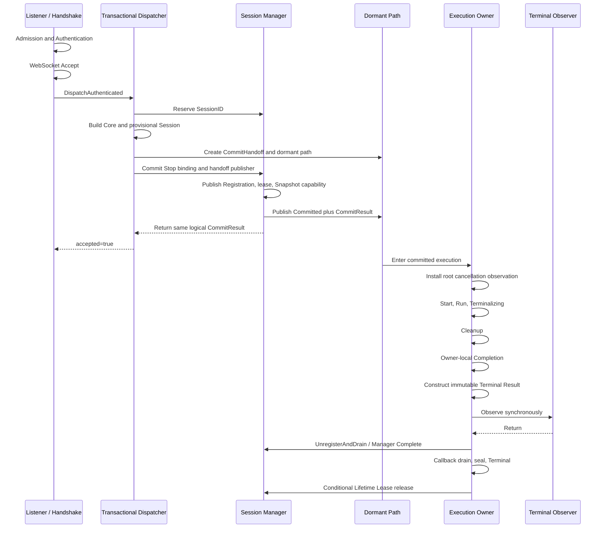
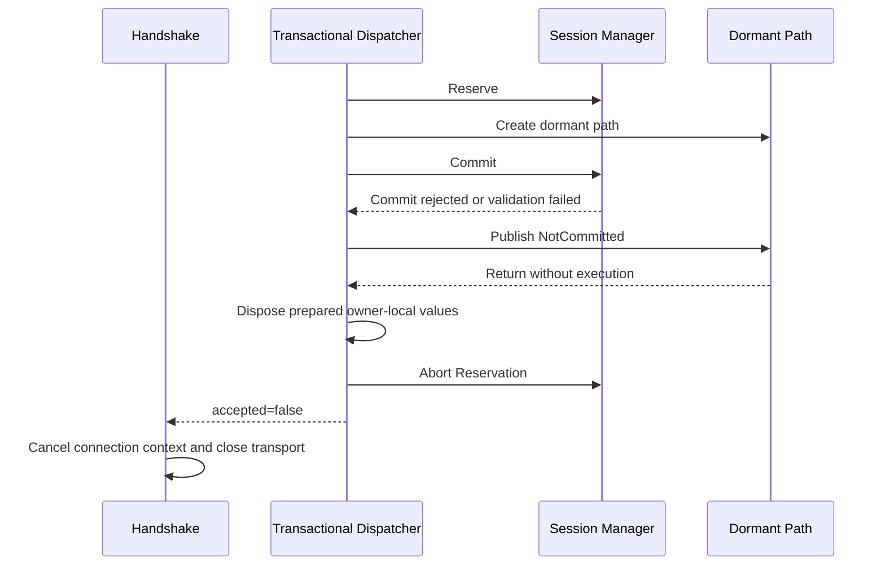
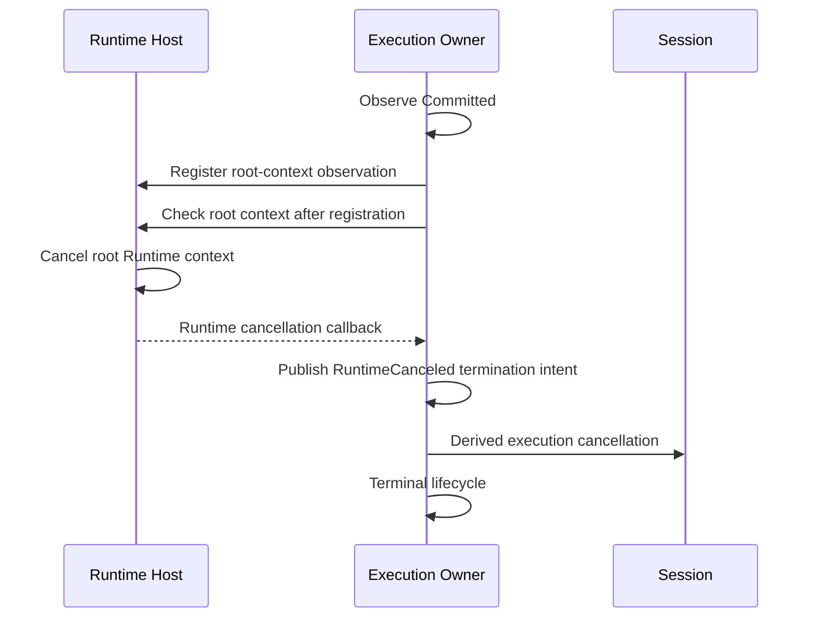

# DP-006: Production-интеграция Runtime

[English version](../../en/design/DP-006-runtime-production-integration.md)

## 1. Статус

**Статус:** Draft

Это предложение определяет только production-интеграцию уже утверждённых и реализованных контрактов Runtime Foundation. Оно не пересматривает [DP-003](DP-003-runtime-session-manager.md), [DP-004](DP-004-per-session-execution-boundary.md) или [ARCH-003](../architecture/ARCH-003-runtime-migration-revision.md).

## 2. Назначение

Runtime Foundation Migration Task 9 предоставляет завершённые transaction-capable Dispatcher, один `CommitHandoff`, один dormant execution path, полный terminal lifecycle Owner и правдивый Manager accounting вне production composition Runtime. Production Runtime по-прежнему выбирает legacy synchronous Dispatcher и не координирует shutdown Session Manager.

Это предложение определяет Task 10: один atomic production cutover, который выбирает завершённый transactional path и одновременно активирует соответствующую shutdown orchestration. Оно не вводит новый компонент, уровень ownership, lifecycle, publication point или recovery transaction.

## 3. Источники истины

Нормативными источниками являются:

- [DP-003: Runtime Session Manager](DP-003-runtime-session-manager.md);
- [DP-004: Per-Session Execution Boundary](DP-004-per-session-execution-boundary.md);
- [ARCH-002: Runtime Foundation Freeze](../architecture/ARCH-002-runtime-foundation-freeze.md);
- [ARCH-003: Runtime Foundation Migration Revision](../architecture/ARCH-003-runtime-migration-revision.md);
- фактическое [текущее состояние](../../../spec/current-state.md).

Если формулировка этого integration proposal может быть истолкована шире этих документов, приоритет имеет более узкий утверждённый контракт.

## 4. Scope

Task 10 включает только:

- создание одного Session Manager на экземпляр Runtime в composition root Host;
- передачу подготовленному execution утверждённого DP-004 input наблюдения корневого Runtime context;
- передачу одной synchronous dependency Terminal Observer без определения diagnostics backend;
- выбор `TransactionalDispatcher` как единственного production Session handoff;
- хранение Manager как стабильного участника скомпонованного Runtime graph;
- расширение shutdown Host операциями `BeginShutdown`, Stop requests из capability-bearing Snapshot, отменой корневого Runtime context, Listener Stop и Manager Wait в утверждённом порядке;
- удаление legacy synchronous Dispatcher из production graph;
- сохранение startup rollback, readiness, Admission Gate, ownership Listener, поведения Router и Authentication и внешнего контракта Handshake handoff;
- добавление production integration и shutdown proof tests.

Task 10 не включает:

- изменения семантики Reserve, Commit, Abort, Manager Complete как operation удаления Registration, Lookup, Snapshot, Wait, `CommitHandoff` или Owner Lifetime Lease;
- изменения lifecycle Execution Owner, Terminal Result, порядка Observer, callback drain, Cleanup или causal cell;
- Router, Delivery, Presence, Groups, Topics, Broadcast, Persistence, Plugins, Metrics, diagnostics backends, limits или rate limiting;
- новые состояния lifecycle Runtime, restart, reload, supervision или глобальный coordinator;
- новые публичные Configuration или management API;
- изменения Authentication Handshake или порядка WebSocket Upgrade;
- второй execution path или compatibility fallback к legacy Dispatcher.

После Task 10 будущие эпики по-прежнему владеют Delivery, Persistence, ещё не реализованным исполнением TLS capabilities, Metrics, operational diagnostics, Plugin contracts, restart, reload, supervision и всеми прочими пунктами, явно отложенными утверждённым roadmap. Принятые ограничения постоянно заблокированных Cleanup, Observer, callback entry или accounting остаются неизменными.

## 5. Текущая граница и правило cutover

До Task 10 Runtime composition создаёт Router, Authentication, legacy synchronous Dispatcher, Handshake и Listener. Завершённый TransactionalDispatcher существует, но не выбран Runtime.

Task 10 является одним production cutover. Runtime не должен выбирать TransactionalDispatcher без одновременной установки Manager-aware shutdown и не должен устанавливать shutdown Manager вокруг Sessions, которыми всё ещё владеет legacy Dispatcher. После cutover существует ровно один production execution path Session.

## 6. Production Composition Root

Runtime Host остаётся единственным production composition root и lifecycle coordinator. Container остаётся holder immutable Snapshot, а не service locator. Явная композиция создаёт следующий graph:

```text
Runtime Host
    -> immutable Runtime Snapshot / Container
    -> Host-owned Admission Gate
    -> Host-owned live Runtime-context access capability
    -> Message Router
    -> Authentication Service
    -> Session Manager
    -> synchronous Terminal Observer value
    -> Transactional Dispatcher
       -> Session Manager
       -> Message Router as Handler
       -> root Runtime-context observation input
       -> Terminal Observer
    -> Handshake Handler
       -> Admission capability
       -> Runtime-context capability
       -> Authentication Service
       -> Transactional Dispatcher
    -> Listener
```

Host владеет identity Listener, Manager, Runtime context, cancellation function Runtime, Admission Gate и immutable composed dependency graph. Manager владеет только accounting Reservation, Registration, Snapshot, Manager Complete и Lifetime Lease. Owner-local Completion остаётся частью terminal lifecycle Owner и не является Manager mutation удаления Registration. TransactionalDispatcher владеет каждой pre-Commit transaction. Каждый committed Execution Owner владеет исполнением своей Session и terminal obligations.

Фактический корневой Runtime context остаётся отсутствующим до успешного запуска Listener, как заморожено ARCH-002. Composition передаёт уже утверждённый live read-only input наблюдения Runtime context, а не преждевременно созданный root context и никогда не его cancellation function. Admission остаётся закрытым во время startup, поэтому ни один вызов Dispatcher не может достичь Commit до активации Host корневого context и перехода в Running.

Dependency Terminal Observer является synchronous composition-local value, требуемым DP-004. Task 10 не определяет внешний diagnostics output. Пока diagnostics epic не предоставит backend, observer может принять immutable Terminal Result и вернуться, не сохраняя ownership и не создавая другого effect.

## 7. Порядок startup

Startup сохраняет transaction ARCH-002:

1. Host входит в `Starting`; readiness равен false, Admission закрыт.
2. Проверяется executability Runtime Snapshot.
3. Создаются Router и Authentication Service.
4. Создаются один пустой Session Manager и одно значение Terminal Observer.
5. TransactionalDispatcher создаётся из Manager, Router, root observation input и Observer.
6. Handshake создаётся с TransactionalDispatcher.
7. Listener создаётся и запускается последним.
8. После успеха Listener Host создаёт и публикует корневой Runtime context, сохраняет Listener и Manager, входит в `Running`, открывает Admission и становится Ready в существующем startup commit.
9. При любой предшествующей ошибке ресурсы Listener откатываются, Admission не открывается, ненаблюдаемый пустой graph Manager освобождается, а Host возвращается в существующее non-running состояние.

```mermaid
sequenceDiagram
    participant H as Runtime Host
    participant M as Session Manager
    participant D as Transactional Dispatcher
    participant L as Listener
    H->>H: Enter Starting; Admission closed
    H->>M: Construct empty Manager
    H->>D: Construct with Manager and observation input
    H->>L: Construct and Start
    alt Listener startup succeeds
        H->>H: Create root Runtime context
        H->>H: Publish graph; Running and Ready
        H->>H: Open Admission
    else Composition or startup fails
        H->>L: Roll back acquired Listener resource
        H->>H: Keep Admission closed and Ready false
    end
```

Во время startup не существует Session, Reservation, Registration, callback, dormant path или lease.

## 8. Ownership на фазах Runtime

| Фаза | Владелец transport и derived cancellation | Владелец execution | Владелец Registration/accounting | Ответственность Host |
| --- | --- | --- | --- | --- |
| До Upgrade | Граница Listener/Handshake | Нет | Нет | Admission и root context |
| После Upgrade, до Commit | TransactionalDispatcher, действующий для Upgrade boundary | Dispatcher владеет provisional path; Owner остаётся `PreCommit` и не может исполняться | Dispatcher владеет obligation Reservation; Manager учитывает Reservation | Нет исполнения Session |
| Успешный Commit | Ownership атомарно переходит Execution Owner | Ровно один committed path становится eligible | Manager владеет Registration и lease accounting | Координирует только lifecycle Runtime |
| Running/Terminalizing до возврата synchronous Observer | Execution Owner | Execution Owner является единственным post-Commit lifecycle writer и выполняет Cleanup, owner-local Completion, создание Terminal Result и synchronous invocation Observer | Manager сохраняет Registration и lifetime lease | Может публиковать Stop intent и root cancellation |
| После synchronous Observer, во время UnregisterAndDrain / Manager Complete | Execution Owner до завершения terminal obligations | Owner вызывает boundary удаления Registration только после возврата Observer | Manager Complete удаляет Registration; lifetime lease остаётся активным | Wait остаётся pending |
| После Manager Complete, до conditional release lease | Execution Owner | Owner ещё выполняет callback drain, seal и достигает Terminal | Registration отсутствует; lifetime lease остаётся активным | Wait остаётся pending |
| После eligible release lease | Не остаётся Runtime-owned transport или execution work | Owner не выполняет дальнейшую Runtime-owned работу | Accounting Registration и lease для этой Session пуст | Manager может сойтись |
| Shutdown | Существующие owners сохраняют ресурсы до terminal completion | Owners независимо terminalize | Manager фиксирует Snapshot и правдиво ожидает | Host задаёт порядок shutdown, но не принимает ownership Session |

Не существует фазы, где Host, Listener, Handshake, Manager и Owner являются конкурентными владельцами одной Session или WebSocket.

## 9. Жизненный цикл успешного подключения

Production connection flow следует DP-004. Reservation предшествует provisional formation Session, поскольку устанавливает identity-owned transaction, которая обязана завершиться Commit или Abort.



Ownership по этапам:

1. Listener и Handshake владеют обработкой request до Upgrade.
2. После успешного Accept TransactionalDispatcher исключительно владеет pre-Commit cleanup transport, derived cancellation, Reservation, prepared values, `CommitHandoff` и obligation возврата dormant path.
3. Manager владеет только accounting и committed publication внутри Commit.
4. Успешный Commit передаёт подготовленному Owner ownership Session, WebSocket, derived cancellation и execution и делает eligible ровно один dormant path.
5. Dispatcher немедленно возвращает `accepted=true` и не выполняет post-Commit cleanup.
6. Owner выполняет фиксированный terminal chain: `Terminalizing -> Cleanup -> owner-local Completion -> Terminal Result -> synchronous Terminal Observer -> UnregisterAndDrain / Manager Complete -> callback drain -> seal -> Terminal -> conditional Lifetime Lease release`.
7. UnregisterAndDrain / Manager Complete удаляет Registration только после возврата synchronous Observer. Эта operation не освобождает owner lifetime.
8. Conditional Lifetime Lease release является последней Runtime-owned operation.

## 10. Failed Commit и pre-Commit failure

Каждая recoverable failure до Commit, включая проигрыш Commit операции BeginShutdown, использует существующий path Task 9:



На этом path не существует Registration, lease, committed или Snapshot-visible Manager-bound Stop capability, Runtime callback, Manager Complete, invocation Observer или исполнения Owner. Provisional owner-local Stop binding мог быть подготовлен, но он никогда не становится committed и не публикуется через Snapshot. Runtime integration не должна добавлять post-Commit branch `accepted=false`.

## 11. Runtime Cancellation

Host остаётся единственным владельцем отмены корневого Runtime context. Handshake и TransactionalDispatcher получают только observation. Derived execution cancellation остаётся отдельной и owner-local после Commit.

До Commit:

- Runtime-cancellation callback не зарегистрирован;
- Dispatcher проверяет текущую отмену root и derived execution перед eligibility Commit;
- cancellation или проигрыш BeginShutdown приводит к NotCommitted, возврату dormant path, Abort и `accepted=false`.

После Commit:

- committed Owner устанавливает observation до linearization Start;
- регистрация использует утверждённый race-safe contract register-and-check;
- отмена root до или во время установки становится `RuntimeCanceled` ровно один раз через causal cell;
- explicit Stop и Runtime cancellation конкурируют как termination intent и никогда не становятся lifecycle writers;
- Session Cleanup отменяет только derived execution context и не может породить root `RuntimeCanceled`.



Runtime integration не создаёт callback до Commit и не позволяет Host, Dispatcher или Manager устанавливать его за Owner.

## 12. Shutdown Runtime

Первый owner операции Host Stop выполняет нормативный порядок:

```text
close Admission
    -> Manager.BeginShutdown
    -> capture immutable capability-bearing Snapshot
    -> invoke each Snapshot RequestStop capability
    -> cancel root Runtime context
    -> Listener Stop
       |-> HTTP handler drain -> Listener Stop returns
       |-> committed owners terminalize -> eligible leases release
    -> after Listener Stop returns, Manager Wait
    -> publish the one Host Stop result and exit
```

```mermaid
sequenceDiagram
    participant H as Runtime Host
    participant M as Session Manager
    participant O as Execution Owners
    participant L as Listener
    H->>H: Close Admission; enter Stopping
    H->>M: BeginShutdown
    M-->>H: Immutable Snapshot
    loop Every captured Registration
        H->>O: RequestStop
    end
    H->>H: Cancel root Runtime context
    par Handler drain
        H->>L: Stop
        L-->>H: Listener Stop returns
    and Owner drain
        O->>O: Cleanup, owner-local Completion, Terminal Result, synchronous Observer
        O->>M: UnregisterAndDrain / Manager Complete
        O->>O: Callback drain, seal, Terminal
        O->>M: Conditional Lifetime Lease release
    end
    H->>M: Wait after Listener Stop
    M-->>H: Accounting converged or caller context error
    H->>H: Store shared terminal Stop result
```

`BeginShutdown` является nonblocking и не выполняет Session I/O. Membership Snapshot фиксируется первым вызовом. RequestStop является nonblocking относительно lifecycle Session. Отмена root происходит до Listener Stop, сохраняя ARCH-002. Drain handlers Listener и drain Owners выполняются конкурентно; ни один не ждёт другой. Manager Wait начинается только после возврата Listener Stop и не выполняет Stop request или Session I/O.

Ошибка Listener Stop не пропускает Manager Wait. Ошибка Manager Wait или истечение caller context не стирает accounting. Host объединяет существующую terminal error Listener и error Wait, не заменяя ни одну cause. Nil-результат Host Stop доказывает и завершение Listener, и успешную convergence Manager. Non-nil result не заявляет ложную convergence; Manager правдиво остаётся `Closing`, если accounting всё ещё активен. Concurrent и repeated callers Host Stop наблюдают один сохранённый terminal shutdown result, сохраняя frozen lifecycle Host.

## 13. Race Commit и BeginShutdown

Commit и BeginShutdown сохраняют единственную Manager linearization boundary:

- Commit выигрывает: полные Registration, lease, Stop capability и committed execution path публикуются до их захвата BeginShutdown; Snapshot включает Registration, а shutdown штатно запрашивает Stop.
- BeginShutdown выигрывает: Commit отклоняется, Dispatcher публикует NotCommitted, присоединяет dormant path, выполняет Abort, возвращает `accepted=false`, а Handshake очищает transport.

Не существует late Registration discovery, mutable membership Snapshot, orphan execution или rollback committed Registration.

## 14. Миграция Legacy Dispatcher

Текущий legacy synchronous Dispatcher выполняет `Start`, `Run` и `Stop` в вызове HTTP handler. Task 10 удаляет его из production composition.

| Элемент | Действие Task 10 |
| --- | --- |
| Production selection `session.NewDispatcher` | Атомарно заменяется `NewTransactionalDispatcher` |
| Legacy synchronous execution в `internal/session/dispatcher.go` | Может быть удалено сразу после миграции его focused tests; оно не должно оставаться достижимым из production composition |
| Unit tests legacy Dispatcher | Сохраняются только пока доказывают прежнюю compatibility во время изменения, затем удаляются или переписываются для единственного production path |
| Интерфейс `connection.AuthenticatedDispatcher` | Сохраняется без изменений; Handshake продолжает зависеть от него |
| Поведение accepted/error Handshake | Сохраняется без изменений |
| Router как внедрённый `message.Handler` | Сохраняется и передаётся TransactionalDispatcher |
| Session Core, provisional Session, Cleanup, Owner, CommitHandoff, Manager | Сохраняются с неизменной ответственностью |

Временное сосуществование разрешено только внутри незакоммиченного implementation change или изолированных tests. Acceptance Task 10 требует отсутствия production reference, fallback, configuration switch или runtime branch, способных выбрать legacy Dispatcher.

## 15. Ожидаемое влияние на репозиторий

Production integration предположительно затрагивает только сфокусированные seams:

- `internal/runtime/host.go`: хранение identity Manager и координация утверждённого shutdown order;
- `internal/runtime/composition.go`: создание Manager, Observer и TransactionalDispatcher вместо legacy Dispatcher и возврат/хранение полного composed graph;
- `internal/runtime/startup_transaction.go` только если существующий typed startup-resource plumbing должен переносить полный graph без изменения rollback semantics;
- `internal/session/transactional_dispatcher.go` и `internal/executionowner/environment.go`: адаптация construction seam к утверждённому DP-004 live root-context observation input с сохранением поведения Task 9 и приватностью root cancellation у Host;
- `internal/session/dispatcher.go`: удаление устаревшей production implementation, когда не останется test-only references;
- focused integration tests Runtime, Handshake, Listener, Session и Session Manager.

Не ожидается изменения production semantics Router, Authentication, Listener, Handshake, Session Manager, owner-local stage Completion, adapter Manager Complete, Lifetime Lease, Execution Binding или terminal logic Execution Owner. Изменения в этих packages допустимы только при необходимости compilation уже утверждённого dependency seam; они не должны изменять контракты.

## 16. Семантика ошибок и результатов

- Composition failure предотвращает создание или запуск Listener и сохраняет существующее wrapping startup error.
- Ошибка запуска Listener откатывает acquired resource Listener и не публикует Runtime context или readiness.
- Pre-Commit failures Dispatcher сохраняют семантику `(accepted=false, error)` и ownership cleanup Handshake.
- Successful Commit сохраняет `(accepted=true, nil)`, даже когда дальнейшее execution завершается ошибкой.
- Post-Commit failures представлены только terminal processing Owner и Terminal Observer, но не вторым результатом Handshake.
- Listener Stop и Manager Wait оба выполняются в требуемом порядке; их errors остаются доступными через normal cause-preserving combination.
- Caller deadline может завершить Manager Wait без изменения state Manager или заявления успешного shutdown.

## 17. Ограничения concurrency и deadlock

- Host не удерживает lifecycle mutex во время блокировки Listener Stop или Manager Wait.
- BeginShutdown не удерживает lock во время вызовов capabilities RequestStop из Snapshot; Snapshot detached и immutable.
- RequestStop и root cancellation не ждут terminal operation Session.
- Dispatcher ждёт возврата dormant path только на non-committed paths и никогда не ждёт Owner после успешного Commit.
- Listener Stop может ждать HTTP handlers, пока committed owners независимо terminalize.
- Owner никогда не ждёт Listener Stop или Manager Wait.
- Manager Wait не удерживает Manager lock во время блокировки и никогда не вызывает Session или Owner.
- UnregisterAndDrain / Manager Complete и conditional lease release изменяют соответствующий Manager accounting без ожидания Host. Owner-local Completion не удаляет Registration.
- Постоянно заблокированные Cleanup, Observer, callback entry или unconfirmed callback cleanup могут правдиво предотвратить успешный Wait, но не создают circular wait при утверждённых контрактах.

## 18. Архитектурные инварианты Task 10

- Host остаётся единственным production composition root и lifecycle coordinator Runtime.
- Один экземпляр Runtime владеет ровно одним Session Manager.
- Production использует ровно один TransactionalDispatcher без fallback legacy execution.
- Runtime никогда не запускает Owner, Session Start или Session Run до успешного Commit.
- Dispatcher создаёт ровно один `CommitHandoff` и один dormant path на попытку handoff.
- Только Session Manager публикует Registration и committed Manager-bound capabilities.
- Commit остаётся единственной irreversible point Registration, execution eligibility и ownership transfer.
- Каждая accepted production Session отслеживается Manager от Commit через UnregisterAndDrain / Manager Complete до conditional release Lifetime Lease.
- Callback наблюдения Runtime cancellation не существует до Commit.
- Только Owner устанавливает observation корневого Runtime context после Commit и до Start.
- Ownership отмены корневого Runtime context остаётся исключительно у Host.
- Derived execution context принадлежит Dispatcher до Commit и Owner после Commit.
- Session Cleanup не может породить root `RuntimeCanceled`.
- UnregisterAndDrain / Manager Complete является единственной operation удаления Registration и происходит только после возврата synchronous Terminal Observer.
- Terminal order равен `Terminalizing -> Cleanup -> owner-local Completion -> Terminal Result -> synchronous Terminal Observer -> UnregisterAndDrain / Manager Complete -> callback drain -> seal -> Terminal -> conditional Lifetime Lease release`.
- Lease release остаётся последней Runtime-owned operation.
- Первый BeginShutdown фиксирует immutable membership Snapshot.
- Commit и BeginShutdown сохраняют строгие взаимоисключающие race outcomes.
- Shutdown закрывает Admission до BeginShutdown и отменяет root context до Listener Stop.
- Drain handlers Listener и terminalization Owners выполняются конкурентно.
- Manager Wait начинается только после возврата Listener Stop.
- Успешный Manager Wait доказывает пустой accounting Reservation, Registration и Lifetime Lease и отсутствие отслеживаемой Runtime-owned работы.
- Runtime никогда не сообщает успешный shutdown при активном accounting Manager.
- Frozen lifecycle Host, startup rollback, readiness, Admission Gate, timing Runtime context и ownership Listener остаются неизменными.

## 19. Acceptance Criteria

Implementation принимается только при выполнении условий:

1. Startup Runtime создаёт один Manager и один TransactionalDispatcher и сохраняет их identity на lifetime Runtime.
2. Production composition не содержит вызова или branch, выбирающего legacy Dispatcher.
3. Listener остаётся последним externally visible startup resource, а readiness открывается только после successful startup commit.
4. Каждый accepted WebSocket создаёт ровно одну committed Registration, один eligible execution path и один Lifetime Lease.
5. Failed Commit не оставляет Registration или lease и возвращает cleanup transport Handshake.
6. Normal disconnect выполняет Cleanup, owner-local Completion, создание immutable Terminal Result, synchronous Terminal Observer, UnregisterAndDrain / Manager Complete, callback drain, seal, Terminal и conditional Lifetime Lease release строго в этом порядке.
7. Отмена корневого Runtime context наблюдается только после Commit и до продолжения Start/Run.
8. Stop выполняет `Admission close -> BeginShutdown -> Snapshot RequestStop -> root cancellation -> Listener Stop -> Manager Wait`.
9. Races Commit/BeginShutdown создают только два утверждённых outcome.
10. Successful Host Stop означает successful Manager Wait и пустой accounting.
11. Context-bounded shutdown failure сохраняет truthful state Manager и causes errors.
12. Существующее поведение Authentication, Router, Echo/no-match, Handshake, Listener, startup rollback, readiness и concurrent/repeated Host Stop остаётся совместимым.
13. Не вводится новый lifecycle, coordinator, supervisor, global state, service locator или post-Commit activation step.

## 20. Обязательные тестовые доказательства

Tests должны детерминированно доказать:

- startup success создаёт Manager и выбирает TransactionalDispatcher ровно один раз;
- failure composition или Listener startup не открывает Admission и не оставляет published state Runtime Session;
- normal authenticated connection достигает Commit, Start, Run, normal disconnect, Cleanup, owner-local Completion, immutable Terminal Result, synchronous Terminal Observer, UnregisterAndDrain / Manager Complete, callback drain, seal, Terminal и conditional Lifetime Lease release в установленном порядке;
- failed Commit создаёт `accepted=false`, присоединяет dormant execution, aborts Reservation и позволяет Handshake закрыть transport;
- Start failure, Run failure, Cleanup anomaly, Observer anomaly и eligible lease release сохраняют truthful accounting;
- no matching Router route и Handler error сохраняют существующую семантику Session через TransactionalDispatcher;
- несколько concurrent Sessions получают разные identity Registration и один общий Manager;
- repeated dispatch не создаёт второй execution path для одного connection;
- root cancellation до Commit не создаёт callback или Registration;
- root cancellation после Commit наблюдается Owner и завершает execution через normal path;
- explicit Snapshot Stop и root cancellation при race имеют одну primary cause и не создают второго lifecycle writer;
- Commit, выигравший BeginShutdown, входит в Snapshot; выигравший BeginShutdown вызывает Abort и отсутствие Registration;
- membership Snapshot и Stop capabilities остаются immutable и безопасными после UnregisterAndDrain / Manager Complete, Terminal и lease release;
- drain handlers Listener и drain Owner могут пересекаться без deadlock;
- Manager Wait начинается после возврата Listener Stop и остаётся pending при существующем accounting Registration или lease;
- successful graceful shutdown оставляет Manager Closed и весь tracked accounting пустым;
- concurrent и repeated calls Runtime Stop наблюдают одно shutdown execution и один сохранённый terminal result;
- legacy Dispatcher недостижим из production composition;
- race-enabled tests покрывают dispatch, Commit/shutdown, Snapshot Stop, callback entry, UnregisterAndDrain / Manager Complete, conditional lease release, Listener drain и Wait без произвольных sleeps.

## 21. Совместимость

Внешняя dependency Handshake остаётся `connection.AuthenticatedDispatcher`; смысл `(accepted, error)` не меняется. Cleanup WebSocket остаётся у Handshake только при `accepted=false`. Router остаётся единственным Message Handler, переданным execution Session. Authentication остаётся до Upgrade. Listener остаётся единственным network resource, запускаемым Host.

Изменение production behavior намеренно ограничено ownership и правдивостью shutdown: accepted Sessions больше не удерживают HTTP handler как synchronous execution owner и теперь отслеживаются Manager до полного завершения owner lifetime.

## 22. Последствия

Положительные последствия:

- Runtime получает единый authoritative shutdown wait set Session;
- HTTP handlers возвращаются после successful Commit вместо ownership lifetime Session;
- каждая accepted Session имеет ровно одного execution owner и один отслеживаемый Manager lifetime;
- Runtime cancellation и explicit Stop сходятся через утверждённую causal model;
- successful shutdown получает truthful accounting proof.

Цена и сохраняемые ограничения:

- shutdown Host теперь ожидает drain Listener и accounting Manager;
- постоянно заблокированная обязательная terminal work может предотвратить успешный shutdown;
- graph Runtime включает mutable accounting Manager, хотя identity компонентов остаются фиксированными после startup;
- не вводится diagnostics backend, retry, timeout policy сверх caller contexts или operational remediation.

## 23. Самостоятельная архитектурная проверка

### Соответствие DP-003

Соответствует. Manager остаётся ограничен Reservation, Commit, Registration, Snapshot, Manager Complete, lease accounting, BeginShutdown и Wait. Linearization Commit и BeginShutdown, removal только через UnregisterAndDrain / Manager Complete после возврата Observer, immutable Snapshot и truthful Wait не изменены.

### Соответствие DP-004

Соответствует. Production выбирает уже определённые pre-Commit transaction, `CommitHandoff`, dormant execution, exclusive lifecycle Owner, observation только root cancellation, terminal order, capability Stop из Snapshot и boundary lease release без добавления другого owner или activation step.

### Соответствие ARCH-003

Соответствует. Предложение реализует только atomic production composition и shutdown cutover Task 10 после Task 9. Transactional activation и shutdown accounting не разделяются.

### Проверка scope

Предложение не расширяет Task 10. Оно не вводит Router, Delivery, Persistence, Plugins, Metrics, diagnostics backend, restart, reload, supervisor, coordinator, состояние lifecycle или модель ownership.

### Проверка новых решений

Нового решения target architecture не введено. Каждое нормативное поведение является следствием production wiring или orchestration, уже зафиксированных DP-003, DP-004, ARCH-002 и ARCH-003. Implementation-level names и private wiring shapes остаются ненормативными.

## 24. Открытые вопросы

Нет. До начала implementation требуется independent approval review.
