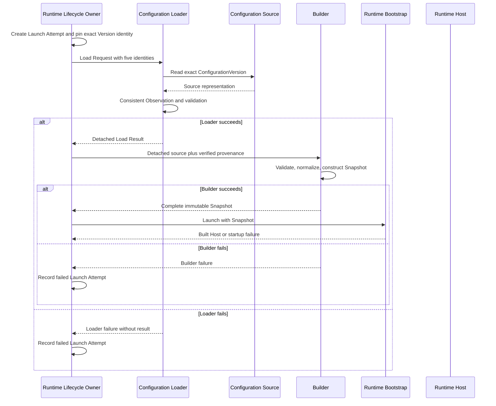

# DP-007: Configuration Loader Contract

[English version](../../en/design/DP-007-configuration-loader-contract.md)

## 1. Статус

**Статус:** Draft

**Статус архитектуры:** Контракт реализации утверждённой модели [ARCH-004](../architecture/ARCH-004-runtime-deployment-and-identity-model.md) и [ARCH-005](../architecture/ARCH-005-runtime-configuration-snapshot-and-loading-model.md)

Этот proposal не вводит и не пересматривает архитектуру. Он определяет инженерный контракт, посредством которого Runtime Lifecycle Owner получает точную Published ConfigurationVersion, закреплённую за Launch Attempt, и передаёт detached source material в Builder.

## 2. Назначение

В repository существуют lifecycle публикации ConfigurationVersion, Snapshot Builder и Runtime Bootstrap, но отсутствует production boundary, соединяющая их. Сейчас Builder получает подготовленную ConfigurationVersion, а Bootstrap получает подготовленный Snapshot.

DP-007 определяет этот отсутствующий implementation contract:

```text
Runtime Lifecycle Owner
    -> Configuration Loader
    -> Builder
    -> Runtime Bootstrap
```

Proposal определяет одну operation Loader, её обязательные inputs, успешный result, границы validation и failure, handoff в Builder, правила dependencies и обязательные acceptance proofs.

## 3. Источники архитектурных решений

Нормативной архитектурой остаются:

- [ADR-0002: Configuration DSL](../adr/0002-configuration-dsl.md);
- [ADR-0003: Runtime Architecture](../adr/0003-runtime-architecture.md);
- [ARCH-002: Runtime Foundation Freeze](../architecture/ARCH-002-runtime-foundation-freeze.md);
- [ARCH-004: Runtime Deployment and Identity Model](../architecture/ARCH-004-runtime-deployment-and-identity-model.md);
- [ARCH-005: Runtime Configuration Snapshot and Loading Model](../architecture/ARCH-005-runtime-configuration-snapshot-and-loading-model.md).

Если этот implementation proposal допускает более широкое толкование, чем указанные документы, применяется более узкий утверждённый архитектурный контракт.

## 4. Область

DP-007 определяет:

- одну operation Configuration Loader;
- границу между Runtime Lifecycle Owner, Loader и Builder;
- пять обязательных существующих identity в load request;
- загрузку exact version вместо выбора current version;
- согласованное наблюдение source identity, lifecycle eligibility, schema identity и payload;
- detached successful load result;
- обязанности Loader validation;
- категории Loader failures и последствия failure;
- гарантии и отсутствие гарантий при handoff в Builder;
- правила ownership, immutability, concurrency и dependencies;
- acceptance proofs, обязательные до одобрения реализации.

DP-007 не определяет:

- PostgreSQL schemas, queries, transactions или drivers;
- HTTP resources или management API;
- YAML syntax или parsing rules;
- persistence Runtime Instance или Launch Attempt;
- реализацию Runtime Launcher;
- management commands или desired-state contracts;
- retry, fallback, replacement, rollback или reconciliation policy;
- migration Configuration schema или version negotiation;
- Secret storage или изменения Secret resolution и Authentication semantics;
- reload Snapshot или in-place replacement;
- изменения Runtime Bootstrap, lifecycle Host, readiness, rollback или shutdown;
- Go interfaces, сигнатуры методов, конкретные structs, packages или exported API.

## 5. Термины контракта

### Pinned Version

Pinned Version — точная identity ConfigurationVersion, уже связанная Runtime Lifecycle Owner с одним Launch Attempt. Это не команда загрузить любую version, находящуюся сейчас в состоянии Published.

### Load Request

Load Request — immutable набор существующих declarative и operational identities, необходимых для получения и проверки Pinned Version.

### Detached Load Result

Detached Load Result — полное, независимое от source представление точной Published ConfigurationVersion вместе с проверенными identity и schema facts, необходимыми Builder. Оно не содержит source handle или mutable source-owned memory.

### Consistent Observation

Consistent Observation — одно наблюдение source, в котором exact identity, ownership Configuration, Published eligibility, identity Configuration schema и полный declarative payload принадлежат одному состоянию ConfigurationVersion.

Source Boundary должна гарантировать все следующие свойства одного Consistent Observation:

- identity Workspace, Configuration и точной ConfigurationVersion и их ownership relationships наблюдаются как одно logical source state;
- lifecycle state ConfigurationVersion, identity и version schema и полный declarative payload описывают ту же точную version в том же logical source state;
- ни одно field или relationship не объединяется с другой version или другим source observation;
- observation либо завершается полностью успешно, либо возвращает failure без раскрытия partial material;
- возвращённое source representation остаётся стабильным после observation, даже если последующая публикация или архивация изменяет source.

Это контрактные свойства atomicity. DP-007 не предписывает, обеспечивает ли source их через transaction, lock, storage snapshot, immutable record или другой механизм.

### Semantic Equivalence

Два Detached Load Results являются семантически эквивалентными, когда:

- все пять identity, номер ConfigurationVersion, Published fact, identity и version schema равны;
- их decoded declarative domain values равны, включая ordering и различия absent-versus-present;
- ни один из них не содержит source-specific metadata, позволяющую различить исходные adapters; и
- один conforming Builder создаёт из обоих results структурно равные Snapshots либо отклоняет оба с одной Builder failure category.

Pointer identity, allocation layout, serialization bytes, тип source, retrieval path и source-internal metadata не влияют на Semantic Equivalence.

## 6. Обзор контракта

Полная operation:

```text
receive Load Request
    -> load exact Pinned Version
    -> validate identity and source consistency
    -> verify Published eligibility
    -> preserve schema identity
    -> detach complete source material
    -> return Detached Load Result

or

receive Load Request
    -> return one Loader failure
    -> publish no result
```

Loader никогда не возвращает одновременно successful result и failure. Он никогда не возвращает partial result.

## 7. Operation Loader

Единственная архитектурная operation — **Load Exact Published Configuration**.

Operation последовательно выполняет следующие обязанности:

1. Получить один immutable Load Request от Runtime Lifecycle Owner.
2. Проверить наличие каждой обязательной identity.
3. Адресовать точную identity ConfigurationVersion из request.
4. Получить связь Configuration и ConfigurationVersion через настроенную source boundary.
5. Установить одно Consistent Observation identity, Published eligibility, schema identity и полного payload.
6. Отклонить любое нарушение identity, lifecycle, consistency или source integrity.
7. Отделить весь возвращаемый declarative material от source-owned mutable memory.
8. Вернуть один полный Detached Load Result или один failure.

Consistent Observation является linearization point выбора source. До этой точки никакой source не принят для построения Runtime. После неё operation связана с наблюдаемой точной ConfigurationVersion и не может быть перенаправлена последующей публикацией.

Operation не:

- выбирает Configuration или ConfigurationVersion;
- ищет latest, newest или replacement Published Version;
- создаёт identity Runtime Instance или Launch Attempt;
- изменяет lifecycle state ConfigurationVersion;
- нормализует Runtime configuration;
- строит Snapshot или Runtime components;
- разрешает Secret values;
- получает Runtime resources;
- выполняет retry или fallback к другому source или version.

## 8. Inputs Loader

Load Request содержит ровно следующие обязательные identity, уже определённые ARCH-004 и ARCH-005:

1. Identity Workspace.
2. Identity Configuration.
3. Точную identity ConfigurationVersion.
4. Identity Runtime Instance.
5. Identity Launch Attempt.

Новая domain identity не вводится.

Identity имеют разные назначения:

| Identity | Использование Loader |
| --- | --- |
| Workspace | Проверить ownership boundary запрошенной Configuration |
| Configuration | Адресовать и проверить declarative parent |
| ConfigurationVersion | Загрузить точную Pinned Version и запретить redirection |
| Runtime Instance | Сохранить operational provenance, установленную Lifecycle Owner |
| Launch Attempt | Связать result с единственным attempt, для которого он загружен |

Identity Runtime Instance и Launch Attempt не являются критериями выбора source. Loader не запрашивает Configuration по этим identity и не проверяет их persistence state. Он без изменений сохраняет их для handoff в Builder.

Доступ к source является явно предоставленной dependency Loader, а не шестой identity request и не данными, передаваемыми дальше в Builder или Runtime. Source Boundary должна предоставить identity и version schema вместе с точным source representation; это representation metadata, а не новые domain identities. Source, который не может предоставить их, получает source-integrity failure. Построение конкретного source adapter находится вне этого proposal.

## 9. Успешный output Loader

При успехе Loader возвращает один Detached Load Result, содержащий архитектурные facts, необходимые Builder:

- полный declarative payload точной ConfigurationVersion;
- identity Workspace из проверенной request boundary;
- identity Configuration, проверенную относительно Workspace и загруженной version;
- точную identity ConfigurationVersion;
- номер ConfigurationVersion;
- факт нахождения version в состоянии Published при Consistent Observation;
- identity и version Configuration schema, сохранённые из source representation;
- identity Runtime Instance, сохранённую из request;
- identity Launch Attempt, сохранённую из request.

Result должен быть:

- полным;
- immutable по ownership после публикации caller;
- detached от repository, transport, parser, cache или adapter-owned mutable memory;
- независимым от типа source;
- достаточным, чтобы Builder выполнил собственные validation, normalization, построение provenance и построение Snapshot без нового чтения source.

Result не содержит:

- Repository, transaction, cursor, HTTP client, parser или source adapter;
- тип source, retrieval path, cache metadata или load timestamp;
- Secret values или Secret Resolver;
- Snapshot, Bootstrap, Host или Runtime component;
- desired state, actual state, retry policy или management authority.

## 10. Validation Loader

Validation Loader ограничена load boundary.

Для Loader **representation completeness** означает, что Source Boundary предоставила каждую identity, ownership relation, lifecycle fact, schema fact, configured section, field, ordering relation и различие absent-versus-present, необходимые для восстановления выбранной ConfigurationVersion без truncation или source mixing. Это не означает, что decoded configuration семантически корректна или исполнима.

Loader обязан проверять:

- наличие всех пяти обязательных identity;
- связь Workspace-to-Configuration;
- связь Configuration-to-ConfigurationVersion;
- равенство запрошенной и загруженной identity ConfigurationVersion;
- Published eligibility при Consistent Observation;
- наличие и сохранение identity Configuration schema;
- полноту и целостность source representation, необходимого для handoff в Builder;
- отсутствие смешения sources между versions или lifecycle observations.

Loader не должен проверять:

- поддерживается ли Configuration schema текущим Builder;
- behavior-specific semantics Listener, Authentication, Routing или будущих sections;
- cross-field инварианты Runtime Snapshot;
- Runtime normalization;
- поддержку startup capabilities;
- Handler references относительно Runtime composition;
- существование Secrets или Secret values;
- может ли Runtime получить Listener или другие resources.

Эти обязанности остаются у Builder, построения Runtime-компонентов или Bootstrap, как установлено ARCH-005.

Для Builder **semantic completeness** означает, что detached declarative values удовлетворяют поддерживаемой schema, domain и cross-field invariants, необходимым для построения canonical Snapshot. Поэтому representation может быть полной для Loader и при этом отклоняться Builder.

Validation при публикации в Control Plane не отменяет defensive identity и lifecycle checks Loader. Validation Loader не отменяет validation Builder или Bootstrap. Builder обязан повторно проверить Published state по fact, содержащемуся в Detached Load Result; он не выполняет новое чтение source. Отсутствующий или non-Published fact является Builder failure, поскольку нарушен контракт Loader-to-Builder.

## 11. Failure contract

Loader предоставляет архитектурные failure categories, а не storage-specific failures.

### Invalid Load Request

Одна или несколько обязательных identity отсутствуют либо request не может представить требуемую identity closure.

### Source Unavailable

Настроенный source не может завершить необходимое чтение до раскрытия запрошенных entities и их logical state. Эта категория охватывает failure доступа к source и не означает отсутствия или несовпадения какой-либо запрошенной identity. Она не определяет transport, storage или retry behavior.

### Source Not Found

Как минимум одна из запрошенных Workspace, Configuration или точная ConfigurationVersion не существует в logical state Source Boundary. Эта категория применяется только тогда, когда установлено отсутствие, а не конфликтующая relationship.

### Identity Mismatch

Запрошенные entities существуют, но загруженная Configuration не принадлежит запрошенному Workspace, загруженная ConfigurationVersion не принадлежит запрошенной Configuration либо identity загруженной version отличается от Pinned Version. Существование при конфликтующей relationship является Identity Mismatch, а не Source Not Found.

### Version Not Published

Точная Pinned Version не находится в состоянии Published при Consistent Observation. Loader не должен подставлять другую Published Version.

### Inconsistent Source Observation

Source доступен и запрошенный material существует, но Source Boundary не может доказать, что identity relationships, lifecycle state, schema identity и payload принадлежат одному logical source state точной ConfigurationVersion. Эта категория отличается от Source Unavailable, поскольку доступ к source успешен, и от Source Integrity Failure, поскольку проблема относится к cross-observation consistency, а не malformed material.

### Source Integrity Failure

Source Boundary создала material, но его representation malformed, не содержит representation-complete fields или schema facts либо не может сохранить domain payload, необходимый для handoff в Builder. Семантически invalid, но representation-complete configuration относится к validation Builder, а не к этой категории.

Для каждого Loader failure:

- Detached Load Result не возвращается;
- Builder не вызывается;
- Bootstrap и Host не вызываются;
- Snapshot и Runtime resource не возникают;
- source не изменяется;
- alternative source или version не выбирается;
- Runtime Lifecycle Owner остаётся ответственным за регистрацию truthful failed Launch Attempt.

DP-007 не определяет Go error types, wrapping, logging, формат redaction, retry или caller-facing management errors.

Unsupported Configuration schema и invalid Runtime configuration являются failures Builder, а не Loader, если schema identity и source representation были успешно сохранены.

## 12. Handoff в Builder

Runtime Lifecycle Owner передаёт полный Detached Load Result в Builder без дополнительного доступа к declarative source.

Loader гарантирует Builder:

- точную pinned identity;
- проверенную связь Workspace и Configuration;
- Published eligibility в linearization point выбора source;
- один полный и внутренне согласованный declarative payload;
- сохранённые identity и version Configuration schema;
- сохранённые identity Runtime Instance и Launch Attempt;
- detached ownership без source-owned mutable aliases;
- отсутствие Secret values.

Loader не гарантирует Builder:

- поддержку schema;
- корректность всех behavior-specific или cross-field invariants;
- выполнение normalization;
- исполнимость startup-critical capabilities;
- возможность разрешения Handler references;
- существование указанных Secrets;
- что version остаётся текущей Published Version после linearization;
- успешность startup Bootstrap или Host.

Builder остаётся authoritative boundary Runtime normalization. Он defensively проверяет поддержку schema, полноту и cross-field инварианты Snapshot, строит обязательную provenance, отделяет собственный output и возвращает либо один полный Snapshot, либо Builder failure.

Builder обязан повторно проверить Published state по fact из Detached Load Result. Successful Loader return не является основанием удалить эту defensive проверку, и Builder не должен повторно читать source для её выполнения.

Builder не должен вызывать Loader, source adapter, Repository или management API.

## 13. Ownership, immutability и lifetime

Ownership движется в одном направлении:

| Этап | Ownership |
| --- | --- |
| Runtime Lifecycle Owner | Владеет Load Request и решением о запуске |
| Loader | Временно владеет load operation и source material во время detachment |
| Runtime Lifecycle Owner после успеха | Владеет Detached Load Result |
| Builder | Заимствует result для construction и не сохраняет source reference |
| Launch preparation | Владеет полным Snapshot, возвращённым Builder |
| Bootstrap и Host | Применяется существующий ownership ARCH-002/005 |

Loader не должен сохранять request, Detached Load Result, source transaction или source-owned reference после возврата operation. Копирование или повторное чтение result не должно позволять изменять source state или другой result.

Lifetime Detached Load Result заканчивается после завершения Builder и прекращения его использования launch preparation. Он не владеет Runtime resource и не требует явного cleanup protocol.

## 14. Semantics публикации и concurrency

Точная identity ConfigurationVersion в Load Request immutable для operation.

Правила concurrency:

- concurrent publication не может перенаправить operation на другую version;
- publication или archival до Consistent Observation отражаются в eligibility validation;
- publication или archival после успешного Consistent Observation не изменяют и не инвалидируют detached result;
- payload не может объединять fields разных versions или разных observations одной version;
- concurrent loads одного request должны создавать семантически эквивалентные detached results либо одну архитектурную failure category для одного наблюдаемого source state;
- Loader не сериализует lifecycle Runtime Instance и не создаёт второй launch claim;
- разные Runtime Instances могут независимо загружать одну точную Published ConfigurationVersion;
- Loader не создаёт mutable global state, видимого Runtime.

Idempotency management commands и persistence transactions остаётся вне этого proposal. Сама Loader operation является read-only относительно Configuration и operational identity.

Loader operation должна быть безопасна для concurrent invocation. Это требование не предписывает internal synchronization или построение instances.

## 15. Правила package dependencies

Реализация должна сохранять следующее направление dependencies:

```text
Runtime Lifecycle Owner
    -> Configuration Loader contract
        -> configured source adapter boundary

Runtime Lifecycle Owner
    -> Builder
        -> detached declarative input

Runtime Lifecycle Owner
    -> Runtime Launcher / Bootstrap
        -> Snapshot only
```

Обязательные правила:

- Runtime Services не знают Loader, Repository, HTTP, YAML или PostgreSQL.
- Runtime Bootstrap принимает Snapshot и не знает Repository или Loader.
- Runtime Host владеет Snapshot и не знает Loader или историю ConfigurationVersion.
- Builder не знает реализацию Loader или source adapters.
- Loader не знает реализацию Builder, Bootstrap, Host, Listener, Session Manager, Router или Authentication services.
- Source adapters Loader не получают Bootstrap или Runtime ownership.
- Repository и transport-specific errors не становятся dependencies Runtime packages.
- Secret Resolver не является dependency Loader.
- Ни один dependency cycle не может связывать Runtime packages обратно с repositories Control Plane.

Представление контракта, разделяемое при handoff в Builder, должно располагаться так, чтобы Loader мог его создавать, а Builder — потреблять без импорта concrete Loader implementation со стороны Builder и без импорта Builder со стороны Loader. Конкретная package layout остаётся implementation decision, но должна позволять статически проверить эти dependency rules.

## 16. Последовательность взаимодействия



Runtime Launcher остаётся утверждённой stateless boundary между Lifecycle Owner и Bootstrap. Его конкретная реализация находится вне DP-007.

## 17. Acceptance proofs

Следующие свойства реализации обязательны. Они не являются именами тестов и не предписывают один способ проверки.

### AP-001: Stability Pinned Version

Одна Loader operation может наблюдать только точную identity ConfigurationVersion из своего Load Request.

### AP-002: Failure останавливает pipeline

Builder, Bootstrap и Host никогда не вызываются после Loader failure.

### AP-003: Изоляция Repository

Repository, source adapter, transaction, cursor или management service недостижимы из Builder output, Snapshot, Bootstrap, Host или Runtime Services.

### AP-004: Эквивалентность sources

Для одинаковых пяти identity, номера ConfigurationVersion, Published fact, schema и decoded declarative domain values эквивалентные source representations удовлетворяют каждому критерию Semantic Equivalence из раздела 5. Тип source, serialization, retrieval path, allocation и source metadata не могут изменить наблюдаемый result или его Builder outcome.

### AP-005: Concurrent publication не может выполнить redirect

Публикация другой ConfigurationVersion не может привести к тому, что выполняющаяся или завершённая load operation вернёт эту другую version.

### AP-006: Только Published eligibility

Versions Draft, Validated и Archived не могут создать successful Detached Load Result для новой operation.

### AP-007: Identity closure

Successful result доказывает связь Workspace-to-Configuration-to-exact-ConfigurationVersion. Он сохраняет identity Runtime Instance и Launch Attempt byte-for-byte или value-for-value согласно их representation, не утверждая validation их persistence state или lifecycle.

### AP-008: Consistent Observation

Identity, Published state, schema identity и payload одного successful result происходят из одного source observation одной version.

### AP-009: Detached ownership

Mutation или замена source-owned memory после возврата не может изменить successful result, а mutation caller-owned result memory не может изменить source state.

### AP-010: Отсутствие partial success

Каждая operation возвращает либо один полный Detached Load Result, либо один failure, но никогда не оба и никогда не partial result.

### AP-011: Сохранение ответственности Builder

Loader не выполняет Runtime normalization или построение Snapshot, а Builder не выполняет source access или выбор version.

### AP-012: Сохранение Secret boundary

Ни Load Request, ни Detached Load Result не содержат Secret values или authority Secret Resolver.

### AP-013: Отсутствие получения Runtime resources

Успех Loader сам по себе не создаёт Host, Listener, Runtime context, Session Manager, socket или readiness state.

### AP-014: Эквивалентность repeated load

Повторные successful loads, Consistent Observations которых содержат одинаковые пять identity, номер ConfigurationVersion, Published fact, schema и decoded declarative domain values, удовлетворяют каждому критерию Semantic Equivalence из раздела 5. Pointer identity и allocation могут отличаться; source state должна оставаться неизменной.

### AP-015: Ownership failure

Loader failure возвращает управление Runtime Lifecycle Owner, который остаётся единственной authority, имеющей право зарегистрировать failure Launch Attempt или выбрать последующее management action.

## 18. Совместимость с архитектурой

### ARCH-002

DP-007 заканчивается до Runtime Bootstrap. Он не изменяет построение Host, startup transaction, readiness, rollback, shutdown или ownership Snapshot.

### ARCH-004

Runtime Lifecycle Owner остаётся единственной launch authority. Он создаёт Launch Attempt, закрепляет точную ConfigurationVersion, вызывает Loader, владеет Host reference и регистрирует failure. Loader не создаёт operational identity и не принимает management decisions.

### ARCH-005

Loader получает один exact Published source и возвращает detached material. Builder остаётся boundary normalization и construction Snapshot. Bootstrap и Host получают только Snapshot.

### ADR-0002

Published ConfigurationVersion остаётся единственным declarative source поведения Runtime. Alternate defaults или вторая модель Configuration не вводятся.

### ADR-0003

Runtime core и Runtime Services не получают доступ к Loader или Repository. Snapshot остаётся единственным Configuration input Runtime execution.

## 19. Намеренно отложенные вопросы

Следующие вопросы остаются вне DP-007 и требуют focused proposal или implementation contract до их реализации:

- конкретные contracts source adapters;
- поведение PostgreSQL и других persistent repositories;
- YAML representation и parsing;
- persistence Runtime Instance и Launch Attempt;
- management commands, authorization и idempotency;
- реализацию Runtime Launcher;
- compatibility ranges, negotiation и migration Configuration schema;
- retry, replacement, rollback и reconciliation;
- operational diagnostics, logging и error redaction;
- cancellation Loader, deadline и caller-wait semantics;
- время Secret resolution и lifetime значений consuming capabilities;
- reload и process recovery.

Ни один из этих вопросов не может быть реализован как hidden behavior Loader.

## 20. Решение

UWP реализует загрузку Configuration через одну operation: Load Exact Published Configuration.

Runtime Lifecycle Owner передаёт пять существующих identity Workspace, Configuration, точной ConfigurationVersion, Runtime Instance и Launch Attempt. Loader выполняет одно согласованное чтение точного pinned source, проверяет identity и Published eligibility, сохраняет schema identity, отделяет полный declarative material и возвращает либо один полный Detached Load Result, либо один Loader failure.

Builder получает этот result без доступа к source, выполняет Runtime validation и normalization, строит обязательную provenance и создаёт immutable Snapshot, используемый Bootstrap. Loader никогда не выбирает другую version, не строит Snapshot, не разрешает Secrets, не получает Runtime resources и не становится lifecycle owner.
