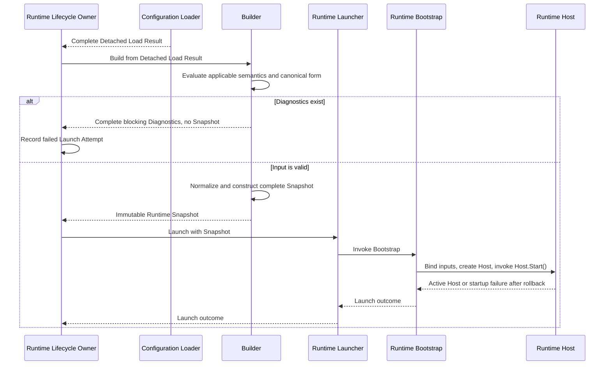

# DP-008: Контракт Snapshot Builder

[English version](../../en/design/DP-008-snapshot-builder-contract.md)

## 1. Статус

**Статус:** Draft

**Статус реализации:** запланирован; текущий Builder всё ещё принимает
ConfigurationVersion напрямую и не строит полный provenance ARCH-005 или
blocking Diagnostics

**Статус архитектуры:** Контракт реализации утверждённой модели из
[ARCH-004](../architecture/ARCH-004-runtime-deployment-and-identity-model.md)
и
[ARCH-005](../architecture/ARCH-005-runtime-configuration-snapshot-and-loading-model.md)

Этот proposal не вводит и не пересматривает архитектуру. Он определяет
инженерный контракт, согласно которому Builder преобразует один полный
`DetachedLoadResult` в один полный immutable Runtime Snapshot либо возвращает
блокирующие Diagnostics без Snapshot.

## 2. Назначение

[DP-007](DP-007-configuration-loader-contract.md) определяет, как Runtime
Lifecycle Owner получает точную Published ConfigurationVersion, закреплённую
за одним Launch Attempt, и принимает detached, не зависящий от source
результат. ARCH-005 определяет Runtime Snapshot как единственный immutable
configuration input для Runtime Bootstrap и Runtime Host.

DP-008 определяет отсутствующий контракт Builder между этими границами:

```text
Configuration Loader
    -> Detached Load Result
    -> Builder
    -> immutable Runtime Snapshot
    -> Runtime Bootstrap
```

Proposal определяет одну operation Builder, границы её input и output,
semantic validation, normalization, Diagnostics, ownership, determinism,
правила dependencies, инварианты Runtime Snapshot и обязательные acceptance
proofs.

## 3. Источники архитектурных решений

Нормативной архитектурой остаются:

- [ADR-0002: Configuration DSL](../adr/0002-configuration-dsl.md);
- [ADR-0003: Runtime Architecture](../adr/0003-runtime-architecture.md);
- [ARCH-002: Runtime Foundation Freeze](../architecture/ARCH-002-runtime-foundation-freeze.md);
- [ARCH-004: Runtime Deployment and Identity Model](../architecture/ARCH-004-runtime-deployment-and-identity-model.md);
- [ARCH-005: Runtime Configuration Snapshot and Loading Model](../architecture/ARCH-005-runtime-configuration-snapshot-and-loading-model.md);
- [DP-007: Configuration Loader Contract](DP-007-configuration-loader-contract.md).

Если этот implementation proposal допускает более широкое толкование, чем
указанные документы, применяется более узкий утверждённый архитектурный
контракт.

## 4. Область

DP-008 определяет:

- одну operation Runtime Snapshot Builder;
- handoff от `DetachedLoadResult` к Builder;
- границу между полнотой representation и semantic completeness;
- полную semantic validation правил, принадлежащих Builder;
- детерминированную normalization в каноническую Runtime model;
- создание одного полного immutable Runtime Snapshot;
- сохранение declarative и operational provenance;
- создание блокирующих Diagnostics;
- взаимоисключающий контракт результата success-or-failure;
- правила ownership, detachment, immutability, atomicity и determinism;
- правила dependencies между Builder, контрактом Loader, Bootstrap и Runtime;
- инварианты Runtime Snapshot;
- acceptance proofs, обязательные до утверждения реализации.

DP-008 не определяет:

- загрузку Configuration, выбор source или source adapters;
- поведение Repository, PostgreSQL, HTTP или YAML;
- публикацию ConfigurationVersion или изменение её lifecycle;
- Runtime Lifecycle Owner, Runtime Launcher или management commands;
- реализацию Runtime Bootstrap или запуск Runtime;
- изменения lifecycle, readiness, rollback или shutdown Runtime Host;
- создание Runtime resources;
- разрешение Secret или lifetime значения Secret;
- persistence, caching, serialization или inspection API для Snapshot;
- hot reload, replacement, reconciliation, retry или fallback;
- Go interfaces, сигнатуры методов, конкретные structs, packages или
  exported APIs.

## 5. Термины контракта

### Detached Load Result

Detached Load Result — это полный, immutable за счёт ownership output Loader,
определённый в DP-007. Он содержит точный declarative payload, проверенный факт
Published, identity схемы и declarative и operational identities, необходимые
для provenance Snapshot.

Builder заимствует это значение на время одной operation Build. Он не получает
полномочий Loader, Source, Repository, publication или lifecycle.

### Runtime Snapshot

Runtime Snapshot — это полное, immutable, detached, готовое к исполнению
значение, определённое ARCH-005 для одного Runtime Host и одного Launch Attempt.

Runtime Snapshot является Runtime model. Он не является ConfigurationVersion,
Configuration, Workspace, сущностью Repository, Control Plane DTO или
обёрткой над любым из этих объектов.

### Semantic Validation

Semantic Validation определяет, удовлетворяют ли detached declarative values и
provenance поддерживаемой схеме, domain rules, cross-field rules и инвариантам
полного Runtime Snapshot, принадлежащим Builder.

Semantic Validation не повторяет доступ к source, выбор публикации,
representation decoding или validation ресурсов при запуске.

### Normalization

Normalization — это детерминированное преобразование семантически корректных
declarative values в одно каноническое Runtime representation. Оно может
вычислять чистые derived values, необходимые Runtime model, но не создаёт
Runtime resources или mutable operational state.

### Diagnostic

Diagnostic — одно блокирующее semantic violation, обнаруженное Builder. Оно
структурировано для последующего представления через CLI, Web UI или API без
необходимости для этих consumers заново интерпретировать Configuration domain.

### Semantic Equivalence

Два Detached Load Result семантически эквивалентны для Builder, когда они
удовлетворяют Semantic Equivalence из DP-007 и содержат равные declarative
values, schema facts, факт Published и provenance identities, относящиеся к
созданию Snapshot. Это определение применяется независимо от того, являются ли
эти значения семантически корректными для создания Snapshot.

Два Runtime Snapshot семантически эквивалентны, когда равны их effective
Runtime configuration, canonical ordering, семантика
absence-versus-presence, Secret References, чистые derived structures и полный
provenance. Allocation layout и адрес объекта не влияют на эквивалентность.

Два Diagnostics Set семантически эквивалентны, когда они содержат одинаковые
блокирующие semantic violations, определённые одинаковыми rule identities и
logical locations. Presentation ordering, allocation layout и адрес объекта
не влияют на эквивалентность Diagnostics Set.

## 6. Обзор контракта

Наблюдаемая успешная operation:

```text
получить полный Detached Load Result
    -> проверить handoff, schema, semantic и normalization obligations
    -> создать полную Runtime model и provenance
    -> отделить все значения, принадлежащие Snapshot
    -> вернуть immutable Runtime Snapshot
```

Наблюдаемая неуспешная operation:

```text
получить Detached Load Result
    -> проверить каждое применимое правило, принадлежащее Builder
    -> собрать детерминированный набор блокирующих Diagnostics
    -> вернуть Diagnostics
    -> не публиковать Runtime Snapshot
```

У Builder есть ровно два результата:

1. один полный Runtime Snapshot без Diagnostics; либо
2. одна непустая коллекция Diagnostics без Runtime Snapshot.

Runtime Snapshot вместе с Diagnostics, partial Snapshot, recoverable Snapshot
и Snapshot с отложенной semantic validation запрещены.

Эти flows определяют наблюдаемые обязательства и результаты, а не внутренний
алгоритм. Builder может чередовать, повторять или совместно использовать любые
чистые промежуточные вычисления, необходимые для semantic validation,
normalization, Diagnostics или создания Snapshot. Ни одно промежуточное
вычисление не становится наблюдаемым Snapshot, Diagnostic или Runtime resource.

## 7. Operation Builder

Единственная архитектурная operation — **Build Runtime Snapshot**.

У operation есть следующие наблюдаемые обязанности:

- получить один полный `DetachedLoadResult`;
- защитно проверить факты handoff, требуемые DP-007 и ARCH-005;
- проверить, что Configuration schema поддерживается этим Builder;
- проверить каждое применимое semantic, cross-field и normalization rule;
- собрать все применимые блокирующие Diagnostics, не останавливаясь после
  первого независимого violation;
- вернуть полный Diagnostics Set без Snapshot при наличии любого Diagnostic;
- иначе создать одну каноническую Runtime model, включая допустимые чистые
  derived structures и полный provenance;
- отделить всё логическое содержимое Snapshot от mutable memory input;
- опубликовать один полный immutable Runtime Snapshot.

Этот список не предписывает порядок фаз или внутренний control flow. Builder
может вычислять предварительные канонические значения или чистые derived
structures тогда, когда они нужны для определения semantic validity. Такие
вычисления локальны для operation и не образуют partial Snapshot.

Успешный return является linearization point создания Snapshot. До него
Snapshot архитектурно невидим. После него полный Snapshot immutable, а Builder
не сохраняет ни input, ни output.

Operation не:

- загружает и не выбирает Configuration;
- вызывает Loader, Source, Repository или management API;
- изменяет ConfigurationVersion или `DetachedLoadResult`;
- принимает решения о launch, retry, replacement или lifecycle;
- вызывает Bootstrap и не создаёт Runtime components;
- разрешает значения Secret;
- получает sockets или иные Runtime resources;
- запускает goroutines, callbacks или background work.

## 8. Input Builder

Builder получает ровно один полный `DetachedLoadResult` через neutral handoff
contract, определённый после DP-007.

Input предоставляет:

- полный declarative payload точной ConfigurationVersion;
- identity Workspace;
- identity Configuration;
- точную identity и номер ConfigurationVersion;
- факт Published, наблюдавшийся Loader;
- identity и версию Configuration schema;
- identity Runtime Instance;
- identity Launch Attempt.

Builder должен защитно проверить факты input, необходимые ему для успешного
создания, включая:

- наличие и внутреннюю согласованность обязательного provenance;
- факт Published, переданный через handoff;
- поддерживаемую Configuration schema;
- полноту, необходимую для semantic validation и создания Snapshot.

Builder не перечитывает и не устанавливает заново:

- существование source;
- repository ownership между Workspace и Configuration;
- Consistent Observation Loader;
- остаётся ли эта version текущей Published version;
- persistence state Runtime Instance или Launch Attempt.

Гарантия Loader не разрешает опускать защитную handoff validation. Защитная
validation не должна превращать Builder во второй Loader.

### Контракт поддерживаемой Schema и Handoff

Этот Builder поддерживает ровно одну byte-for-byte пару schema:
`uwp.configuration` и version `1`. Он не выполняет trimming, case folding,
range negotiation, migration, downgrade или fallback для identity или version
schema. Пустая identity schema и version zero считаются отсутствующими. Любая
другая непустая identity или ненулевая version не поддерживается.

Workspace, Configuration, ConfigurationVersion и номер ConfigurationVersion
используют существующие числовые representations. Zero считается
отсутствующим. Identities Runtime Instance и Launch Attempt остаются opaque:
пустая identity отсутствует, а каждая непустая identity сохраняется
byte-for-byte.

Переданный факт Published должен быть `true`, а состояние detached payload
должно быть ровно `Published`. Configuration ID, Version ID и номер Version
внутри payload должны быть ненулевыми и равны соответствующим переданным
значениям provenance. Builder не исправляет ни одну сторону.

Отсутствующие или неподдерживаемые факты schema делают неприменимыми все
section-specific rules. Они не подавляют независимые правила provenance,
Published и согласованности payload с provenance.

## 9. Output Runtime Snapshot

При успехе Builder возвращает один Runtime Snapshot, содержащий ровно
архитектурные категории, утверждённые ARCH-005:

1. полную effective behavior-affecting Runtime configuration для
   поддерживаемого component graph; и
2. полный стабильный declarative и operational provenance.

Runtime Snapshot должен быть:

- полным;
- immutable после успешного создания;
- структурно независимым от Configuration domain model;
- detached от всей mutable memory, принадлежащей input;
- каноническим для семантически эквивалентного input;
- достаточным для Bootstrap и Runtime Services без доступа к source;
- свободным от независимо принадлежащих Runtime resources.

Runtime Snapshot не должен содержать:

- объекты ConfigurationVersion, Configuration или Workspace;
- сущности Repository, Source adapters, Loader или management services;
- HTTP, YAML или persistence DTO;
- историю ConfigurationVersion или полномочия publication;
- значения Secret или Secret Resolver;
- Runtime components, callbacks, contexts, goroutines, channels, locks,
  sockets, timers или mutable operational state;
- desired или actual lifecycle state;
- identity Snapshot, identity Build, source metadata или telemetry.

### Полная модель Snapshot

Snapshot содержит следующую private logical model:

- `Provenance`: `WorkspaceID uint64`, `ConfigurationID uint64`,
  `ConfigurationVersionID uint64`, `ConfigurationVersionNumber uint32`,
  `SchemaIdentity string`, `SchemaVersion uint32`, opaque
  `RuntimeInstanceID` и opaque `LaunchAttemptID`;
- `Listener`: `Host string`, `Port uint16`, `TLS` и `Timeouts`;
- `TLS`: `Enabled bool`, `CertificateRef string`, `PrivateKeyRef string` и
  `MinVersion string`;
- `Timeouts`: `HandshakeSeconds`, `ReadSeconds`, `WriteSeconds` и
  `IdleSeconds`, каждое поле имеет тип `uint32`;
- `Authentication`: `Enabled bool` и упорядоченные `Providers`;
- каждый Provider: `Name`, точный `Type` (`jwt`, `api-key` или `basic`),
  `Enabled`, `Priority` и ровно одна присутствующая typed settings branch;
- настройки API Key: `Header` и `SecretRef`;
- настройки Basic: `Realm` и `SecretRef`;
- настройки JWT: упорядоченные `SigningKeys` из `Name` и `SecretRef`,
  упорядоченные `AllowedAlgorithms`, `AllowedIssuers`, `AllowedAudiences`,
  упорядоченные `RequiredClaims` из `Name` и `Value`, а также
  `ClockSkewSeconds`;
- optional `Routing` с наблюдаемым presence; при наличии он содержит
  упорядоченные `Routes` и optional `DefaultHandlerRef`, presence которого
  также наблюдаем;
- каждый Route: `ID`, `Enabled`, `Priority`, канонические `Matchers` и
  `HandlerRef`;
- каждый Matcher: `Type` и `Value`.

Отсутствующий Routing отличается от присутствующего Routing без Routes и
default handler. Settings branches Provider образуют discriminated union:
присутствует ровно branch, соответствующая Type Provider.

### Private Detached Readers

Каждый aggregate и collection Snapshot является private. Каждое чтение
aggregate, optional aggregate или collection возвращает полностью detached
value copy. Чтение Routing раскрывает presence отдельно от его detached value.
Settings branches Provider и `DefaultHandlerRef` также раскрывают presence
отдельно.

Коллекции Provider, все последовательности JWT, Routes и Matchers рекурсивно
копируются при каждом чтении, включая всё их logical content. Scalars
возвращаются by value. Reader не раскрывает internal slice, pointer, map,
iterator, mutable view или Configuration domain object. Точные Go signatures
остаются implementation choice только при идентичном наблюдаемом поведении.

Изменение заимствованного input, любого результата reader или другого
результата Build не должно изменять Snapshot или другое чтение. Независимые
успешные operations Build не разделяют mutable logical content.

Наблюдается только optionality, явно определённая schema: Routing,
`DefaultHandlerRef` и discriminated settings branch Provider. Nil и empty
repeated fields семантически эквивалентны и нормализуются в одну empty
sequence.

## 10. Контракт Provenance

У Runtime Snapshot нет независимой business identity. Builder не должен
создавать Snapshot ID, Build ID или другую identity.

Snapshot сохраняет уже установленное замыкание identities для выбранного
launch:

- identity Workspace;
- identity Configuration;
- точную identity и номер ConfigurationVersion;
- identity и версию Configuration schema;
- identity Runtime Instance;
- identity Launch Attempt.

Provenance содержит значения, а не Control Plane entities. Он не содержит тип
source adapter, время load, время build, duration, PID, указатель Host, socket
address, process identity или другую telemetry.

Builder может проверять и копировать provenance. Он не выделяет, не заменяет и
не переинтерпретирует identities, переданные через handoff.

## 11. Граница Semantic Validation

Builder является авторитетной границей semantic validation для создания
Runtime Snapshot.

Builder должен проверять:

- поддерживаемые identity и version Configuration schema;
- полноту, требуемую поддерживаемой Runtime model;
- domain semantics поддерживаемых behavior-affecting sections;
- cross-field и cross-section инварианты Runtime Snapshot;
- правила uniqueness, ordering, reference и absence-versus-presence,
  принадлежащие поддерживаемой Configuration semantics;
- возможность создать каждое обязательное каноническое Runtime value и чистую
  derived structure;
- сохранение и внутреннюю согласованность обязательного provenance;
- факт Published в handoff, требуемый DP-007.

Builder должен проверить каждое применимое semantic rule и собрать все
обнаруженные блокирующие violations. Он не должен останавливаться на первом
независимом violation.

Semantic validation может использовать любую чистую operation-local
normalization или derived calculation, необходимую для проверки rule. Различие
между validation и normalization определяет ответственность и наблюдаемые
результаты; оно не требует отдельных внутренних фаз.

Builder не должен проверять:

- доступность source или storage representation;
- repository ownership посредством другого чтения source;
- историю publication или выбор current version;
- persistence state Runtime Instance или Launch Attempt;
- management authorization, desired state или launch eligibility;
- существование Secret или значения Secret;
- возможность создать Listener, TLS, Authentication или другой Runtime
  resource в текущем environment;
- Runtime lifecycle, readiness, rollback или shutdown.

Control Plane validation и Loader validation не отменяют защитную semantic
ответственность Builder. Acceptance semantics Builder не должны противоречить
утверждённому Configuration domain.

`Host.Start()` сохраняет startup-critical capability validation, требуемую
ARCH-002 и ARCH-005. Эта validation относится к исполняемой полностью
собранной Runtime configuration и созданию operational resources, а не к
semantic validity Configuration. Bootstrap может проверять только свой static
construction input.

### Правила Strings и References

Там, где этот раздел требует trimming строки, Builder удаляет только leading
и trailing Unicode `White_Space`. Он не сворачивает internal whitespace, не
выполняет lowercase, case-fold или Unicode normalization и не добавляет
default. Ограничения в characters считают Unicode code points, если явно не
задано ограничение в bytes.

Secret Reference является своим trimmed значением и должен содержать от 1 до
255 ASCII characters из `[A-Za-z0-9/._-]`. Он не должен иметь leading или
trailing slash, содержать `//`, `://` или `-----BEGIN`. Builder сохраняет
только references и никогда не разрешает значения Secret.

### Правила Listener, TLS и Timeout

Listener Host подвергается trimming, обязателен и ограничен 255 Unicode code
points. Он должен быть одним из:

- IPv4 с ровно четырьмя unsigned decimal octets в `0..255`, без leading zero,
  кроме единственной цифры `0`;
- IPv6 в форме RFC 4291 section 2.2, без brackets и zone identifier;
- ASCII hostname, optionally заканчивающийся одной dot, общей длиной не более
  255 bytes, с labels длиной от 1 до 63 letters, digits или hyphens и
  alphanumeric endpoints каждого label.

Корректное spelling сохраняется. Listener Port должен находиться в
`1..65535`.

TLS `CertificateRef`, `PrivateKeyRef` и `MinVersion` подвергаются trimming.
`MinVersion` обязателен и должен быть ровно `1.2` или `1.3`. При включённом TLS
обязательны обе references. Присутствующая reference должна соответствовать
грамматике Secret Reference. Выключенный TLS сохраняет каждую корректную
присутствующую reference; trimmed-empty reference считается отсутствующей.

Диапазоны timeout в seconds: Handshake `1..300`, Read `0..86400`, Write
`1..300` и Idle `0..86400`.

### Правила Authentication

Порядок объявления Provider сохраняется; nil и empty Providers нормализуются
в одну empty sequence. Включённый Authentication требует непустую sequence
Providers и хотя бы один enabled Provider. Выключенный Authentication всё
равно проверяет и сохраняет настроенные Providers.

Name Provider подвергается trimming, обязателен, ограничен 255 Unicode code
points и уникален по точному case-sensitive значению. Priority сохраняется
неизменным; zero разрешён, и каждый Priority Provider должен быть уникален.
Type является точным обязательным token: `jwt`, `api-key` или `basic`.

Для поддерживаемого Type требуется ровно соответствующая settings branch, а
каждая присутствующая несоответствующая branch запрещена. Отсутствующий или
неподдерживаемый Type делает неприменимыми правила branch и её children.

Header API Key подвергается trimming, обязателен, ограничен 255 Unicode code
points и должен соответствовать HTTP token syntax: ASCII letters или digits
либо один из символов ``!#$%&'*+-.^_`|~``. `SecretRef` API Key соответствует
правилу Secret Reference.

Realm Basic подвергается trimming, обязателен и ограничен 255 Unicode code
points. Internal whitespace и case сохраняются. `SecretRef` Basic
соответствует правилу Secret Reference.

Правила JWT:

- Signing Keys непусты и сохраняют порядок. Каждый Name подвергается trimming,
  обязателен и уникален по точному case-sensitive значению; дополнительный
  maximum не применяется. Каждый `SecretRef` соответствует правилу Secret
  Reference.
- Allowed Algorithms непусты, сохраняют порядок и содержат только точные
  tokens `HS256`, `HS384`, `HS512`, `RS256`, `RS384`, `RS512`, `ES256`,
  `ES384`, `ES512`, `PS256`, `PS384` и `PS512`; точные duplicates запрещены.
- Allowed Issuers и Allowed Audiences сохраняют порядок. Каждый элемент
  подвергается trimming, непуст и уникален по точному case-sensitive
  значению; дополнительные length или syntax rules не применяются.
- Required Claims сохраняют порядок. Name и Value подвергаются trimming и
  непусты; Names уникальны по точному case-sensitive значению. Дополнительные
  length или syntax rules не применяются.
- `ClockSkewSeconds` должен находиться в `0..300`.

Ни одна коллекция Authentication не сортируется.

### Правила Routing

Routing сохраняет различие absence и presence. Присутствующий Routing с nil
или empty Routes нормализуется в одну empty sequence. Порядок объявления Route
сохраняется; разрешено не более 256 Routes.

ID Route и Handler Reference подвергаются trimming, обязательны, ограничены
128 ASCII characters и должны соответствовать
`[A-Za-z][A-Za-z0-9._-]*`. ID Route и каждый положительный Priority уникальны
среди всех Routes, включая disabled Routes. Priority должен быть
положительным.

Каждый Route содержит не более четырёх Matchers. Enabled Route требует хотя бы
один Matcher. Type и Value Matcher подвергаются trimming. Type уникален внутри
Route и должен быть ровно `message-type`, `principal-kind`,
`authentication-type` или `authentication-provider`. Соответствующий Value
должен быть:

- `text` или `binary` для `message-type`;
- `authenticated` или `anonymous` для `principal-kind`;
- `jwt`, `api-key` или `basic` для `authentication-type`;
- любым непустым trimmed, case-preserved значением для
  `authentication-provider`.

Канонические Matchers сортируются по точной паре `(Type, Value)`. Enabled
Routes должны иметь уникальные канонические наборы Matcher; disabled Routes не
участвуют в этом правиле уникальности.

Raw-empty `DefaultHandlerRef` считается отсутствующим. Raw non-empty значение
присутствует, после чего подвергается trimming, обязательно, ограничено 128
ASCII characters и проверяется той же грамматикой, что Handler Reference
Route.

Builder не разрешает Handler Reference и не компилирует Router.

## 12. Normalization и чистые Derived Structures

Builder является единственным authority normalization на границе Runtime.

Normalization должна:

- быть чистой функцией полного `DetachedLoadResult`;
- сохранять утверждённую Configuration semantics;
- создавать канонические Runtime values;
- сохранять значимый ordering и различия absence-versus-presence;
- устанавливать детерминированный ordering там, где Configuration semantics
  определяет порядок независимо от source representation;
- разрешать declarative references только тогда, когда resolution является
  чистой operation над detached input;
- вычислять lookup tables, indices, inheritance results и другие derived
  structures только тогда, когда они являются immutable values, полностью
  определяемыми input;
- оставлять input неизменным.

В рамках normalization Builder не должен создавать:

- goroutines;
- channels;
- mutexes или другие synchronization primitives;
- sockets или network clients;
- timers;
- объекты TLS configuration;
- compiled regular expressions;
- JWT validators;
- Authentication Providers;
- экземпляры Router;
- Listener, Session Manager или другие Runtime objects.

Эти объекты принадлежат `Host.Start()` или специализированному Runtime
component, создание которого координирует Host.

Bootstrap, запуск Host и Runtime Services не должны повторять semantic
normalization, создавать source-specific defaults или переинтерпретировать
корректный Snapshot. Bootstrap может только проверять static construction input
и связывать dependencies. `Host.Start()` выполняет startup-critical checks и
создаёт Runtime resources.

## 13. Контракт Diagnostics

Diagnostics Builder содержат только блокирующие semantic violations. Warning и
informational diagnostics находятся вне этого proposal.

Каждый Diagnostic должен:

- определять одно нарушенное semantic rule в machine-readable виде;
- определять затронутое logical configuration location, если violation
  относится к конкретному location;
- предоставлять presentation text, подходящий для человека-оператора;
- не содержать значения Secret, объекта source, Runtime resource или mutable
  authority;
- оставаться осмысленным без доступа к Repository, Loader, Bootstrap или
  Runtime.

Коллекция Diagnostics должна:

- содержать каждое блокирующее violation, обнаруживаемое проверкой всех
  применимых semantic rules относительно переданного detached input;
- не содержать Snapshot или partial Runtime model;
- не зависеть от traversal timing, source adapter и allocation layout;
- подходить для детерминированного rendering слоями CLI, Web UI и API;
- оставаться detached от mutable memory, принадлежащей input.

### Применимость Diagnostics

Semantic rule **применимо**, когда:

- rule принадлежит поддерживаемой schema и проверяемой configured section;
- каждый prerequisite fact, необходимый для проверки rule, присутствует и
  семантически пригоден; и
- проверка rule не требует предположений о факте, уже отклонённом другим
  применимым prerequisite rule.

**Prerequisite rule** устанавливает факт, необходимый одному или нескольким
dependent rules. Нарушение prerequisite rule:

- создаёт собственный блокирующий Diagnostic;
- делает неприменимыми только rules, которым необходим отклонённый факт;
- не подавляет независимые rules, чьи prerequisites остаются выполненными.

Builder должен подавлять cascading Diagnostic, когда тот сообщает только о
следствии уже сообщённого нарушения prerequisite и не может определить
дополнительное независимо проверяемое violation. Builder не должен использовать
cascade suppression для пропуска независимого violation.

Для одного input и одного утверждённого набора semantic rules Builder должен
вернуть один детерминированный Diagnostics Set:

- каждое нарушенное применимое rule добавляет один Diagnostic для каждого
  отдельного logical location, где существует это violation;
- одинаковые identity rule и logical location встречаются не более одного
  раза;
- семантически эквивалентные некорректные inputs создают семантически
  эквивалентные Diagnostics Sets;
- traversal order, allocation и presentation ordering не изменяют состав Set;
- rules, ставшие неприменимыми из-за нарушенных prerequisites, не добавляют
  Diagnostic.

Builder не должен логировать Diagnostics, публиковать их во внешнюю систему,
записывать failure Launch Attempt или выбирать management response. После
возврата Builder ответственность за результат failed launch остаётся у Runtime
Lifecycle Owner.

### Representation Diagnostic и грамматика Location

Каждый Diagnostic является immutable tuple из `Severity`, `Code`, `Location` и
`Message`. `Severity` всегда имеет literal `error`. Code, Location и Message
являются фиксированными redacted English strings из исчерпывающего registry
ниже. Messages не содержат отклонённое значение и не локализуются Builder.

Location начинается с `$`, использует lower-camel-case field tokens и
zero-based исходные declaration indices. Registry tokens `[i]` и `[j]`
заменяются фактическими indices.

### Registry Diagnostic: Handoff, Provenance и Listener

| Code | Location | Message |
| --- | --- | --- |
| `snapshot.provenance.workspace.required` | `$.provenance.workspaceId` | `workspace identity is required` |
| `snapshot.provenance.configuration.required` | `$.provenance.configurationId` | `configuration identity is required` |
| `snapshot.provenance.configuration_version.required` | `$.provenance.configurationVersionId` | `configuration version identity is required` |
| `snapshot.provenance.configuration_number.required` | `$.provenance.configurationVersionNumber` | `configuration version number is required` |
| `snapshot.provenance.runtime_instance.required` | `$.provenance.runtimeInstanceId` | `runtime instance identity is required` |
| `snapshot.provenance.launch_attempt.required` | `$.provenance.launchAttemptId` | `launch attempt identity is required` |
| `snapshot.schema.identity.required` | `$.provenance.schemaIdentity` | `configuration schema identity is required` |
| `snapshot.schema.identity.unsupported` | `$.provenance.schemaIdentity` | `configuration schema identity is unsupported` |
| `snapshot.schema.version.required` | `$.provenance.schemaVersion` | `configuration schema version is required` |
| `snapshot.schema.version.unsupported` | `$.provenance.schemaVersion` | `configuration schema version is unsupported` |
| `snapshot.handoff.not_published` | `$.handoff.published` | `detached load result is not published` |
| `snapshot.configuration_version.state.not_published` | `$.configurationVersion.state` | `configuration version state is not published` |
| `snapshot.configuration_version.configuration.required` | `$.configurationVersion.configurationId` | `configuration version payload configuration identity is required` |
| `snapshot.configuration_version.identity.required` | `$.configurationVersion.id` | `configuration version payload identity is required` |
| `snapshot.configuration_version.number.required` | `$.configurationVersion.number` | `configuration version payload number is required` |
| `snapshot.configuration_version.configuration.inconsistent` | `$.configurationVersion.configurationId` | `configuration identity conflicts with provenance` |
| `snapshot.configuration_version.identity.inconsistent` | `$.configurationVersion.id` | `configuration version identity conflicts with provenance` |
| `snapshot.configuration_version.number.inconsistent` | `$.configurationVersion.number` | `configuration version number conflicts with provenance` |
| `snapshot.listener.host.required` | `$.listener.host` | `listener host is required` |
| `snapshot.listener.host.too_long` | `$.listener.host` | `listener host exceeds 255 characters` |
| `snapshot.listener.host.invalid` | `$.listener.host` | `listener host is not a valid IP address or hostname` |
| `snapshot.listener.port.out_of_range` | `$.listener.port` | `listener port must be between 1 and 65535` |
| `snapshot.listener.tls.min_version.required` | `$.listener.tls.minVersion` | `TLS minimum version is required` |
| `snapshot.listener.tls.min_version.unsupported` | `$.listener.tls.minVersion` | `TLS minimum version is unsupported` |
| `snapshot.listener.tls.certificate.required` | `$.listener.tls.certificateRef` | `TLS certificate reference is required when TLS is enabled` |
| `snapshot.listener.tls.certificate.too_long` | `$.listener.tls.certificateRef` | `TLS certificate reference exceeds 255 characters` |
| `snapshot.listener.tls.certificate.invalid` | `$.listener.tls.certificateRef` | `TLS certificate reference is invalid` |
| `snapshot.listener.tls.private_key.required` | `$.listener.tls.privateKeyRef` | `TLS private key reference is required when TLS is enabled` |
| `snapshot.listener.tls.private_key.too_long` | `$.listener.tls.privateKeyRef` | `TLS private key reference exceeds 255 characters` |
| `snapshot.listener.tls.private_key.invalid` | `$.listener.tls.privateKeyRef` | `TLS private key reference is invalid` |
| `snapshot.listener.timeout.handshake.out_of_range` | `$.listener.timeouts.handshakeSeconds` | `handshake timeout must be between 1 and 300 seconds` |
| `snapshot.listener.timeout.read.out_of_range` | `$.listener.timeouts.readSeconds` | `read timeout must be between 0 and 86400 seconds` |
| `snapshot.listener.timeout.write.out_of_range` | `$.listener.timeouts.writeSeconds` | `write timeout must be between 1 and 300 seconds` |
| `snapshot.listener.timeout.idle.out_of_range` | `$.listener.timeouts.idleSeconds` | `idle timeout must be between 0 and 86400 seconds` |

### Registry Diagnostic: Authentication

| Code | Location | Message |
| --- | --- | --- |
| `snapshot.authentication.providers.required` | `$.authentication.providers` | `authentication requires at least one provider` |
| `snapshot.authentication.enabled_provider.required` | `$.authentication.providers` | `authentication requires at least one enabled provider` |
| `snapshot.authentication.provider.name.required` | `$.authentication.providers[i].name` | `authentication provider name is required` |
| `snapshot.authentication.provider.name.too_long` | `$.authentication.providers[i].name` | `authentication provider name exceeds 255 characters` |
| `snapshot.authentication.provider.name.duplicate` | `$.authentication.providers[i].name` | `authentication provider name is duplicated` |
| `snapshot.authentication.provider.priority.duplicate` | `$.authentication.providers[i].priority` | `authentication provider priority is duplicated` |
| `snapshot.authentication.provider.type.required` | `$.authentication.providers[i].type` | `authentication provider type is required` |
| `snapshot.authentication.provider.type.unsupported` | `$.authentication.providers[i].type` | `authentication provider type is unsupported` |
| `snapshot.authentication.provider.settings.required` | matching `$.authentication.providers[i].apiKey`, `.basic`, or `.jwt` | `authentication provider settings are required for its type` |
| `snapshot.authentication.provider.settings.forbidden` | each present nonmatching `$.authentication.providers[i].apiKey`, `.basic`, or `.jwt` | `authentication provider settings are forbidden for its type` |
| `snapshot.authentication.api_key.header.required` | `$.authentication.providers[i].apiKey.header` | `API key header is required` |
| `snapshot.authentication.api_key.header.too_long` | `$.authentication.providers[i].apiKey.header` | `API key header exceeds 255 characters` |
| `snapshot.authentication.api_key.header.invalid` | `$.authentication.providers[i].apiKey.header` | `API key header is invalid` |
| `snapshot.authentication.api_key.secret_ref.required` | `$.authentication.providers[i].apiKey.secretRef` | `API key secret reference is required` |
| `snapshot.authentication.api_key.secret_ref.too_long` | `$.authentication.providers[i].apiKey.secretRef` | `API key secret reference exceeds 255 characters` |
| `snapshot.authentication.api_key.secret_ref.invalid` | `$.authentication.providers[i].apiKey.secretRef` | `API key secret reference is invalid` |
| `snapshot.authentication.basic.realm.required` | `$.authentication.providers[i].basic.realm` | `Basic realm is required` |
| `snapshot.authentication.basic.realm.too_long` | `$.authentication.providers[i].basic.realm` | `Basic realm exceeds 255 characters` |
| `snapshot.authentication.basic.secret_ref.required` | `$.authentication.providers[i].basic.secretRef` | `Basic secret reference is required` |
| `snapshot.authentication.basic.secret_ref.too_long` | `$.authentication.providers[i].basic.secretRef` | `Basic secret reference exceeds 255 characters` |
| `snapshot.authentication.basic.secret_ref.invalid` | `$.authentication.providers[i].basic.secretRef` | `Basic secret reference is invalid` |
| `snapshot.authentication.jwt.signing_keys.required` | `$.authentication.providers[i].jwt.signingKeys` | `JWT requires at least one signing key` |
| `snapshot.authentication.jwt.signing_key.name.required` | `$.authentication.providers[i].jwt.signingKeys[j].name` | `JWT signing key name is required` |
| `snapshot.authentication.jwt.signing_key.name.duplicate` | `$.authentication.providers[i].jwt.signingKeys[j].name` | `JWT signing key name is duplicated` |
| `snapshot.authentication.jwt.signing_key.secret_ref.required` | `$.authentication.providers[i].jwt.signingKeys[j].secretRef` | `JWT signing key secret reference is required` |
| `snapshot.authentication.jwt.signing_key.secret_ref.too_long` | `$.authentication.providers[i].jwt.signingKeys[j].secretRef` | `JWT signing key secret reference exceeds 255 characters` |
| `snapshot.authentication.jwt.signing_key.secret_ref.invalid` | `$.authentication.providers[i].jwt.signingKeys[j].secretRef` | `JWT signing key secret reference is invalid` |
| `snapshot.authentication.jwt.algorithms.required` | `$.authentication.providers[i].jwt.allowedAlgorithms` | `JWT requires at least one allowed algorithm` |
| `snapshot.authentication.jwt.algorithm.unsupported` | `$.authentication.providers[i].jwt.allowedAlgorithms[j]` | `JWT algorithm is unsupported` |
| `snapshot.authentication.jwt.algorithm.duplicate` | `$.authentication.providers[i].jwt.allowedAlgorithms[j]` | `JWT algorithm is duplicated` |
| `snapshot.authentication.jwt.issuer.required` | `$.authentication.providers[i].jwt.allowedIssuers[j]` | `JWT issuer must not be empty` |
| `snapshot.authentication.jwt.issuer.duplicate` | `$.authentication.providers[i].jwt.allowedIssuers[j]` | `JWT issuer is duplicated` |
| `snapshot.authentication.jwt.audience.required` | `$.authentication.providers[i].jwt.allowedAudiences[j]` | `JWT audience must not be empty` |
| `snapshot.authentication.jwt.audience.duplicate` | `$.authentication.providers[i].jwt.allowedAudiences[j]` | `JWT audience is duplicated` |
| `snapshot.authentication.jwt.claim.name.required` | `$.authentication.providers[i].jwt.requiredClaims[j].name` | `JWT required claim name is required` |
| `snapshot.authentication.jwt.claim.name.duplicate` | `$.authentication.providers[i].jwt.requiredClaims[j].name` | `JWT required claim name is duplicated` |
| `snapshot.authentication.jwt.claim.value.required` | `$.authentication.providers[i].jwt.requiredClaims[j].value` | `JWT required claim value is required` |
| `snapshot.authentication.jwt.clock_skew.out_of_range` | `$.authentication.providers[i].jwt.clockSkewSeconds` | `JWT clock skew must be between 0 and 300 seconds` |

### Registry Diagnostic: Routing

| Code | Location | Message |
| --- | --- | --- |
| `snapshot.routing.routes.too_many` | `$.routing.routes` | `routing contains more than 256 routes` |
| `snapshot.routing.default_handler.required` | `$.routing.defaultHandlerRef` | `default handler reference is required when present` |
| `snapshot.routing.default_handler.too_long` | `$.routing.defaultHandlerRef` | `default handler reference exceeds 128 characters` |
| `snapshot.routing.default_handler.invalid` | `$.routing.defaultHandlerRef` | `default handler reference is invalid` |
| `snapshot.routing.route.id.required` | `$.routing.routes[i].id` | `route identity is required` |
| `snapshot.routing.route.id.too_long` | `$.routing.routes[i].id` | `route identity exceeds 128 characters` |
| `snapshot.routing.route.id.invalid` | `$.routing.routes[i].id` | `route identity is invalid` |
| `snapshot.routing.route.id.duplicate` | `$.routing.routes[i].id` | `route identity is duplicated` |
| `snapshot.routing.route.priority.out_of_range` | `$.routing.routes[i].priority` | `route priority must be positive` |
| `snapshot.routing.route.priority.duplicate` | `$.routing.routes[i].priority` | `route priority is duplicated` |
| `snapshot.routing.route.handler.required` | `$.routing.routes[i].handlerRef` | `route handler reference is required` |
| `snapshot.routing.route.handler.too_long` | `$.routing.routes[i].handlerRef` | `route handler reference exceeds 128 characters` |
| `snapshot.routing.route.handler.invalid` | `$.routing.routes[i].handlerRef` | `route handler reference is invalid` |
| `snapshot.routing.route.matchers.too_many` | `$.routing.routes[i].matchers` | `route contains more than four matchers` |
| `snapshot.routing.route.matchers.required` | `$.routing.routes[i].matchers` | `enabled route requires at least one matcher` |
| `snapshot.routing.matcher.type.required` | `$.routing.routes[i].matchers[j].type` | `matcher type is required` |
| `snapshot.routing.matcher.type.unsupported` | `$.routing.routes[i].matchers[j].type` | `matcher type is unsupported` |
| `snapshot.routing.matcher.type.duplicate` | `$.routing.routes[i].matchers[j].type` | `matcher type is duplicated within the route` |
| `snapshot.routing.matcher.value.required` | `$.routing.routes[i].matchers[j].value` | `matcher value is required` |
| `snapshot.routing.matcher.value.unsupported` | `$.routing.routes[i].matchers[j].value` | `matcher value is unsupported for its type` |
| `snapshot.routing.matcher_set.duplicate` | `$.routing.routes[i].matchers` | `enabled route duplicates an earlier normalized matcher set` |

Для `settings.required` фактическим Location является отсутствующая branch,
выбранная Type. Для `settings.forbidden` один Diagnostic создаётся в каждой
присутствующей несоответствующей branch. Для этих Codes разрешены только такие
Locations.
Точное соответствие:

- Type `api-key`: required `$.authentication.providers[i].apiKey`; forbidden
  `$.authentication.providers[i].basic` и
  `$.authentication.providers[i].jwt`;
- Type `basic`: required `$.authentication.providers[i].basic`; forbidden
  `$.authentication.providers[i].apiKey` и
  `$.authentication.providers[i].jwt`;
- Type `jwt`: required `$.authentication.providers[i].jwt`; forbidden
  `$.authentication.providers[i].apiKey` и
  `$.authentication.providers[i].basic`.

### Applicability, Duplicate Anchoring и Ordering

Следующие правила precedence являются нормативными:

1. Правило required-value проверяется после указанного trimming. Его failure
   подавляет правила too-long, invalid, unsupported и uniqueness для того же
   значения. Присутствующее значение может независимо нарушить и too-long, и
   invalid.
2. Schema required предшествует schema unsupported. Отсутствующая или
   неподдерживаемая пара schema подавляет только section rules.
3. Payload required rules независимы. Zero в payload создаёт соответствующий
   payload required Diagnostic. Правило inconsistency применимо только когда
   оба сравниваемых значения ненулевые: carried non-zero и payload zero
   создают только payload-required Diagnostic; carried zero и payload non-zero
   создают только carried-required Diagnostic; оба zero создают оба required
   Diagnostics; оба non-zero и неравные создают только inconsistent; равные
   значения не создают Diagnostic. Проверки Published handoff и payload state
   независимы и не подавляют section rules при корректной schema.
4. Enabled Authentication с zero Providers создаёт только
   `snapshot.authentication.providers.required`; правило enabled-provider
   применимо только к непустой sequence Providers. Missing Type подавляет
   unsupported и все branch rules. Unknown Type создаёт unsupported и
   подавляет branch rules. Для supported Type отсутствующая ожидаемая branch
   создаёт settings-required и подавляет её children; каждая присутствующая
   wrong branch создаёт settings-forbidden и подавляет её children.
5. Scalar uniqueness использует только пригодные normalized values и точное
   case-sensitive equality. Наименьший исходный declaration index является
   silent anchor; каждый последующий исходный index получает один duplicate
   Diagnostic в своём scalar Location. Это применяется к Name и Priority
   Provider, Name Signing Key JWT, Algorithm, Issuer, Audience, Name Claim, ID
   и Priority Route и Type Matcher.
6. Правило too-many не подавляет element rules. Правило matcher-required для
   enabled Route применимо только к empty sequence.
7. Кандидат набора Matcher для enabled Route требует от одного до четырёх
   Matchers, каждый Type и Value должен присутствовать и поддерживаться, а
   каждый Type должен быть уникален. Его normalized pairs сортируются.
   Наименьший исходный index Route является silent anchor; каждый последующий
   эквивалентный кандидат получает Matcher-set duplicate Diagnostic в своём
   Location Matchers. Правила ID, Priority и Handler Route остаются
   независимыми. Disabled Routes не участвуют.
8. Отсутствующий Routing подавляет все правила Routing; present-empty Routing
   корректен. Raw-empty default handler отсутствует. Raw non-empty,
   trimmed-empty default handler присутствует и создаёт только свой required
   Diagnostic.

Diagnostics дедуплицируются по точной паре `(Code, actual Location)`. Их
canonical order начинается с Location и использует segment-aware comparison:
field tokens сравниваются bytewise, indices — numerically, а parent
предшествует descendant. Затем Code сравнивается bytewise. Message никогда не
является ordering key. Эквивалентные invalid inputs создают идентичные
упорядоченные поля Severity, Code, Location и Message.

## 14. Атомарность результата и семантика Failure

Builder публикует ровно одно из следующего:

- один полный immutable Runtime Snapshot; либо
- одну непустую полную коллекцию Diagnostics.

Запрещены следующие состояния:

- одновременный возврат Snapshot и Diagnostics;
- partial Snapshot;
- recoverable или degraded Snapshot;
- Snapshot с некорректными semantic sections, которые должны быть проверены
  при запуске;
- Snapshot, завершаемый асинхронно после return;
- success с последующим failure, принадлежащим Builder.

При failure Builder:

- Snapshot не возвращается и не публикуется;
- Builder не вызывает Bootstrap или Runtime Host;
- operation Build не создаёт Runtime resources;
- `DetachedLoadResult` остаётся неизменным;
- fallback, retry, replacement или downgrade schema не выполняются;
- Builder не сохраняет input или mutable reference, принадлежащую Diagnostics;
- ответственность за правдивую запись failed Launch Attempt остаётся у Runtime
  Lifecycle Owner.

Публикация Diagnostics caller является linearization point failure. Ни один
observer не может получить частично проверенный или частично нормализованный
Snapshot.
Поэтому наличие любого Diagnostic означает отсутствие Snapshot, partial
Snapshot или degraded result. Builder не вызывает ни Bootstrap, ни Host, не
записывает failure Launch Attempt и не создаёт resource. И наоборот, startup
или resource errors `Host.Start()` никогда не становятся Diagnostics Builder,
а некорректный для Builder input никогда не откладывается до Host.

## 15. Инварианты Snapshot

### Инварианты Identity

- У Runtime Snapshot нет независимой identity.
- Snapshot сохраняет identities Workspace, Configuration, точной
  ConfigurationVersion, Runtime Instance и Launch Attempt.
- Snapshot сохраняет номер ConfigurationVersion, а также identity и version
  Configuration schema.
- Builder не создаёт, не заменяет и не перепривязывает ни одну из этих
  identities.

### Структурные инварианты

- Snapshot содержит Runtime model, а не объекты Configuration domain.
- Snapshot содержит только effective Runtime configuration и provenance.
- Каждая поддерживаемая Runtime section, требуемая для исполнения, структурно
  полна.
- Из Snapshot недостижимы Repository, Source, Loader, DTO, history или mutable
  authority.

### Семантические инварианты

- Каждое значение Snapshot удовлетворяет поддерживаемым правилам Configuration
  и cross-field rules, принадлежащим Builder.
- Unsupported schema и семантически некорректный input не могут создать
  Snapshot.
- Secret References могут сохраняться; значения Secret не могут попадать в
  Snapshot.
- Bootstrap и Host не получают неразрешённых semantic violations.

### Инварианты Normalization

- Snapshot использует одно каноническое representation для семантически
  эквивалентного input.
- Значимый ordering и различия absence-versus-presence сохраняются.
- Derived structures immutable и определяются исключительно input.
- Никакие source-specific или скрытые Runtime defaults не изменяют
  Configuration semantics.

### Инварианты Ownership

- Builder заимствует input и после return не сохраняет ссылок.
- Успешный Snapshot не имеет mutable alias на логическое содержимое input.
- После return Builder не сохраняет ownership Snapshot.
- Readers Snapshot не могут изменить logical view другого reader.

### Независимость Runtime

- Создание Snapshot не получает Runtime resources.
- Snapshot не содержит Runtime object или mutable operational state.
- Для интерпретации Snapshot Runtime Services никогда не нуждаются в Loader,
  Source, Repository или истории Configuration.

### Детерминизм

- Семантически эквивалентные корректные inputs создают семантически
  эквивалентные Snapshots.
- Повторные operations Build не зависят от traversal timing, allocation,
  process state, типа source или внешнего mutable state.

### Полнота

- Каждое поддерживаемое behavior-affecting значение input либо представлено в
  Snapshot согласно утверждённой semantics, либо вызывает блокирующие
  Diagnostics.
- Snapshot достаточен для Bootstrap и Host без дополнительного чтения
  declarative source.
- Ни одно поддерживаемое semantic obligation не откладывается до Runtime
  Services.

### Атомарность

- Snapshot становится видимым только после полного успешного создания.
- Failure публикует Diagnostics и не публикует Snapshot.
- Ни один observer не может получить промежуточное состояние validation,
  normalization или construction.

## 16. Ownership, Immutability и Lifetime

Ownership передаётся в одном направлении:

| Этап | Ownership |
| --- | --- |
| Runtime Lifecycle Owner | Владеет подготовкой launch и Detached Load Result |
| Builder | Заимствует input и владеет только синхронной operation Build |
| Runtime Lifecycle Owner после success | Владеет полным Runtime Snapshot |
| Runtime Launcher / Bootstrap | Заимствует или принимает Snapshot согласно передаче ownership из ARCH-005 |
| Runtime Host | Владеет своим независимым immutable Snapshot в течение lifetime Host |
| Runtime Services | Только чтение |

Builder не должен сохранять:

- `DetachedLoadResult`;
- любую mutable reference, принадлежащую input;
- Diagnostics после возврата failure;
- Runtime Snapshot после возврата success;
- cache или registry предыдущих operations Build.

Snapshot становится immutable при успешном создании. Lifetime его значения
продолжается согласно ARCH-005 через подготовку launch, Bootstrap, Host и
разрешённых Runtime readers. У него нет cleanup protocol, поскольку он не
содержит значений Secret или независимо принадлежащих Runtime resources.

## 17. Детерминизм и Concurrency

Output Builder должен зависеть только от полного input и утверждённых semantic
rules.

Правила determinism:

- семантически эквивалентные корректные inputs создают семантически
  эквивалентные Snapshots;
- повторные builds эквивалентных inputs не накапливают state;
- изменения publication или source после success Loader не могут повлиять на
  Build;
- Builder не читает clock, random source, environment, global registry,
  Repository, network service или Runtime state;
- чистые derived structures вычисляются одинаково для эквивалентного input;
- ordering input сохраняется или канонизируется только согласно требованиям
  утверждённой Configuration semantics.

Builder не содержит mutable operation state, переживающего Build. Независимые
operations Build не разделяют частично созданные состояния Snapshot или
Diagnostics. Контракт не вводит synchronization object или background
execution.

Точные concurrency API и семантика ожидания caller находятся вне этого
proposal. Никакая реализация не может ослаблять детерминированную изоляцию
между независимыми operations Build.

## 18. Правила Dependencies

Требуемое направление dependencies:

```text
Runtime Lifecycle Owner
    -> neutral Loader handoff contract
        -> Builder
            -> immutable Runtime Snapshot

Runtime Lifecycle Owner
    -> Runtime Launcher
        -> Runtime Bootstrap
            -> immutable Runtime Snapshot
            -> Host.Start()
```

Builder использует только neutral handoff contract Loader. Он не импортирует
конкретную реализацию Configuration Loader и не зависит от неё. Текущий
repository реализует этот neutral contract в `internal/runtimeconfigload`;
этот path является фактом реализации, а не нормативным требованием к package
layout из DP-008.

Обязательные правила:

- Builder не знает реализацию Loader или Source adapters.
- Builder не знает Repository, PostgreSQL, HTTP, YAML или Configuration
  services.
- Builder не знает Runtime Bootstrap, Runtime Host, Listener, Session Manager,
  реализацию Router или Runtime Services.
- Builder не знает Secret Resolver.
- Loader не импортирует и не вызывает Builder.
- Runtime Bootstrap принимает Runtime Snapshot, связывает construction inputs,
  создаёт Host и вызывает `Host.Start()`; он не получает
  `DetachedLoadResult`.
- Runtime Host и Runtime Services не получают полномочий Builder или Loader.
- Никакой dependency cycle не может соединять создание Runtime Snapshot
  обратно с repositories Control Plane.

Этот proposal определяет ответственности dependencies, а не package layout.

## 19. Последовательность взаимодействия



Builder не вызывает ни Loader, ни Bootstrap. Runtime Lifecycle Owner сохраняет
утверждённый pipeline и владеет всеми management outcomes.

## 20. Acceptance Proofs

Следующие свойства реализации обязательны. Они не являются именами тестов и не
предписывают конкретную технику тестирования.

### AP-001: Детерминизм Builder

Семантически эквивалентные корректные значения `DetachedLoadResult` создают
семантически эквивалентные Runtime Snapshots независимо от allocation, порядка
вызовов, source adapter и случайного process-local state.

### AP-002: Независимость Runtime Model

Из Runtime Snapshot недостижимы ConfigurationVersion, Configuration,
Workspace, сущность Repository, Control Plane DTO или source-specific
representation.

### AP-003: Граница Semantic Validation

Каждое поддерживаемое semantic и cross-field rule, принадлежащее Builder,
проверяется до success, а доступ к source, разрешение Secret, создание ресурсов
и lifecycle decisions остаются вне Builder.

### AP-004: Полнота Snapshot

Каждый успешный Runtime Snapshot содержит всю поддерживаемую effective Runtime
configuration и обязательный provenance, требуемые Bootstrap без
дополнительного чтения declarative source.

### AP-005: Отсутствие Partial Snapshot

Любое блокирующее semantic violation не создаёт Runtime Snapshot, и ни один
observer не может получить промежуточное или recoverable состояние Snapshot.

### AP-006: Полнота Diagnostics

Для некорректного input возвращённые Diagnostics определяют каждое блокирующее
violation каждого применимого semantic rule, принадлежащего Builder, подавляют
только cascading consequences нарушенных prerequisite rules и содержат каждое
независимое violation ровно один раз для каждого отдельного logical location.

### AP-007: Immutability Snapshot

Никакое изменение caller-owned input после Build не может изменить успешный
Snapshot, и ни один reader Snapshot не может изменить logical view другого
reader.

### AP-008: Изоляция Ownership

После return Builder не сохраняет ни input, ни Diagnostics, ни Snapshot, и
независимые результаты Build не разделяют mutable logical content.

### AP-009: Полнота Normalization

Каждый успешный Snapshot представляет весь поддерживаемый input в одной
канонической Runtime form, сохраняя значимый order и absence semantics и не
применяя source-specific или скрытые defaults.

### AP-010: Независимость Runtime

Один только success Build не создаёт Runtime component, goroutine, channel,
lock, socket, timer, TLS configuration, validator, context, readiness state
или другой Runtime resource.

### AP-011: Ответственность за Startup

Builder возвращает только семантически полные значения Snapshot; Bootstrap
выполняет только validation static construction-input и связывание
dependencies, а `Host.Start()` выполняет startup-critical capability
validation и создание ресурсов. Ни один из них не повторяет semantic
validation или normalization Configuration.

### AP-012: Сохранение Identity

Каждый успешный Snapshot сохраняет полный declarative и operational provenance
из `DetachedLoadResult`, не создавая identity Snapshot или Build.

### AP-013: Semantic Equivalence

Эквивалентные source representations, удовлетворяющие Semantic Equivalence из
DP-007, создают семантически эквивалентные значения Snapshot либо семантически
эквивалентные детерминированные Diagnostics Sets для одинаковой invalid
semantics.

### AP-014: Эквивалентность повторных Build

Повторные успешные Builds семантически эквивалентного input создают
семантически эквивалентные, независимо принадлежащие Snapshots, не изменяют
input и не сохраняют operation state.

### AP-015: Полномочия Snapshot

Builder является единственным authority создания Runtime Snapshot; Loader,
Bootstrap, `Host.Start()` и Runtime Services не дополняют, не нормализуют, не
исправляют и не изменяют Snapshot.

## 21. Совместимость с архитектурой

### ADR-0002

ConfigurationVersion остаётся единственным declarative source поведения
Runtime. Builder создаёт detached Runtime representation, а не второй язык
Configuration, и не вводит скрытый behavior-affecting input.

### ADR-0003

Runtime продолжает использовать один immutable Configuration Snapshot через
явную composition. Builder не получает dependencies HTTP или Repository и не
создаёт Runtime service.

### ARCH-002

DP-008 заканчивается до Runtime Bootstrap. Он не изменяет принадлежащие Host
composition, startup transaction, readiness, Admission Gate, rollback,
shutdown или lifecycle.

### ARCH-004

Builder не создаёт Runtime Instance, Launch Attempt, desired state, actual
state или management decision. Он сохраняет identities, уже принадлежащие
Runtime Lifecycle Owner.

### ARCH-005

Builder остаётся единственной границей semantic validation, normalization,
detachment и создания Snapshot. Snapshot остаётся immutable Runtime input,
принадлежащим согласно утверждённому однонаправленному lifetime.

### DP-007

Builder использует полный neutral `DetachedLoadResult`, повторяет только
назначенные ему защитные handoff checks, не обращается к source и возвращает
либо полный Snapshot, либо принадлежащие Builder Diagnostics.

## 22. Намеренно отложенные вопросы

Следующие вопросы остаются вне DP-008:

- диапазоны compatibility, negotiation и migration Configuration schema;
- реализация Runtime Bootstrap и Runtime Launcher;
- контракт Runtime startup и startup error;
- момент разрешения Secret и lifetime значения Secret;
- persistence, cache, serialization, inspection и transport Snapshot;
- hot reload, replacement, reconciliation, retry, fallback и recovery;
- Warning и informational Diagnostics;
- operational logging, metrics и хранение diagnostics;
- представление результатов Build в management API.

Ничто из перечисленного не может быть реализовано как скрытое поведение
Builder.

## 23. Предварительные условия реализации

Focused pre-implementation refinement завершён:

1. Section 8 определяет точную поддерживаемую пару schema и compatibility
   rule.
2. Sections 9–12 определяют полную модель Snapshot, поведение detached readers,
   normalization и всю поддерживаемую section semantics.
3. Section 13 определяет исчерпывающий structured registry Diagnostics,
   applicability, duplicate anchoring, deduplication и canonical ordering.

Эти contracts снимают architecture blocker TASK-001, не изменяя ownership,
validation, atomicity или Runtime independence. Design Status остаётся `Draft`,
Implementation Status остаётся `Planned`, implementation Builder не начата.

## 24. Решение

UWP создаёт Runtime Snapshot посредством одной operation Builder над neutral
`DetachedLoadResult`.

Builder является единственным authority semantic validation, normalization и
создания Runtime Snapshot. Он проверяет все применимые semantic violations,
возвращает либо один полный immutable Runtime Snapshot, либо полные блокирующие
Diagnostics, сохраняет обязательный provenance без создания новой identity и
не создаёт Runtime resources.

Runtime Snapshot — detached Runtime model, а не ConfigurationVersion или
Control Plane entity. Он содержит только полную effective Runtime configuration
и provenance, остаётся immutable после успешного создания и детерминирован для
семантически эквивалентного input. Bootstrap получает только семантически
полный Snapshot, проверяет static construction input, связывает dependencies,
создаёт Host и вызывает `Host.Start()`. Только Host владеет startup-critical
capability validation, operational composition, созданием ресурсов, rollback
и окончательным результатом startup.
