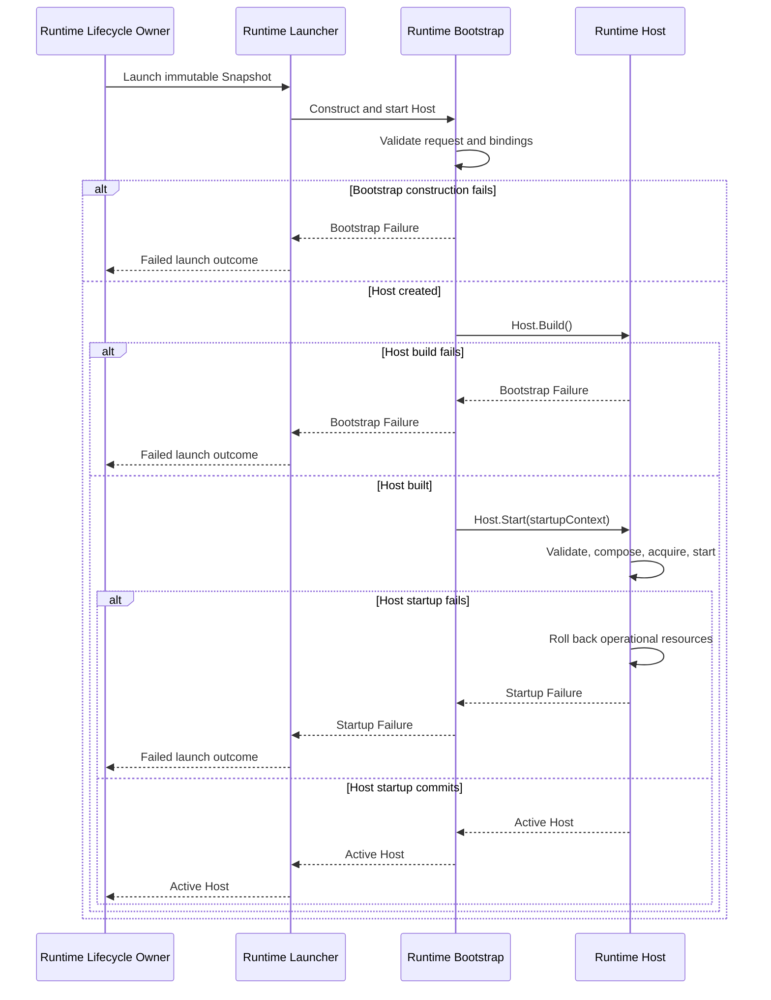

# DP-009: Контракт Runtime Bootstrap

[English version](../../en/design/DP-009-runtime-bootstrap-contract.md)

## 1. Статус

**Design Status:** Draft

**Implementation Status:** Planned

Это предложение описывает будущий контракт реализации. Оно не утверждает,
что pipeline Loader-to-Builder-to-Launcher реализован.

Сфокусированное уточнение implementation prerequisites завершено. Реализация
Runtime Bootstrap и его production integration остаются запланированными.

## 2. Назначение

Определить инженерную границу, посредством которой stateless Runtime Launcher
вызывает Runtime Bootstrap с одним concrete request, а Bootstrap создаёт не
более одного Host и синхронно вызывает `Host.Start()` не более одного раза.

Host остаётся единственной production composition root и единственным
владельцем operational startup transaction.

## 3. Источники полномочий

Нормативной архитектурой остаются:

- [ADR-0002: Configuration DSL](../adr/0002-configuration-dsl.md);
- [ADR-0003: Runtime Architecture](../adr/0003-runtime-architecture.md);
- [ARCH-002: Runtime Foundation Freeze](../architecture/ARCH-002-runtime-foundation-freeze.md);
- [ARCH-004: Runtime Deployment and Identity Model](../architecture/ARCH-004-runtime-deployment-and-identity-model.md);
- [ARCH-005: Runtime Configuration Snapshot and Loading Model](../architecture/ARCH-005-runtime-configuration-snapshot-and-loading-model.md);
- [DP-007: Configuration Loader Contract](DP-007-configuration-loader-contract.md);
- [DP-008: Snapshot Builder Contract](DP-008-snapshot-builder-contract.md).

Если этот Draft допускает более широкое толкование, чем источник со статусом
Approved, Active или Frozen, приоритет имеет более узкий контракт источника с
более высоким уровнем полномочий.

## 4. Область действия

DP-009 определяет:

- одну синхронную операцию Bootstrap;
- вход и выход Bootstrap;
- границу Launcher-to-Bootstrap;
- валидацию статических construction inputs;
- явную привязку зависимостей;
- создание Host;
- синхронное делегирование `Host.Start()`;
- разделение Bootstrap failure и Host startup failure;
- правила владения, очистки, зависимостей и acceptance proofs.

DP-009 не определяет:

- загрузку Configuration или построение Snapshot;
- хранение Runtime Instance или Launch Attempt;
- реализацию Runtime Launcher;
- внутреннее устройство Host или изменения публичного API;
- operational composition, startup validation, получение ресурсов, startup
  rollback, readiness, Admission Gate, shutdown, retry или replacement policy;
- поведение Repository, PostgreSQL, HTTP, YAML или management API.

## 5. Термины контракта

### Runtime Bootstrap

Runtime Bootstrap является границей конструирования. Он получает один
конкретный request, проверяет только его статическое представление, привязывает
фиксированные зависимости, создаёт и строит один Host и вызывает
`Host.Start()` не более одного раза.

Bootstrap не является production composition root, владельцем ресурсов,
владельцем lifecycle, registry или management authority.

### Runtime Launcher

Runtime Launcher — это stateless-граница, определённая ARCH-004. Runtime
Lifecycle Owner поручает Launcher выполнить одну launch attempt. Launcher
вызывает Bootstrap и возвращает его результат, не сохраняя Snapshot, Host или
lifecycle state.

### Runtime Host

Runtime Host является единственной production composition root и lifecycle
coordinator. Только `Host.Start()` владеет startup-critical validation,
компоновкой operational graph, получением ресурсов, запуском компонентов,
rollback, readiness и итоговым результатом startup.

### Bootstrap Failure

Bootstrap Failure — это сбой до начала `Host.Start()`: недопустимый статический
construction input, отсутствие обязательной dependency binding или
невозможность создать или построить незапущенное значение Host. Он не создаёт
operational Runtime resource.

### Startup Failure

Startup Failure — это итоговый неуспешный результат, возвращённый
`Host.Start()` после rollback, принадлежащего Host. Bootstrap передаёт его без
переклассификации в Bootstrap Failure.

## 6. Обязательный поток выполнения

```text
Runtime Lifecycle Owner
    -> Runtime Launcher
        -> Runtime Bootstrap
            -> validate request
            -> validate dependency bindings
            -> create Host
            -> Host.Build()
            -> Host.Start()
                -> validate fully assembled Runtime configuration
                -> compose operational Runtime graph
                -> acquire and start operational resources
                -> commit or rollback
            -> return active Host or failure
        -> return launch outcome
    -> record Launch Attempt outcome
```

Runtime Lifecycle Owner не вызывает Bootstrap или `Host.Start()` напрямую.
Launcher не создаёт Host и не компонует Runtime graph. Bootstrap не обходит
Launcher и не поглощает владение startup, принадлежащее Host.

## 7. Операция Bootstrap

Единственная архитектурная операция — **Construct and Start Runtime Host**:

1. валидировать конкретный Bootstrap Request;
2. валидировать его конкретные Dependency Bindings;
3. вызвать фиксированный production-конструктор Host не более одного раза;
4. вызвать `Host.Build()` не более одного раза;
5. вызвать `Host.Start(startupContext)` не более одного раза;
6. вернуть ровно один Success, Bootstrap Failure или Startup Failure.

Порядок фиксирован и fail-fast. Неуспешный шаг предотвращает все последующие
шаги. Операция является синхронной, не содержит retry и после возврата не
сохраняет request, dependency, Host или launch state.

`Host.Build()` выполняет только существующий неоперационный переход из Created
в Built. Ошибка Build является Bootstrap Failure. Получение operational
resources остаётся невозможным до `Host.Start()` и после начала Start
принадлежит исключительно Host.

## 8. Конкретный Bootstrap Request

Request является одним структурно полным значением, содержащим ровно:

| Поле | Контракт |
| --- | --- |
| Snapshot | Один полный immutable архитектурный Runtime Snapshot, переданный by value |
| Startup Context | Один обязательный non-nil startup context, заимствованный только для синхронного вызова `Host.Start()` и переданный без изменения |
| Dependency Bindings | Одно фиксированное typed-значение Dependency Bindings, определённое разделом 11 |

Provenance Snapshot является единственной launch identity в Request. Request
не должен дублировать identity Workspace, Configuration,
ConfigurationVersion, schema, Runtime Instance или Launch Attempt вне Snapshot.

Startup context не является Runtime lifetime context. Bootstrap заимствует его,
передаёт то же значение context в `Host.Start()` и не сохраняет его. Уже
отменённый context является допустимым статическим входом. Если Host отказывает
в startup из-за отмены этого context, результатом является Startup Failure, а
не Bootstrap Failure.

Request не несёт полномочий Repository, Configuration Source, Loader, Builder,
publication, management, Runtime Lifecycle Owner, предварительно созданного
Listener или operational Runtime graph. Dependency Bindings не могут
переопределять Snapshot или действовать как второй декларативный источник
Configuration.

## 9. Взаимоисключающий результат Bootstrap

Закрытый tagged outcome имеет ровно одну из следующих форм:

| Результат | Payload | Значение |
| --- | --- | --- |
| Success | `ActiveHost` | `Host.Start()` завершился успешно, и Host находится в Running |
| Bootstrap Failure | `Stage`, `Code`, optional `Cause` | Ошибка до вызова `Host.Start()` |
| Startup Failure | обязательный `Cause` | `Host.Start()` был вызван и вернул ошибку после rollback, принадлежащего Host |

Outcome не может содержать одновременно Host и failure. Success не может
содержать nil, Built, незапущенный, failed или частично сконструированный Host.
Bootstrap Failure и Startup Failure не публикуют Host. `PreparedRuntime`,
partial-success и промежуточный результат Host отсутствуют.

## 10. Граница валидации

Bootstrap выполняет ровно три static validation checks в указанном порядке:

1. request envelope и startup context структурно присутствуют;
2. Snapshot не является zero-value и содержит все восемь provenance facts:
   Workspace ID, Configuration ID, ConfigurationVersion ID и number, schema
   identity и version, Runtime Instance ID и Launch Attempt ID;
3. envelope Dependency Bindings структурно присутствует, а его обязательный
   Secret Resolver присутствует согласно разделу 11.

После успешного завершения этих validations Bootstrap выполняет фиксированный
production-конструктор Host, а затем выполняет неоперационный `Build()`
созданного Host. Это реальные execution steps, а не static checks или dry
runs. Ошибка constructor и ошибка Build являются четвёртой и пятой failure
points в глобальном fail-fast precedence, определённом разделом 14. Bootstrap
не вызывает constructor после более ранней validation failure, не вызывает
Build до успешного construction и не вызывает Start до успешного Build.

Nil или typed-nil startup context не проходит статическую input validation.
Уже отменённый, но non-nil context проходит статическую validation и достигает
`Host.Start()`.

Bootstrap не проверяет:

- доменную семантику Configuration, принадлежащую Builder;
- semantics schema, Listener, TLS, Timeout, Authentication или Routing, уже
  принадлежащие Builder и Snapshot;
- являются ли startup capabilities исполняемыми;
- можно ли получить Listener, TLS, Authentication или другие operational
  resources;
- может ли Runtime graph запуститься;
- readiness или lifecycle transitions.

Компоненты могут владеть сфокусированными startup validators. `Host.Start()` —
единственный вызывающий и координатор этих validators для полностью собранной
Runtime configuration.

## 11. Конкретные Dependency Bindings

Dependency Bindings является одним фиксированным typed-значением, а не map,
service locator или registry:

| Binding | Наличие | Контракт Bootstrap |
| --- | --- | --- |
| Secret Resolver | Обязателен, в том числе при отключённой Authentication | Стабильная заимствованная capability; Bootstrap никогда не вызывает `Resolve` |
| Legacy Message Handler | Опционален | Отсутствие явно; только composition Host решает, нужен ли он |
| Terminal Error Reporter | Опционален | Capability синхронного callback; Bootstrap никогда его не вызывает |

Для обязательного Secret Resolver nil и typed-nil оба означают отсутствие. Для
каждого optional binding nil и typed-nil оба означают отсутствие. Отсутствие
никогда не выбирает fallback-реализацию.

Bindings не несут identity Runtime или Launch Attempt и полномочий Loader,
Builder, Repository, publication, management или lifecycle. Bootstrap передаёт
Host выбранные стабильные ссылки capability, не закрывая их. Внешние владельцы
сохраняют ownership; Host может сохранять только ссылки, необходимые его
существующему composition contract.

Production-конструктор Host фиксирован и принадлежит Bootstrap, а не
передаётся как caller binding. Реализация может использовать private immutable
factory seam только для тестов. Binding не должна вводить dependency injection
на основе reflection, global registry, скрытый fallback, mutable shared launch
state или construction operational graph.

## 12. Граница запуска Host

Исключительно `Host.Start()`:

- валидирует startup-critical capabilities;
- конструирует поддерживаемый operational component graph;
- конструирует и получает Listener и другие operational resources;
- запускает Runtime components;
- владеет startup transaction;
- выполняет rollback после любого startup failure;
- сохраняет сведения об ошибках startup и rollback;
- публикует Runtime context, readiness, admission и Running только при commit.

Bootstrap может вызвать эту операцию и передать её результат. Вызов не
передаёт ни одну из этих обязанностей Bootstrap или Launcher.

## 13. Очистка и rollback

До `Host.Start()` неуспешный вызов Bootstrap отбрасывает только свои локальные
construction values. Эти значения не являются operational и не требуют
контракта cleanup.

После начала `Host.Start()` Host владеет каждым operational resource,
полученным для startup, и всем rollback. Bootstrap никогда не вызывает
`Host.Stop()`, не выполняет cleanup или retry, не создаёт второй Host и не
вызывает Start повторно.

После успешного startup Runtime Lifecycle Owner владеет ссылкой на активный
Host согласно ARCH-004. Bootstrap не сохраняет владение.

## 14. Структурированный контракт ошибок

Bootstrap Failure и Startup Failure являются взаимоисключающими стадиями:

- Bootstrap Failure означает, что `Host.Start()` не был вызван;
- Startup Failure означает, что `Host.Start()` был вызван и вернулся только
  после завершения своего rollback contract.

Bootstrap использует следующий полный упорядоченный registry Bootstrap
Failure:

| Приоритет | Stage | Code | Фиксированное описание |
| --- | --- | --- | --- |
| 1 | Input Validation | `invalid-startup-context` | Bootstrap startup context отсутствует |
| 2 | Input Validation | `invalid-snapshot` | Bootstrap Snapshot недопустим |
| 3 | Dependency Binding | `missing-secret-resolver` | Binding Bootstrap Secret Resolver отсутствует |
| 4 | Host Construction | `host-construction-failed` | Не удалось сконструировать Runtime Host |
| 5 | Host Preparation | `host-build-failed` | Не удалось выполнить build Runtime Host |

Validation является fail-fast и возвращает не более одного Bootstrap Failure,
используя первую применимую пару. Отсутствие optional bindings не является
ошибкой.

`Stage` и `Code` являются стабильной machine-readable identity Bootstrap
failure. Bootstrap Failure может иметь cause; Startup Failure всегда содержит
cause, возвращённый `Host.Start()`. Failure напрямую unwrap свой cause, чтобы
сохранялась наблюдаемость через `errors.Is`, `errors.As` и существующую цепочку
`errors.Join`. Bootstrap не заменяет, не сворачивает, не преобразует в строку и
не переклассифицирует cause startup Host.

Любая ошибка после фактического начала вызова `Host.Start()` является
исключительно Startup Failure. После неё Bootstrap не выполняет cleanup, Stop,
retry, второй Start или fallback.

Identity failure не дублирует Runtime Instance или Launch Attempt identity,
которая остаётся только в provenance Snapshot. Описания Bootstrap failure
постоянны и не содержат значения Snapshot, Secret, dependency или текст cause.
Этот контракт не утверждает, что cause безопасно логировать, и не определяет
logging, serialization, operational presentation, storage или redaction.

Ни один из результатов не выбирает другую ConfigurationVersion, не
перестраивает Snapshot, не повторяет launch и не меняет identity Launch
Attempt. Runtime Lifecycle Owner фиксирует правдивый результат Launch Attempt.

## 15. Владение

| Объект | До Bootstrap | Во время Bootstrap | После успеха |
| --- | --- | --- | --- |
| Bootstrap Request | Граница Launcher | Заимствован синхронным вызовом | Не сохраняется |
| Runtime Snapshot | Lifecycle Owner | Передан by value для создания Host | Host владеет своим immutable-значением |
| Startup context | Caller | Заимствован и передан без изменения в `Host.Start()` | Не сохраняется Bootstrap |
| Стабильные dependency capabilities | Внешние владельцы | Заимствованы для binding; Bootstrap никогда их не закрывает | Host сохраняет необходимые ссылки; внешнее ownership не меняется |
| Host | Не существует | Сконструирован и построен Bootstrap; startup принадлежит Host | Lifecycle Owner владеет единственной активной ссылкой |
| Operational Runtime graph | Не существует | Создан и принадлежит `Host.Start()` | Host |
| Listener | Не существует | Создан и принадлежит `Host.Start()` | Host |
| Runtime context | Не существует | Создан при startup commit Host | Host |

После возврата Bootstrap не сохраняет ни один из этих объектов.

## 16. Граница lifecycle и активации

Startup commit Host является единственной точкой линеаризации активации.

До неё:

- активный Host не опубликован;
- Runtime context не существует;
- readiness имеет значение false;
- admission закрыт;
- operational failure всё ещё подлежит rollback со стороны Host.

После неё:

- Host находится в состоянии Running;
- Runtime context существует;
- readiness и admission отражают существующий lifecycle Host;
- Runtime Lifecycle Owner может опубликовать ссылку на активный Host.

Возврат Bootstrap не создаёт вторую точку активации.

## 17. Детерминизм и конкурентность

До Start Bootstrap следует одному фиксированному приоритету validation и
порядку binding для одинакового request. Он не обходит dependency map и не
обращается к global, registry, cache, environment fallback или mutable shared
state.

Один вызов Bootstrap конструирует не более одного Host, вызывает Build не более
одного раза и вызывает Start не более одного раза. Bootstrap не создаёт
goroutine или background lifecycle. Конкурентные вызовы независимы. Результат
`Host.Start()` может зависеть от operational external conditions; это не
ослабляет детерминированное поведение до Start.

## 18. Правила зависимостей

```text
Runtime Lifecycle Owner
    -> Runtime Launcher
        -> Runtime Bootstrap
            -> Runtime Host
```

- Launcher зависит от контракта Bootstrap, а не от внутреннего устройства Host.
- Bootstrap зависит от фиксированного контракта создания Host и фиксированных
  typed Dependency Bindings.
- Host не зависит от Launcher или Bootstrap.
- Bootstrap не зависит от реализации Loader, реализации Builder, Repository,
  HTTP или сервисов Control Plane.
- Bootstrap получает Snapshot, а не ConfigurationVersion или
  `DetachedLoadResult`.
- Ни один dependency cycle не может связывать Host или Bootstrap обратно с
  репозиториями Control Plane.

## 19. Последовательность взаимодействия



## 20. Приёмочные доказательства

### AP-001: Единственная composition root

Только `Host.Start()` компонует production Runtime graph.

### AP-002: Единственный владелец startup

Startup validation, operational acquisition, commit и rollback координируются
Host.

### AP-003: Наличие Launcher

Каждый production launch request проходит через stateless Runtime Launcher.
Изолированная реализация Bootstrap не может доказать это integration property;
proof требуется при реализации Launcher, Lifecycle Owner и production launch
wiring.

### AP-004: Граница Bootstrap

Bootstrap валидирует статический construction input, привязывает зависимости,
создаёт не более одного Host и сам не выполняет operational startup work.

### AP-005: Build и Start не более одного раза

Одна операция Bootstrap конструирует не более одного Host, вызывает
`Host.Build()` не более одного раза и вызывает `Host.Start()` не более одного
раза.

### AP-006: Отсутствие публикации частичного Host

Успешно может быть возвращён только активный Host, startup которого достиг
commit.

### AP-007: Разделение ошибок

Bootstrap Failure доказывает, что Start не был вызван; Startup Failure
доказывает, что rollback, принадлежащий Host, завершился до возврата.
Структурированный outcome взаимоисключающий и сохраняет исходную cause chain.

### AP-008: Полномочия Snapshot

Bootstrap и Host получают Snapshot без полномочий Loader, Builder, Repository
или publication.

### AP-009: Отсутствие декларативной переинтерпретации

Bootstrap не нормализует Snapshot и не вводит второй декларативный источник
configuration.

### AP-010: Владение ресурсами

Каждый operational resource, созданный во время startup, принадлежит Host и
охвачен rollback со стороны Host.

### AP-011: Stateless Launcher

Launcher не сохраняет Snapshot, Host, registry или lifecycle state после
вызова launch. Изолированная реализация Bootstrap не может доказать это
свойство Launcher; proof требуется при production integration.

### AP-012: Отделение Bootstrap

Bootstrap не сохраняет Snapshot, Host, dependency или launch state после
возврата.

### AP-013: Атомарность активации

Ни один observer не видит Running, readiness, admission или Runtime context до
startup commit Host.

### AP-014: Направление зависимостей

Ни Host, ни Bootstrap не получают полномочий Repository или Control Plane, и
ни один dependency cycle не вводится.

### AP-015: Честность planned state

Пока реализация не проверена, документация состояния проекта определяет этот
pipeline как planned, а не implemented.

### AP-016: Конкретный Request

Bootstrap принимает ровно один Snapshot by value, один обязательный non-nil
startup context и одно фиксированное typed-значение Dependency Bindings. Launch
identity не дублируется вне provenance Snapshot.

### AP-017: Фиксированная семантика Bindings

Secret Resolver всегда обязателен. Nil и typed-nil обрабатываются одинаково
для required и optional bindings, отсутствие optional binding не выбирает
fallback, а Bootstrap не вызывает ни Secret Resolver, ни Terminal Error
Reporter.

### AP-018: Приоритет Validation

Каждая ошибка до Start выбирает не более одной из пяти упорядоченных пар
Stage/Code, а отсутствие optional binding не создаёт failure.

### AP-019: Сохранение Cause

Startup Failure напрямую unwrap неизменённый cause `Host.Start()`, включая
цепочки `errors.Join`, а Bootstrap не выполняет post-Start cleanup, Stop, retry
или reclassification.

### AP-020: Ownership и независимость

Bootstrap не сохраняет request, context, dependency, Host или launch state;
конкурентные вызовы не разделяют mutable state, принадлежащий Bootstrap.

## 21. Совместимость с архитектурой

### ARCH-002

Host остаётся единственной production composition root и владельцем startup
transaction, operational resources, rollback, readiness и lifecycle.

### ARCH-004

Runtime Launcher остаётся обязательным и stateless. Runtime Lifecycle Owner
использует Launcher, а не вызывает Bootstrap или Host напрямую.

### ARCH-005

Snapshot остаётся единственным immutable декларативным входом Runtime.
Bootstrap передаёт Host независимое значение без полномочий source или
publication.

### DP-007 и DP-008

Bootstrap не получает ни результат Loader, ни полномочия Builder и не выполняет
source validation, semantic normalization или исправление Snapshot.

## 22. Намеренно отложенные вопросы

За пределами DP-009 остаются:

- конкретные Go types, signatures и package layout;
- private test-factory seam и детали production wiring;
- реализация Runtime Launcher;
- integration Runtime Lifecycle Owner и Control Service;
- operational diagnostics, logging, serialization, storage и redaction;
- retry, replacement, reconciliation и persistence;
- момент Secret resolution там, где он ещё не зафиксирован источником более
  высокого уровня;
- process topology и remote launch transport.

Ни один из этих вопросов не может быть реализован как скрытое поведение
Bootstrap.

## 23. Предварительные условия реализации

Сфокусированное prerequisite refinement определяет concrete request semantics,
фиксированный набор bindings и nil behavior, упорядоченную identity failure,
взаимоисключающий outcome и сохранение cause, необходимые до реализации.

Это завершает prerequisite design refinement, а не implementation или
production integration. Конкретные Go types, signatures, package placement,
private test seam и production wiring остаются для отдельной implementation
task в границах разделов 7–18. AP-003 и AP-011 остаются
integration-gated.

## 24. Решение

UWP использует Runtime Launcher как обязательную stateless launch boundary.
Launcher будет вызывать одну синхронную операцию Runtime Bootstrap с одним
concrete request: Snapshot by value, обязательным startup context и
фиксированным typed-значением Dependency Bindings. Bootstrap валидирует только
статическое представление в фиксированном порядке, конструирует не более одного
Host, вызывает Build не более одного раза и Start не более одного раза.

Только Host валидирует полностью собранную Runtime configuration, компонует и
запускает operational graph, получает ресурсы, владеет rollback и публикует
успех startup. Bootstrap возвращает ровно один Success, структурированный
Bootstrap Failure или сохраняющий cause Startup Failure, не публикует partial
Host, не выполняет cleanup или retry и не сохраняет lifecycle state.
