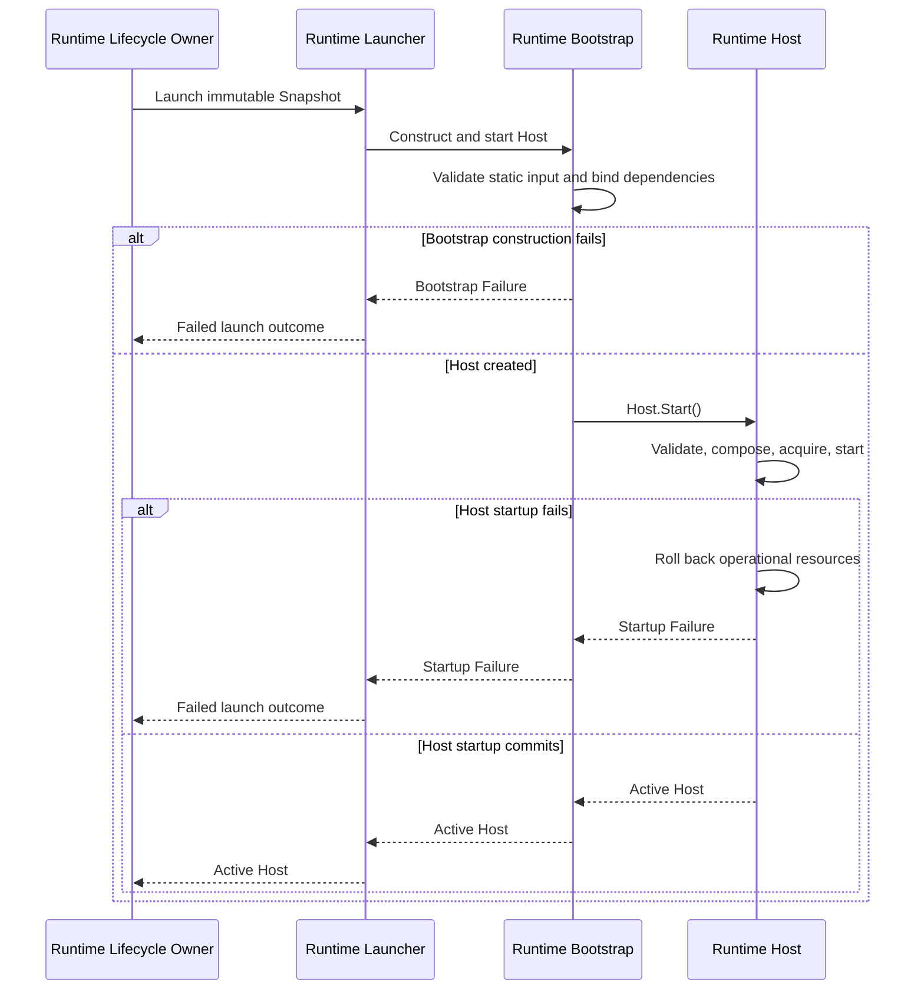

# DP-009: Контракт Runtime Bootstrap

[English version](../../en/design/DP-009-runtime-bootstrap-contract.md)

## 1. Статус

**Design Status:** Draft

**Implementation Status:** Planned

Это предложение описывает будущий контракт реализации. Оно не утверждает,
что pipeline Loader-to-Builder-to-Launcher реализован.

## 2. Назначение

Определить инженерную границу, посредством которой stateless Runtime Launcher
вызывает Runtime Bootstrap с одним immutable Runtime Snapshot, а Bootstrap
создаёт один Host и синхронно вызывает `Host.Start()`.

Host остаётся единственной production composition root и единственным
владельцем operational startup transaction.

## 3. Источники полномочий

Нормативной архитектурой остаются:

- [ADR-0002: Configuration DSL](../adr/0002-configuration-dsl.md);
- [ADR-0003: Runtime Architecture](../adr/0003-runtime-architecture.md);
- [ARCH-002: Runtime Foundation Freeze](../architecture/ARCH-002-runtime-foundation-freeze.md);
- [ARCH-004: Runtime Deployment and Identity Model](../architecture/ARCH-004-runtime-deployment-and-identity-model.md);
- [ARCH-005: Runtime Configuration Snapshot and Loading Model](../architecture/ARCH-005-runtime-configuration-snapshot-and-loading-model.md);
- [DP-007: Configuration Loader Contract](DP-007-configuration-loader-contract.md);
- [DP-008: Snapshot Builder Contract](DP-008-snapshot-builder-contract.md).

Если этот Draft допускает более широкое толкование, чем источник со статусом
Approved, Active или Frozen, приоритет имеет более узкий контракт источника с
более высоким уровнем полномочий.

## 4. Область действия

DP-009 определяет:

- одну синхронную операцию Bootstrap;
- вход и выход Bootstrap;
- границу Launcher-to-Bootstrap;
- валидацию статических construction inputs;
- явную привязку зависимостей;
- создание Host;
- синхронное делегирование `Host.Start()`;
- разделение Bootstrap failure и Host startup failure;
- правила владения, очистки, зависимостей и acceptance proofs.

DP-009 не определяет:

- загрузку Configuration или построение Snapshot;
- хранение Runtime Instance или Launch Attempt;
- реализацию Runtime Launcher;
- внутреннее устройство Host или изменения публичного API;
- operational composition, startup validation, получение ресурсов, startup
  rollback, readiness, Admission Gate, shutdown, retry или replacement policy;
- поведение Repository, PostgreSQL, HTTP, YAML или management API.

## 5. Термины контракта

### Runtime Bootstrap

Runtime Bootstrap является границей конструирования. Он получает launch input,
проверяет его статическое представление, привязывает конкретные зависимости,
создаёт один Host и вызывает `Host.Start()` ровно один раз.

Bootstrap не является production composition root, владельцем ресурсов,
владельцем lifecycle, registry или management authority.

### Runtime Launcher

Runtime Launcher — это stateless-граница, определённая ARCH-004. Runtime
Lifecycle Owner поручает Launcher выполнить одну launch attempt. Launcher
вызывает Bootstrap и возвращает его результат, не сохраняя Snapshot, Host или
lifecycle state.

### Runtime Host

Runtime Host является единственной production composition root и lifecycle
coordinator. Только `Host.Start()` владеет startup-critical validation,
компоновкой operational graph, получением ресурсов, запуском компонентов,
rollback, readiness и итоговым результатом startup.

### Bootstrap Failure

Bootstrap Failure — это сбой до начала `Host.Start()`: недопустимый статический
construction input, отсутствие обязательной dependency binding или
невозможность создать незапущенное значение Host. Он не создаёт operational
Runtime resource.

### Startup Failure

Startup Failure — это итоговый неуспешный результат, возвращённый
`Host.Start()` после rollback, принадлежащего Host. Bootstrap передаёт его без
переклассификации в Bootstrap Failure.

## 6. Обязательный поток выполнения

```text
Runtime Lifecycle Owner
    -> Runtime Launcher
        -> Runtime Bootstrap
            -> validate static construction input
            -> bind dependencies
            -> create Host
            -> Host.Start()
                -> validate fully assembled Runtime configuration
                -> compose operational Runtime graph
                -> acquire and start operational resources
                -> commit or rollback
            -> return active Host or failure
        -> return launch outcome
    -> record Launch Attempt outcome
```

Runtime Lifecycle Owner не вызывает Bootstrap или `Host.Start()` напрямую.
Launcher не создаёт Host и не компонует Runtime graph. Bootstrap не обходит
Launcher и не поглощает владение startup, принадлежащее Host.

## 7. Операция Bootstrap

Единственная архитектурная операция — **Construct and Start Runtime Host**:

1. получить от Launcher один immutable Runtime Snapshot и обязательные
   construction dependencies;
2. проверить статическое наличие, identity и представление этих входных данных;
3. привязать выбранные реализации без создания operational resources;
4. создать ровно один незапущенный Host;
5. вызвать `Host.Start()` ровно один раз;
6. вернуть либо активный Host, либо один Bootstrap Failure, либо Host Startup
   Failure.

Операция является синхронной. После возврата Bootstrap не сохраняет launch
state.

## 8. Входные данные

Bootstrap получает:

- один полный immutable Runtime Snapshot;
- фиксированные construction dependencies, необходимые для создания Host;
- startup context и launch-scoped inputs, требуемые существующим контрактом
  Host.

Bootstrap не получает:

- Repository или Configuration Source;
- полномочия Loader или Builder;
- историю публикаций;
- Control Plane management authority;
- предварительно созданный Listener или operational Runtime graph.

Любая внешняя construction configuration, читаемая Bootstrap, ограничивается
статической привязкой зависимостей. Она не является вторым декларативным
источником Configuration и не может переопределять Runtime Snapshot.

## 9. Выход

Операция возвращает ровно один результат:

- активный Host, startup commit которого завершён;
- один Bootstrap Failure, возникший до `Host.Start()`; либо
- один Startup Failure, возвращённый после rollback, принадлежащего Host.

Runtime Lifecycle Owner не получает частично сконструированный, незапущенный
или неуспешный Host. В этом контракте отсутствует отдельный handoff
`PreparedRuntime`.

## 10. Граница валидации

Bootstrap проверяет только:

- наличие обязательных construction inputs;
- внутреннюю согласованность их статических identities и типов;
- возможность выбрать обязательные dependency bindings без operational work;
- возможность создать один Host из этих значений.

Bootstrap не проверяет:

- доменную семантику Configuration, принадлежащую Builder;
- являются ли startup capabilities исполняемыми;
- можно ли получить Listener, TLS, Authentication или другие operational
  resources;
- может ли Runtime graph запуститься;
- readiness или lifecycle transitions.

Компоненты могут владеть сфокусированными startup validators. `Host.Start()` —
единственный вызывающий и координатор этих validators для полностью собранной
Runtime configuration.

## 11. Привязка зависимостей

Bootstrap выбирает и привязывает конкретные реализации, необходимые
конструктору Host. Привязка явна и детерминирована. Она не создаёт operational
graph, который Host компонует во время Start.

Привязка не должна вводить service locator, dependency injection на основе
reflection, global registry, скрытый fallback или mutable shared launch state.

## 12. Граница запуска Host

Исключительно `Host.Start()`:

- валидирует startup-critical capabilities;
- конструирует поддерживаемый operational component graph;
- конструирует и получает Listener и другие operational resources;
- запускает Runtime components;
- владеет startup transaction;
- выполняет rollback после любого startup failure;
- сохраняет сведения об ошибках startup и rollback;
- публикует Runtime context, readiness, admission и Running только при commit.

Bootstrap может вызвать эту операцию и передать её результат. Вызов не
передаёт ни одну из этих обязанностей Bootstrap или Launcher.

## 13. Очистка и rollback

До `Host.Start()` Bootstrap очищает только созданные им Bootstrap-local
construction values, которые не были переданы Host. Такая очистка не является
operational startup rollback.

После начала `Host.Start()` Host владеет каждым operational resource,
полученным для startup, и всем rollback. Bootstrap не выполняет повторную
очистку или retry.

После успешного startup Runtime Lifecycle Owner владеет ссылкой на активный
Host согласно ARCH-004. Bootstrap не сохраняет владение.

## 14. Контракт ошибок

Bootstrap Failure и Startup Failure являются взаимоисключающими стадиями:

- Bootstrap Failure означает, что `Host.Start()` не был вызван;
- Startup Failure означает, что `Host.Start()` был вызван и вернулся только
  после завершения своего rollback contract.

Ни один из результатов не выбирает другую ConfigurationVersion, не
перестраивает Snapshot, не повторяет launch и не меняет identity Launch
Attempt. Runtime Lifecycle Owner фиксирует правдивый результат Launch Attempt.

Конкретные Go errors, wrapping, представление diagnostics, retry и persistence
остаются за пределами этого предложения.

## 15. Владение

| Объект | До Bootstrap | Во время Bootstrap | После успеха |
| --- | --- | --- | --- |
| Runtime Snapshot | Lifecycle Owner | Заимствован для создания Host | Host владеет своей immutable-копией |
| Construction dependencies | Граница Launcher | Заимствованы для привязки | Host владеет необходимыми bindings |
| Host | Не существует | Создан Bootstrap; startup принадлежит Host | Lifecycle Owner владеет активной ссылкой |
| Operational Runtime graph | Не существует | Создан и принадлежит `Host.Start()` | Host |
| Listener | Не существует | Создан и принадлежит `Host.Start()` | Host |
| Runtime context | Не существует | Создан при startup commit Host | Host |

После возврата Bootstrap не сохраняет ни один из этих объектов.

## 16. Граница lifecycle и активации

Startup commit Host является единственной точкой линеаризации активации.

До неё:

- активный Host не опубликован;
- Runtime context не существует;
- readiness имеет значение false;
- admission закрыт;
- operational failure всё ещё подлежит rollback со стороны Host.

После неё:

- Host находится в состоянии Running;
- Runtime context существует;
- readiness и admission отражают существующий lifecycle Host;
- Runtime Lifecycle Owner может опубликовать ссылку на активный Host.

Возврат Bootstrap не создаёт вторую точку активации.

## 17. Детерминизм и конкурентность

Для одинаковых Snapshot, construction dependencies и эквивалентных внешних
условий Bootstrap выбирает одинаковые bindings и делегирует одну и ту же
startup operation.

Один вызов Bootstrap создаёт не более одного Host и вызывает его Start не более
одного раза. Bootstrap не содержит mutable global state, registry, cache,
goroutine или background lifecycle. Конкурентные вызовы независимы.

## 18. Правила зависимостей

```text
Runtime Lifecycle Owner
    -> Runtime Launcher
        -> Runtime Bootstrap
            -> Runtime Host
```

- Launcher зависит от контракта Bootstrap, а не от внутреннего устройства Host.
- Bootstrap может зависеть от контрактов создания Host и сфокусированных
  dependency factories.
- Host не зависит от Launcher или Bootstrap.
- Bootstrap не зависит от реализации Loader, реализации Builder, Repository,
  HTTP или сервисов Control Plane.
- Bootstrap получает Snapshot, а не ConfigurationVersion или
  `DetachedLoadResult`.
- Ни один dependency cycle не может связывать Host или Bootstrap обратно с
  репозиториями Control Plane.

## 19. Последовательность взаимодействия



## 20. Приёмочные доказательства

### AP-001: Единственная composition root

Только `Host.Start()` компонует production Runtime graph.

### AP-002: Единственный владелец startup

Startup validation, operational acquisition, commit и rollback координируются
Host.

### AP-003: Наличие Launcher

Каждый production launch request проходит через stateless Runtime Launcher.

### AP-004: Граница Bootstrap

Bootstrap валидирует статический construction input, привязывает зависимости,
создаёт один Host и сам не выполняет operational startup work.

### AP-005: Ровно один Start

Одна операция Bootstrap вызывает `Host.Start()` не более одного раза.

### AP-006: Отсутствие публикации частичного Host

Успешно может быть возвращён только активный Host, startup которого достиг
commit.

### AP-007: Разделение ошибок

Bootstrap Failure доказывает, что Start не был вызван; Startup Failure
доказывает, что rollback, принадлежащий Host, завершился до возврата.

### AP-008: Полномочия Snapshot

Bootstrap и Host получают Snapshot без полномочий Loader, Builder, Repository
или publication.

### AP-009: Отсутствие декларативной переинтерпретации

Bootstrap не нормализует Snapshot и не вводит второй декларативный источник
configuration.

### AP-010: Владение ресурсами

Каждый operational resource, созданный во время startup, принадлежит Host и
охвачен rollback со стороны Host.

### AP-011: Stateless Launcher

Launcher не сохраняет Snapshot, Host, registry или lifecycle state после
вызова launch.

### AP-012: Отделение Bootstrap

Bootstrap не сохраняет Snapshot, Host, dependency или launch state после
возврата.

### AP-013: Атомарность активации

Ни один observer не видит Running, readiness, admission или Runtime context до
startup commit Host.

### AP-014: Направление зависимостей

Ни Host, ни Bootstrap не получают полномочий Repository или Control Plane, и
ни один dependency cycle не вводится.

### AP-015: Честность planned state

Пока реализация не проверена, документация состояния проекта определяет этот
pipeline как planned, а не implemented.

## 21. Совместимость с архитектурой

### ARCH-002

Host остаётся единственной production composition root и владельцем startup
transaction, operational resources, rollback, readiness и lifecycle.

### ARCH-004

Runtime Launcher остаётся обязательным и stateless. Runtime Lifecycle Owner
использует Launcher, а не вызывает Bootstrap или Host напрямую.

### ARCH-005

Snapshot остаётся единственным immutable декларативным входом Runtime.
Bootstrap передаёт Host независимое значение без полномочий source или
publication.

### DP-007 и DP-008

Bootstrap не получает ни результат Loader, ни полномочия Builder и не выполняет
source validation, semantic normalization или исправление Snapshot.

## 22. Намеренно отложенные вопросы

За пределами DP-009 остаются:

- конкретные Go interfaces и package layout;
- внешнее представление construction inputs;
- конкретные dependency factories;
- реализация Runtime Launcher;
- operational diagnostics и redaction;
- retry, replacement, reconciliation и persistence;
- момент Secret resolution там, где он ещё не зафиксирован источником более
  высокого уровня;
- process topology и remote launch transport.

Ни один из этих вопросов не может быть реализован как скрытое поведение
Bootstrap.

## 23. Предварительные условия реализации

Перед реализацией сфокусированная работа должна определить конкретный вход
Bootstrap, dependency bindings и представление failures без переноса
ответственности за operational startup из Host.

## 24. Решение

UWP использует Runtime Launcher как обязательную stateless launch boundary.
Launcher вызывает одну синхронную операцию Runtime Bootstrap. Bootstrap
валидирует статический construction input, привязывает зависимости, создаёт
один Host и вызывает `Host.Start()` ровно один раз.

Только Host валидирует полностью собранную Runtime configuration, компонует и
запускает operational graph, получает ресурсы, владеет rollback и публикует
успех startup. Bootstrap возвращает только полученный активный Host или failure
и не сохраняет lifecycle state.
